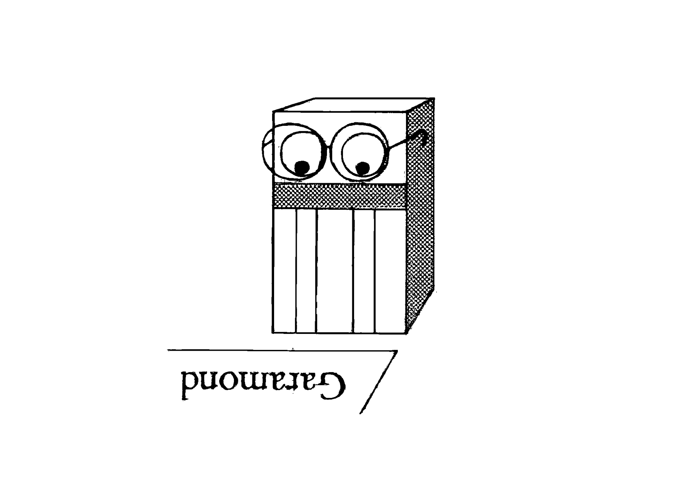

# 📝 Checklist before output
  Vérification avant d'exporter, d'imprimer, de publier, de mettre en ligne,…
### &nbsp;

| |
|:---:|
| Vérification[^1]           |

# 📁 Rendu 

- Sur Teams, dans le dossier correspondant à l’exercice
- En un seul fichier (et non plusieurs fichiers dans un dossier)
- Avec l'extension correcte (p. ex. PDF)
- Dans le format mentionné sur le brief (p. ex. A4)
- Dans l’ordre des pages mentionné sur le brief
- Avec l'orientation correcte pour toutes les pages (horizontal ou vertical)
- Scanné proprement (scan et non photo au téléphone, à plat, avec uniquement du noir et blanc, net)
- Nommé correctement (GRXXX_Nom_Prénom_Exercice)

⚠️  Si le rendu est transmis après la date prévue, il faut l'envoyer par mail avec une justification du retard (et non le mettre sur le serveur)

# 💻 InDesign

- Le format du document est correct
- Le du voyant contrôle en amont (preflight) est vert
- Il n'y a pas de lien manquant ou modifé
- Il n’y a pas de fontes inutilisées ou manquantes (trouver des polices)
- Les images sont au ratio original (1/1), minimum à 300dpi
- Les blocs textes sont bien alignés sur la grille et les marges
- L'application des gabarits aux pages est correcte (folio, section, etc.)
- Le nombre de page est correct par rapport à la reliure (multiple de 2 ou 4)
- Il n’y a pas de teintes inutilisées (nuancier)
- Il n’y a pas styles de paragraphes ou de caractères inutilisés

# 🔎 Micro-Typo

- Les langues adaptées sont appliquées aux paragraphes via les styles
- Les guillemets sont adaptés à la langue du texte, « Français », „Deutsch“, “English”, etc., jamais ceux-ci \"…\"
- Les espaces avec les ponctuations sont justes et adaptés à la langue du texte (espaces fines)

&nbsp;

- Les apostrophes sont typographiques ’ et non '
- Les … utilisent le glyphe adéquat et non 3 points
- Les - dans le texte ont été remplacés par – ou — sauf pour les mots composés et césures
- Les multiplications utilisent le glyphe × et non x
- Les paires oe, ae … sont remplacées par les ligature œ, æ (en française)

&nbsp;

- Aucun paragraphe ne finit par une ligne composée d’un mot seul ou d’un mot avec césure
- Il n’y a pas de veuve ni d’orpheline
- Il n’y a pas de doubles espaces

&nbsp;

- Les styles de paragraphes et de caractères n’ont pas d'exception
- L’interlignage de la fonte est systématique (pour chaque style de pararaphe, aligné sur la grille de lignes de base)
- L’interlettrage de la fonte est en métrique, aucun problème de crénage
- Les chiffres dans le texte sont à chasse proportionnelle

# 📐 Dessin vectoriel 

- Le type de point est juste partout (angle vs courbe)
- Les points sont positionnés correctement (aux extrêmes de la bounding box)
- Les points de contrôle sont soit horizontaux soit verticaux
- Les fûts ont la même largeur dans toutes les lettres
- Les courbes du « o » sont équivalentes (rotation de 180°)
- Les pleins et les déliés sont cohérents dans toutes les lettres
- Les mesures de compensation sont inscrites dans le fichier Glyphs (Fichier > Informations de la police > Master > Mesures)
- La compensation est cohérente dans toutes les lettres en haut et en bas, selon les principes d‘optique (carré, rond, triangle)
- La position du point de départ est correcte
- Le sens des tracés est correct
- L‘espacement est défini systématiquement, selon les principes d‘optique

<!---
# 💻 Digital

- abc
- abc
- abc
- abc
- abc
- abc

# 🌐 Web

- abc
- abc
- abc
- abc
- abc
- abc
--->

# 📎 Sources

- **ECAL/ Ecole Cantonale d’art de Lausanne**  
  Harry Bloch, Pierrick Brégeon & Philippe Karrer  
  *Gas for my Cadillac Manuel et quelques trucs de mise en page pour InDesign*, 2013
- **François Rappo**  
  *Checklist — micro-typographie*, 2009

[^1]: Adrian Frutiger, *Type, Sign, Symbol*, 1980
