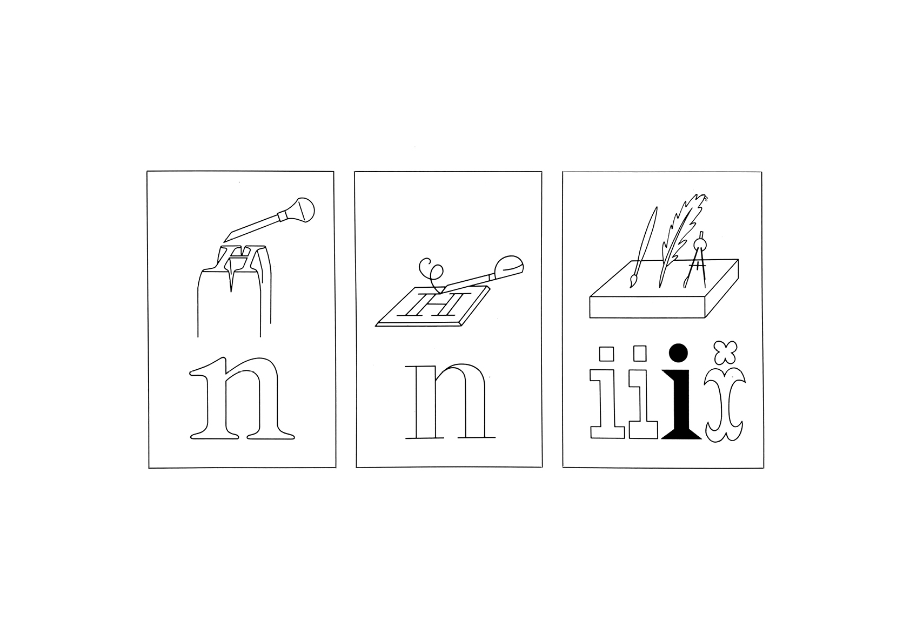
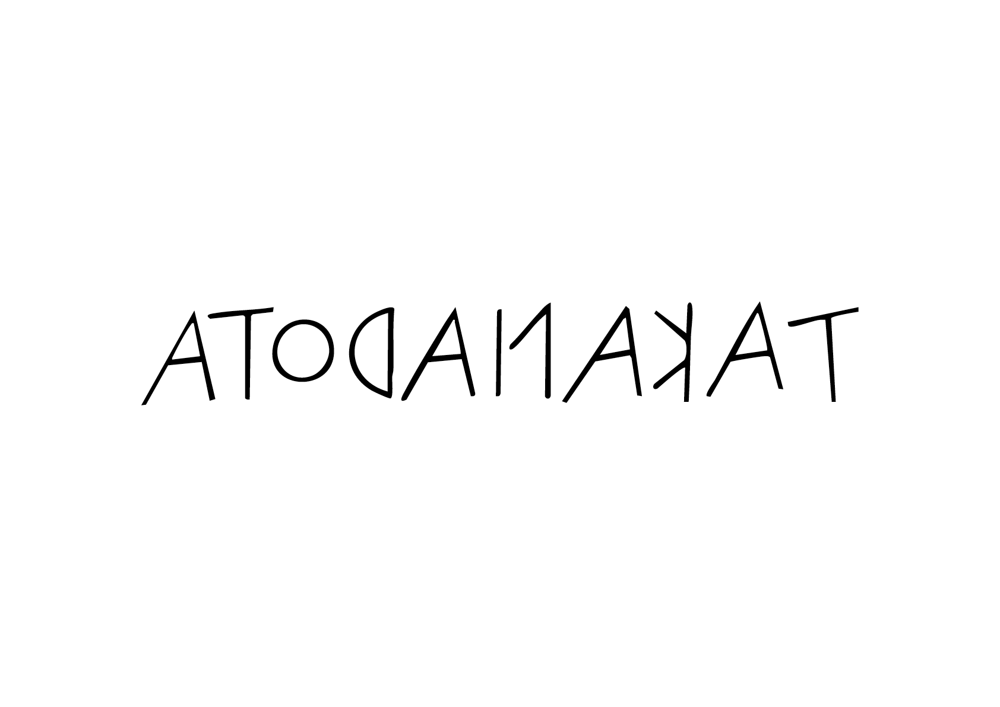
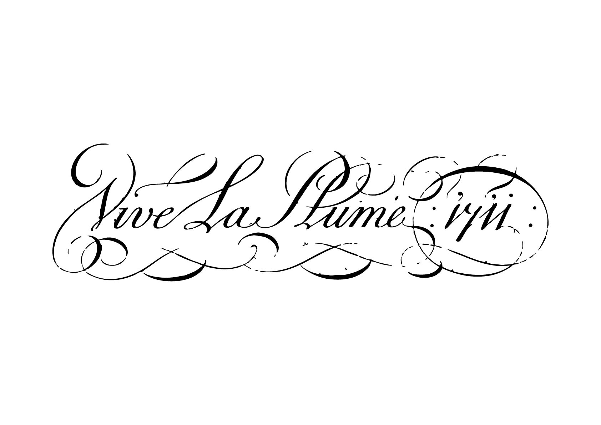

# 🕰️ Classification Historique

- [Incises](#incises)
- [Scriptes](#scriptes)
	- [Scripte Onciale](#scripte-onciale)
	- [Scripte Brisé *Fractures*](#scripte-fracture)
	- [Scripte Chancellerie](#scripte-chancellerie)
	- [Scripte Main Ronde](#scripte-main-ronde)
- [Sérifs](#serifs)
	- [Sérif Humaniste *Garaldes*](#serif-humaniste)
	- [Sérif Transitionnelle *Réales*](#serif-transitionnelle)
	- [Sérif Rationnelle *Didones*](#serif-rationnelle)
- [Slab-Sérifs](#slab-serifs)
	- [Slab Rationnelle *Mécanes*](#slab-rationnelle)
- [Sans-Sérifs](#sans-serifs)
	- [Sans Rationnelle *Grotesques*](#sans-rationnelle)
	- [Sans Humaniste *Humanes*](#sans-humaniste)
	- [Sans Construite *Géométriques*](#sans-construite)
- [Expressives](#expressives)
- [Hybrides](#hybrides)
  
## &nbsp;

# Tableau

| |
|:---:|
| Classification basée sur l’histoire de la typographie | 

# Période / Technique

| |
|:---:|
| Les formes d’écriture reflètent l’esprit propre à chaque époque | 

| |
|:---:|
| L'outil utilisé pour écrire définit certains aspects de la forme des signes | 

# Timeline

| |
|:---:|
| Evolution des formes de l'écriture | 

# [Incises](https://studioto.github.io/track-writing-evolution/#%EF%B8%8F-incises) {#incises}

## Lapidaire {#lapidaire}

<!-- | Période | Technique | Squelette | Vox | 
|:---:|:---:|
| Antiquité | [Gravure dans la pierre](https://studioto.github.io/track-writing-evolution/#%EF%B8%8F-incises) |  —  |  Incises  | -->

|  Ce groupe comprend les caractères à empattements inspirées des premières formes manuscrites, gravées et inscrites. Les polices avec de très petits «empattements en éperon» peuvent également appartenir à ce groupe.  |

| Grec lapidaire | 
|:---:|
| |
|:---:|
| Ve siècle av. J.-C. | 

| Romain lapidaire | 
|:---:|
| |
|:---:|
| IIe siècle av. J.-C. | 

| Capitale monumentalis romaine | 
|:---:|
| |
|:---:|
| Ie siècle av. J.-C. |  

# [Scriptes](https://studioto.github.io/track-writing-evolution/#%EF%B8%8F-onciales) {#scriptes}

## Scripte Onciale / Manuaires {#scripte-onciale}

<!-- | Squelette | Graisse | Enveloppe | Vox |
|:---:|:---:|:---:|
| Scripte |  Contrasté  |  Proto-sérifs  | -->

| L’onciale est un style de calligraphie dont les formes sont créées à l’aide d’une plume à pointe large à un angle presque horizontal, mais parfois plus incliné dans les variantes ultérieures. Il n’y a pas de formes distinctes pour les majuscules et les minuscules dans les designs onciaux purs — les lettres minuscules romaines avec ascendantes et descendantes ont été développées à partir des formes onciales et semi-onciales du Moyen Âge.  |

| Capitale rustika | 
|:---:|
| |
|:---:|
| Ier — Ve siècle | 

| Majuscule romaine cursive | 
|:---:|
| |
|:---:|
| Ier — IIIe siècle | 

| Onciale romaine | 
|:---:|
| |
|:---:|
| IIIe — IXe siècle | 

| Minuscule romaine cursive | 
|:---:|
| |
|:---:|
| IIIe — VIIe siècle | 

| Semi-onciale romaine | 
|:---:|
| |
|:---:|
| IIIe — VIIe siècle | 

| Capitale quadrata | 
|:---:|
| |
|:---:|
| IVe — Ve siècle | 

| Semi-onciale anglo-saxone | 
|:---:|
| |
|:---:|
| VIIe — XIIe siècle | 

| Semi-cursive romaine | 
|:---:|
| |
|:---:|
| VIIe — IXe siècle | 

| Minuscule lombarde | 
|:---:|
| |
|:---:|
| VIIe — IXe siècle | 

| Minuscule mérovingienne | 
|:---:|
| |
|:---:|
| VIIe — VIIIe siècle | 

| Minuscule wisigothique | 
|:---:|
| |
|:---:|
| VIIIe — XIe siècle | 

| Minuscule carolingienne | 
|:---:|
| |
|:---:|
| VIIIe — XIe siècle | 

| Minuscule bénéventaine | 
|:---:|
| |
|:---:|
| IXe — XIIIe siècle | 

| Minuscule carolingienne tardive | 
|:---:|
| |
|:---:|
| XIe — XIIe siècle | 

## Scripte Brisé / Fractures {#scripte-fracture}

| Dans les caractères fractures — également appelés «gothique» — certaines ou toutes les parties rondes des lettres sont «brisées» en traits droits. Ce style s’est progressivement développé dans les régions médiévales afin que les scribes puissent copier les manuscrits plus rapidement qu’avec la main minuscule carolingienne qui était courante auparavant. Alors que les empattements humanistes ont supplanté la lettre noire en Europe du Sud au cours de la Renaissance, le style lettre noire — en particulier le Fraktur — a continué à être largement utilisé dans les pays germanophones jusqu’au milieu du XXe siècle.  |

| Minuscule gothique primitive | 
|:---:|
| |
|:---:|
| XIIe — XIIIe siècle | 

| Minuscule gothique | 
|:---:|
| |
|:---:|
| XIIIe — XVe siècle | 

| Minuscule cursive (bâtarde) | 
|:---:|
| |
|:---:|
| XIIIe — XVe siècle | 

| Rotunda | 
|:---:|
| |
|:---:|
| XIIIe — XVe siècle | 

| Textura | 
|:---:|
| |
|:---:|
| XIVe — XVe siècle | 

| Gothique primitive (Italie) | 
|:---:|
| |
|:---:|
| XIVe siècle | 

# [Sérifs](https://studioto.github.io/track-writing-evolution/#%EF%B8%8F-humanes) {#serifs}

## Sérif Humaniste / Garaldes {#serif-humaniste}

| Squelette | Graisse | Enveloppe |
|:---:|:---:|:---:|
| Dynamique |  Contrasté  |  Sérifs  |

|  Le caractère humaniste est la forme originale des polices romaines développées à la Renaissance, au XVe siècle. Elle peut être divisée en deux styles: le style vénitien (Alde Manuce), caractérisé par une barre transversale inclinée sur le «e» minuscule, et le style français (Claude Garamond), dans lequel le «e» a généralement un œil plus petit. Les majuscules suivent les proportions des lettres romaines inscrites (Capitalis). Les italiques sont similaires à l’écriture chancelleresque. Les empattements sont généralement en forme de crochets, parfois asymétriques. Les empattements supérieurs sont pour la plupart angulaires.  |

| Minuscule humaniste | 
|:---:|
| |
|:---:|
| XVe — XVIe siècle | 

<!-- ## Sérifs Cursives / Italiques {#serifs-italiques} -->

| Humaniste cursive (italique) | 
|:---:|
| |
|:---:|
| XVe — XVIe siècle | 

| Schwabacher | 
|:---:|
| |
|:---:|
| XVIe siècle | 

| Fraktur (Allemagne) | 
|:---:|
| |
|:---:|
| XVIe — XVIIe siècle | 

## Scripte de Chancellerie {#scripte-chancellerie}

|  L’écriture de chancellerie — parfois également appelée «chancelleresque» — trouve son origine dans la calligraphie à plume large de la période de la Renaissance. Elle est basée sur l’écriture cursive des XVe et XVIe siècles développée en Italie, d’où le terme alternatif d’«italique». Des maîtres calligraphes comme Arrighi, Palatino et Tagliente ont publié des manuels d’écriture pour alimenter la «main italique». |

| Écriture de chancellerie / Main courante (Allemagne) | 
|:---:|
| |
|:---:|
| XVIe siècle | 

| Garamond | 
|:---:|
| |
|:---:|
| 1531 | 

## Scripte Main Ronde {#scripte-main-ronde}

|  L’écriture à main ronde est basée sur la calligraphie à stylo pointu et est liée aux périodes de style baroque et classique. Elle a été développée en Angleterre à la fin du XVIIe siècle et s’est largement répandue en Europe et en Amérique du Nord par la suite, propagée par des maîtres de l’écriture tels que Shelley, Bickham ou Snell. |

| Snell Main Ronde | 
|:---:|
| |
|:---:|
| 1712 | 

## Sérif Transitionnelle / Réales {#serif-transitionnelle}

| Squelette | Graisse | Enveloppe |
|:---:|:---:|:---:|
| Dynamique + Statique (rotation) |  Contrasté  |  Sérifs  |

|  Le caractère réaliste, souvent appelée «transitionnel», se situe quelque part entre le style humaniste de la Renaissance et le modèle moderne et rationaliste de la période néoclassique. Elle est également parfois appelée «baroque». Ses principales caractéristiques sont un contraste accru, des formes et des proportions plus régulières, s’éloignant progressivement des formes ressemblant à l’écriture manuscrite. Les empattements sont en forme de parenthèses.  |

| Caslon | 
|:---:|
| |
|:---:|
| 1725 | 

| Baskerville | 
|:---:|
| |
|:---:|
| Milieu du XVIIIe siècle | 

| Fournier | 
|:---:|
| |
|:---:|
| Milieu du XVIIIe siècle | 

## Sérif Rationnelle / Didones {#serif-rationnelle}

| Squelette | Graisse | Enveloppe |
|:---:|:---:|:---:|
| Statique |  Contrasté  |  Sérifs  |

|  Le caractère «moderne», également appelée «néoclassique», se caractérise traditionnellement par un fort contraste vertical entre les tiges verticales épaisses et les traits horizontaux fins. Les empattements sont horizontaux, soit fins et abrupts. Les formes comportent souvent des terminaisons en forme de boules. Les italiques sont similaires à l’écriture ronde. Ces caractéristiques sont conservées même lorsque le contraste diminue.  |

| Didot | 
|:---:|
| |
|:---:|
| Milieu du XVIIIe siècle | 

| Bodoni | 
|:---:|
| |
|:---:|
| 1788 (1818) | 

| Walbaum | 
|:---:|
| |
|:---:|
| 1803 | 

| Caslon égyptienne (première sans-sérif) | 
|:---:|
| |
|:---:|
| 1816 | 

# [Expressives](https://studioto.github.io/track-writing-evolution/#%EF%B8%8F-expressives) {#expressives}

## Ornemental / Display {#slab-display}

|  Il existe une histoire riche et abondante de caractères d’affichage décoratifs et ornementés à empattement plat conçus au 19e et au début du 20e siècle pour des affiches et d’autres travaux à façon. Ces caractères étaient particulièrement florissants aux États-Unis et étaient généralement produits sous forme de caractères en bois, car les grands corps devenaient trop lourds, trop chers et trop difficiles à couler en métal. |

| Italienne | 
|:---:|
| |
|:---:|
| 1821 | 

# [Slab-Sérifs](https://studioto.github.io/track-writing-evolution/#%EF%B8%8F-mécanes) {#slab-serifs}

## Slab Rationnelle / Mécanes {#slab-rationnelle}

| Squelette | Graisse | Enveloppe |
|:---:|:---:|:---:|
| Statique |  Linéaire  |  Sérifs  |

|  Les caractères slab rationnels se caractérisent par des empattements épais qui sont presque aussi épais que les traits principaux. Elles ont été développés au début XIXe siècle, dans le cadre d’une demande croissante de polices de caractères accrocheuses pour l’affichage et la publicité. Elles partagent le modèle de forme rationnelle avec des ouvertures fermées et des proportions cohérentes, généralement larges.  |

| Clarendon | 
|:---:|
| |
|:---:|
| 1844 | 

# [Sans-Sérifs](https://studioto.github.io/track-writing-evolution/#%EF%B8%8F-grotesques) {#sans-serifs}

## Sans Rationnelle / Grotesques {#sans-rationnelle}

| Squelette | Graisse | Enveloppe |
|:---:|:---:|:---:|
| Statique |  Linéaire  |  Sans-Sérif  |

|  Les caractères sans empattement qui sont apparues pour la première fois dans le catalogue des imprimeurs anglais au début du XIXe siècle ont été qualifiées à l’époque de «grotesques». Mais ce style n’était nouveau que dans le domaine de l’imprimerie: les lettres sans empattement étaient déjà utilisées dans les lettrages et les inscriptions. La police English Egyptian de William Caslon, composée uniquement de majuscules, datant de 1816, est considérée comme la première police sans empattement. |

| Akzidenz Grotesk | 
|:---:|
| |
|:---:|
| 1898 | 

## Sans Humaniste / Humanes {#sans-humaniste}

| Squelette | Graisse | Enveloppe |
|:---:|:---:|:---:|
| Dynamique |  Linéaire  |  Sans-Sérif  |

|  Les premières polices de caractères de ce style sont apparues au début du XXe siècle, lors d’un renouveau calligraphique visant à surmonter ce que certains considéraient comme un excès d’éclectisme victorien. Ce mouvement a été lancé par Edward Johnston en Angleterre et s’est manifesté dans sa création pour le métro de Londres en 1916. La police de caractères créée par son élève Eric Gill en 1928 est considérée comme le premier exemple populaire du style humaniste. |

| Gill | 
|:---:|
| |
|:---:|
| 1927 | 

## Sans Construite / Géométriques {#sans-construite}

| Squelette | Graisse | Enveloppe |
|:---:|:---:|:---:|
| Géométrique |  Linéaire  |  Sans-Sérif  |

|  Les formes de caractères sont «construites» à partir de formes géométriques (corrigées optiquement) avec des parties rondes et généralement très peu de contraste entre les traits. D’autres caractères de cette catégorie ont des formes carrées, basées sur un rectangle plutôt que sur un cercle, ou construites à partir d’autres éléments modulaires. |

| Futura | 
|:---:|
| |
|:---:|
| 1927 | 

| Times New Roman | 
|:---:|
| |
|:---:|
| 1931 | 

| Folio | 
|:---:|
| |
|:---:|
| 1954 | 

| Univers | 
|:---:|
| |
|:---:|
| 1957 | 

| Helvetica | 
|:---:|
| |
|:---:|
| 1958 | 

| OCR-B | 
|:---:|
| |
|:---:|
| 1963 | 

| Frutiger | 
|:---:|
| |
|:---:|
| 1970 | 

# [Hybrides](https://studioto.github.io/track-writing-evolution/#%EF%B8%8F-hybrides) {#hybrides}

## Superfamille {#hybride-superfamille}

| Les caractères hybrides cherchent à combiner dans une même famille plusieurs principes de construction typographique. Ils proposent souvent un système avec des variations de terminaisons (de sans-sérif à sérif par ex.) et de contrastes (contrasté à linéaire) de manière à donner plusieurs voix stylistiques à un seul squelette.  |

| Rotis | 
|:---:|
| |
|:---:|
| 1988 |

### Sources

- Ruedi Rüegg, *Basic Typography: Design with Letters / Typografische Grundlagen mit Schrift*, Zurich: Delta & Spes, 1980  
- Indra Kupferschmid, *Buchstaben kommen selten allein: Typografie-Handbuch*, Sulgen: Niggli, 2004  
- Robert Bringhurst, *The Elements of Typographic Style*, Vancouver: Hartley & Marks, 1992   
- Gerrit Noordzij, *The Stroke: Theory of Writing*, London: Hyphen Press, 2005   