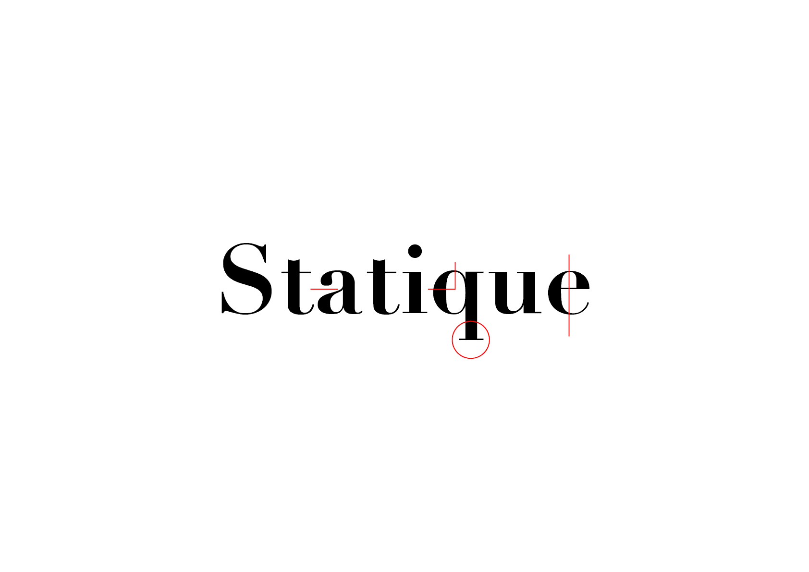
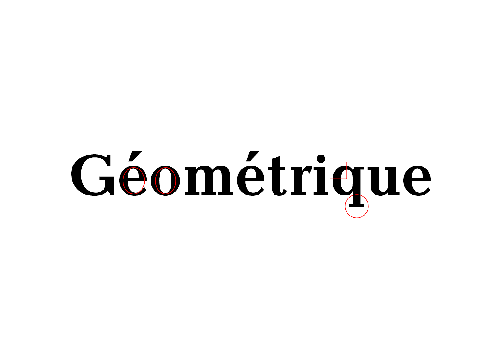
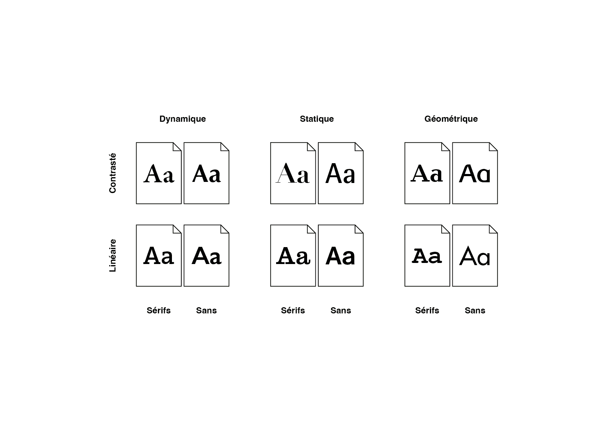
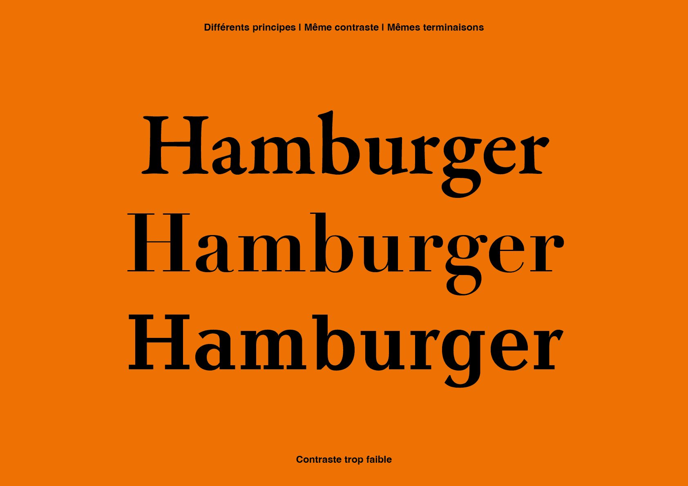
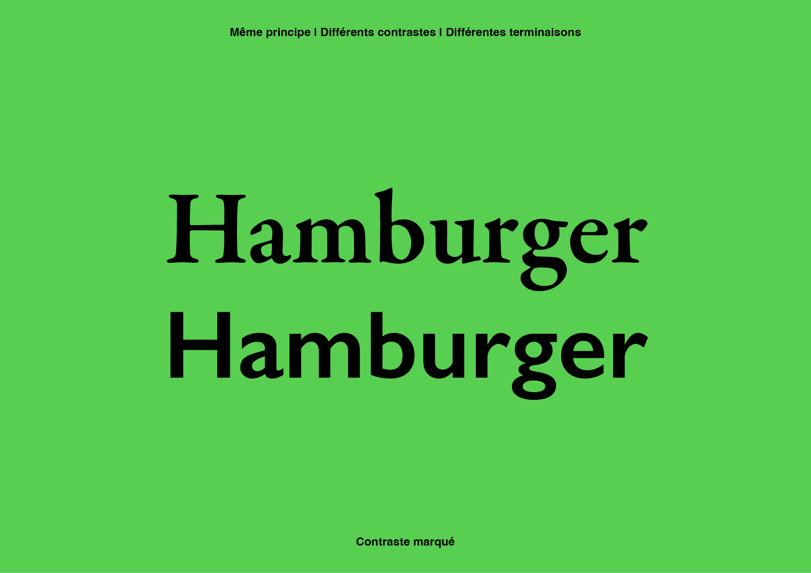
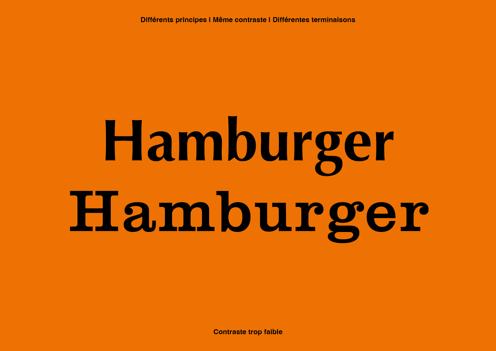

# 🦴 Classification Anatomique

- [Tableau](#tableau)
- [Squelette - Graisse - Enveloppe](#squelette-graisse-enveloppe)
- [Squelette Dynamique](#squelette-dynamique)
- [Squelette Statique](#squelette-statique)
- [Squelette Géométrique](#squelette-geometrique)
- [Combinaisons](#combinaisons)
  
&nbsp;

# Tableau {#tableau}

| |
|:---:|
| Classification basée sur la forme (anatomie) des signes | 

# Squelette - Graisse - Enveloppe {#squelette-graisse-enveloppe}

| |
|:---:|
| Squelette - Graisse - Enveloppe           |

```
Squelette
├── Dynamique
├── Statique
└── Géométrique

    Graisse
    ├── Contrasté (avec)
    └── Linéaire  (sans)

        Enveloppe
          └── Terminaisons
              ├── Avec (sérifs)
              └── Sans (sérifs)
          ├── Fûts
          ├── Ouvertures
          └── Ornements
```

## Squelette Dynamique {#squelette-dynamique}

| |
|:---:|
| Contrasté-Avec, Contrasté-Sans, Linéaire-Avec, Linéaire-Sans           |

Vocabulaire sémiotique:
*convivial, ouvert, accessible, flexible, naturel, démocratique, chaleureux, accueillant, personnel, intemporel*

## Squelette Statique {#squelette-statique}

| |
|:---:|
| Contrasté-Avec, Contrasté-Sans, Linéaire-Avec, Linéaire-Sans           |

Vocabulaire sémiotique:
*rationnel, ordonné, réservé, noble, élégant, sérieux, rigide, correct, rigoureux, autoritaire*

## Squelette Géométrique {#squelette-geometrique}

| |
|:---:|
| Contrasté-Avec, Contrasté-Sans, Linéaire-Avec, Linéaire-Sans           |

Vocabulaire sémiotique:
*géométrique, simple, technique, moderne, fonctionnel, informel, systématique, sobre, construit, épuré*

# Combinaisons {#combinaisons}

| |
|:---:|
| Combiner des fontes avec la classification formelle[^3]           |

En se basant sur la classification formelle de Indra Kupferschmid, on peut faire les remarques suivantes concernant les combinaisons:

- Les fontes du même modèle s'accordent bien
- Les fontes de modèles différents qui partagent le même contraste et les mêmes terminaisons ne s'accordent pas bien
- Les fontes de modèles différents s'accordent bien seulement si elles sont éloignées dans le tableau (plus qu'une colonne d'écart)

Ce système est un point de départ, il n'y a pas de règles absolues en matière de design. Il est nécesaire d'affiner les combinaisons en prenant en compte le contexte de votre projet, notamment les points suivants:

- la concordance des proportions (hauteur de x, hauteur des capitales)
- les hiérarchies
- les corps
- les graisses
- les styles
- les character-sets
- etc.

| |
|:---:|
| Différents principes \| Même principe           |

| |
|:---:|
| Même principe  \| Différents contrastes & terminaisons           |

| |
|:---:|
| Différents principes \| Différents contrastes & terminaisons           |


### Sources

<!-- - **Prénom Nom**  
  *Titre*, 0000 -->

<!-- [^1]: Adrian Frutiger, *Type, Sign, Symbol*, 1980 -->

