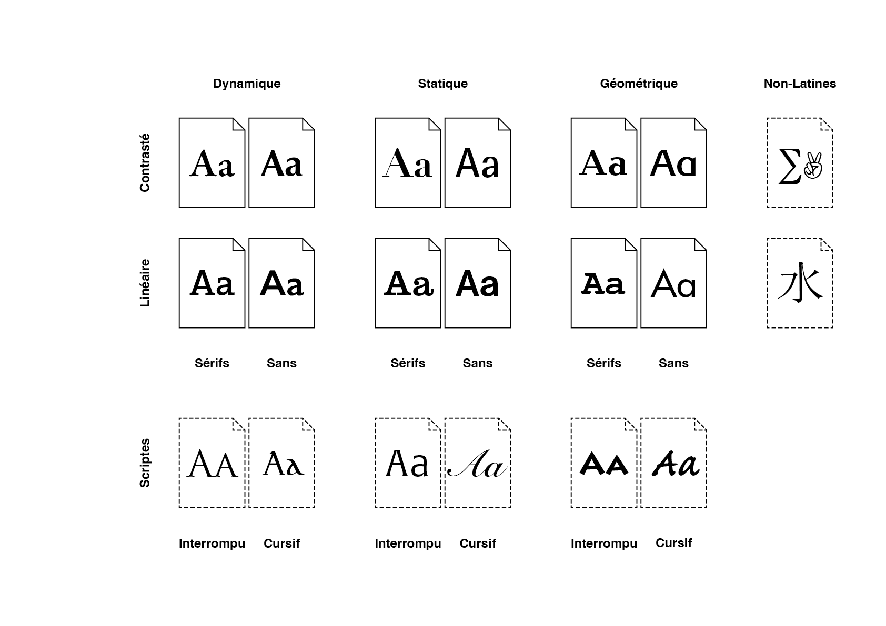
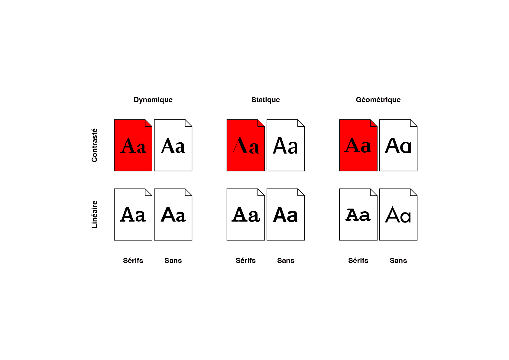
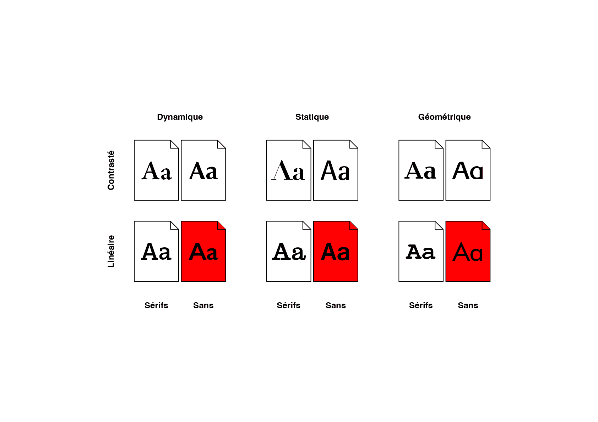
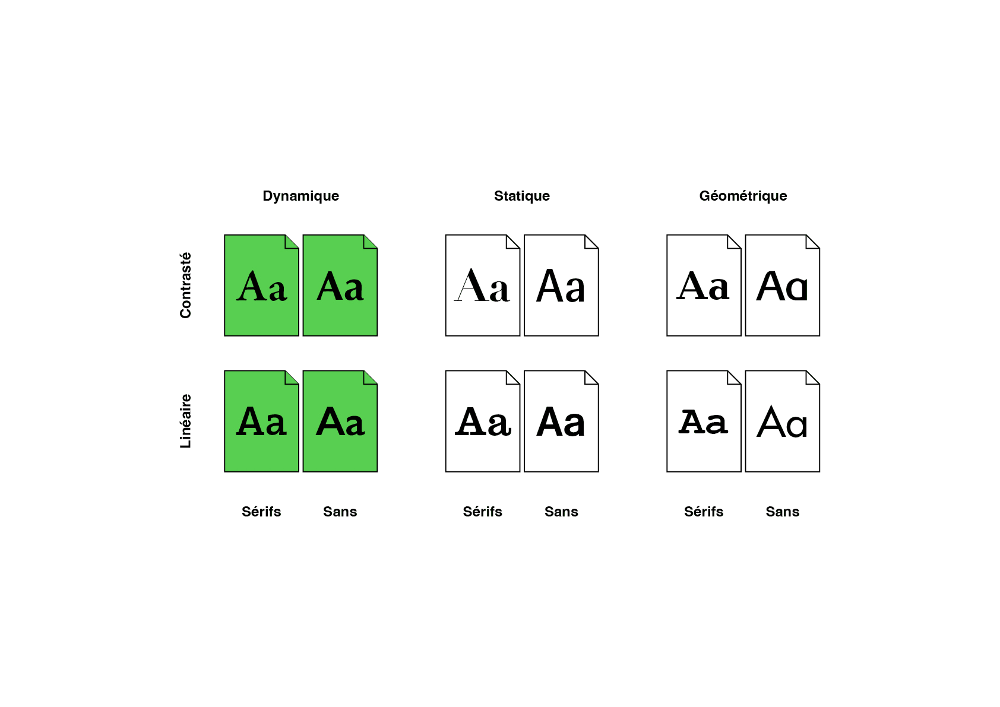
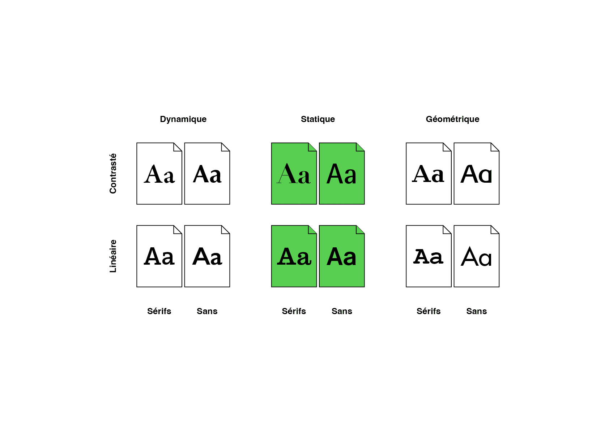
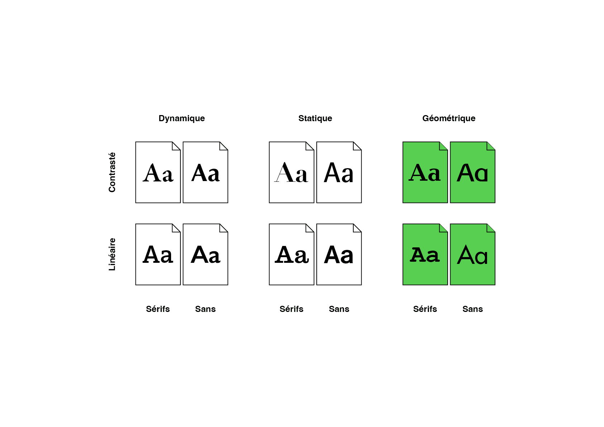
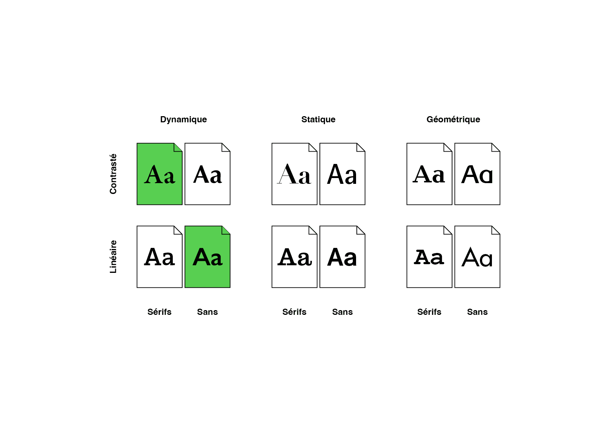
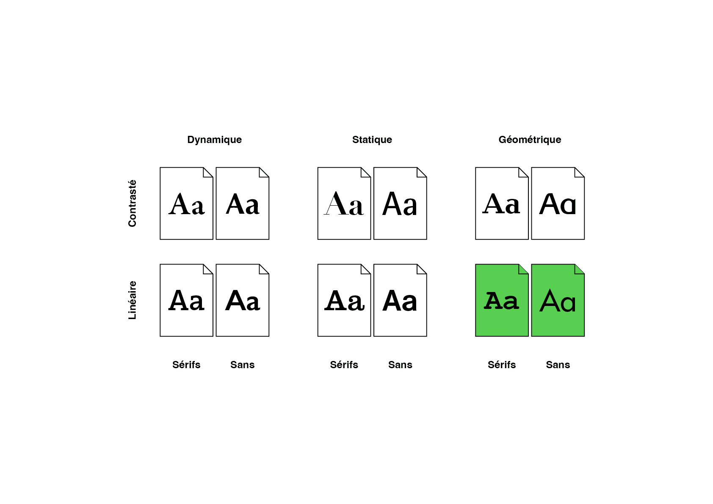
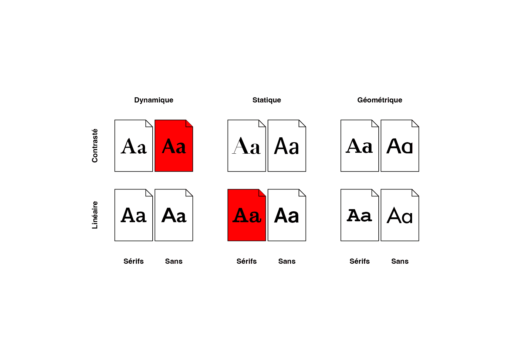
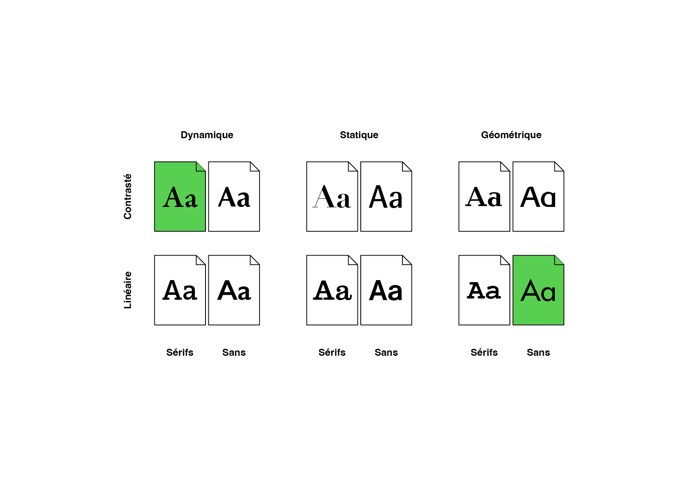

# 🦴 Classification Formelle

  
### &nbsp;

# Tableau

| |
|:---:|
| Abc | 

# Squelette - Graisse - Enveloppe

| |
|:---:|
| Abc | 

| |
|:---:|
| Abc | 

| |
|:---:|
| Abc | 

| |
|:---:|
| Abc | 

| |
|:---:|
| Abc | 

| |
|:---:|
| Abc | 

| |
|:---:|
| Abc | 

| |
|:---:|
| Abc | 

| |
|:---:|
| Abc | 

| |
|:---:|
| Abc | 

| |
|:---:|
| Abc |

### Sources

<!-- - **Prénom Nom**  
  *Titre*, 0000 -->

<!-- [^1]: Adrian Frutiger, *Type, Sign, Symbol*, 1980 -->

