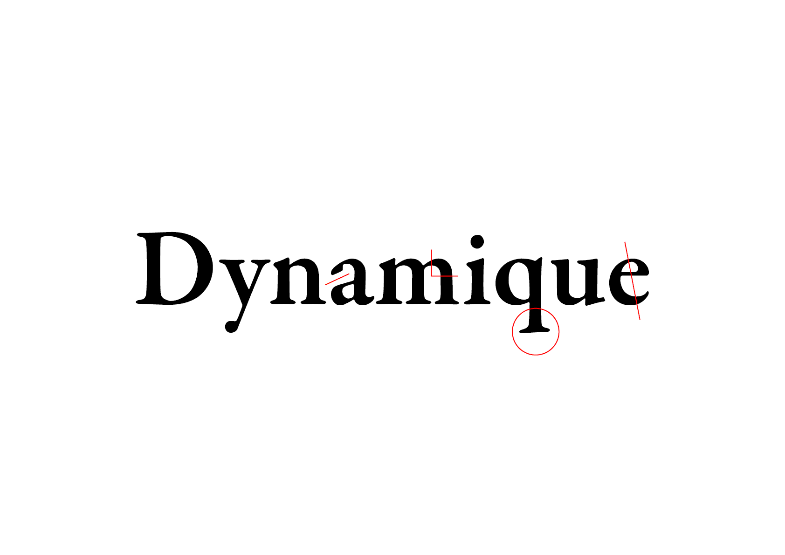
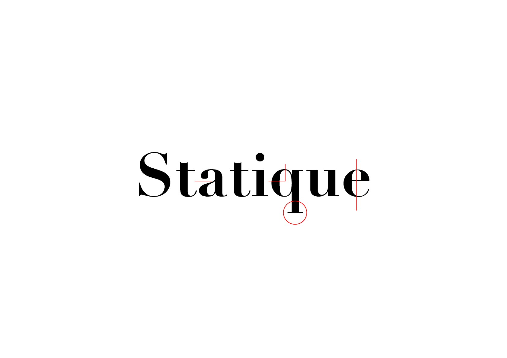
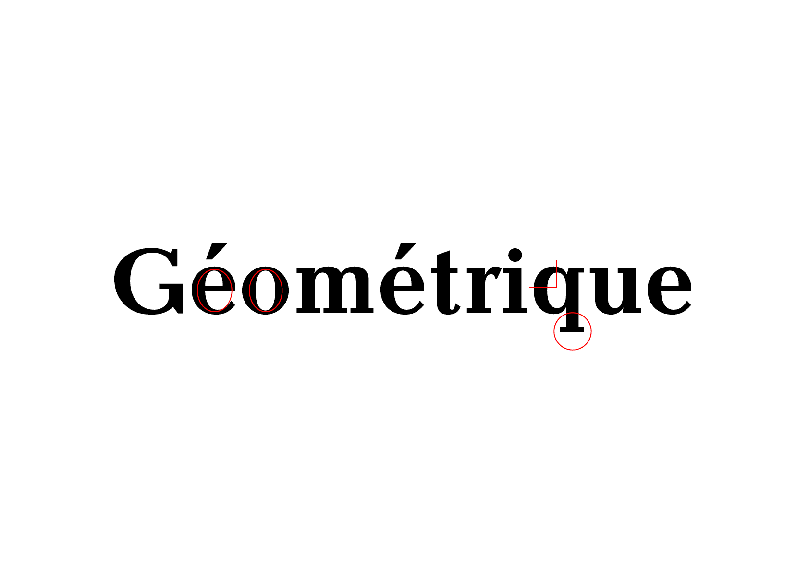

# 🗂️ *Classify typefaces*
  Classer des polices de caractères selon les principes de forme[^1]
# &nbsp;

|  |  |  |
|:---:|:---:|:---:|
| Principe dynamique           | Principe statique           | Principe géométrique           |

## 🪚 Forme

## Principe Dynamique
Ce principe découle historiquement de la calligraphie humaniste (Renaissance) réalisée à la plume à bec large. La **tension diagonale** ainsi que les **terminaisons ouvertes** des lettres résultent de la **translation** du bec carré, maintenu à un angle fixe.

*convivial, ouvert, accessible, flexible, naturel, démocratique, chaleureux, accueillant, personnel, intemporel*

| |
|:---:|
| Translation           |

## Principe Statique
Ce principe découle historiquement de la calligraphie moderne (Renaissance) réalisée à la plume à bec pointu. La **tension verticale** ainsi que les **terminaisons fermées** des lettres résultent de l’**expansion** du bec carré, qui évolue avec la pression de la main.

*rationnel, ordonné, réservé, noble, élégant, sérieux, rigide, correct, rigoureux, autoritaire*

| |
|:---:|
| Expansion           |

## Principe Géométrique
Ce principe découle historiquement du constructivisme post-moderne (XXe) réalisée à la plume à bec rond. La **construction** modulaire des lettres résultent du bec rond qui produit un contraste **monolinéaire**.

*géométrique, simple, technique, moderne, fonctionnel, informel, systématique, sobre, construit, épuré*

| |
|:---:|
| Construction           |

### 📎 Sources

[^1]: Illustration tirée du livre *Le trait. Une théorie de l’écriture* de Gerrit Noordzij (2010) + ajout du principe géométrique basé sur le système de classification de Indra Kupferschmid.

