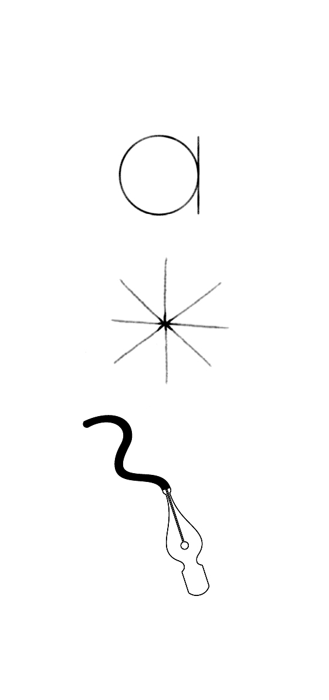

# 🗂️ *Classify typefaces*
  Classer des polices de caractères selon les principes de forme[^1]
#  

|  |  |  |
|:---:|:---:|:---:|
| Principe dynamique           | Principe statique           | Principe géométrique           |

## 🪚 Forme

## Principe Dynamique
L'écriture avec une plume large, maintenue à un angle constant, permet d'obtenir un contraste incliné, des ouvertures et des plongées. de contraste, d'ouvertures et de diversités de traits. largeur de trait. Cela confère aux lettres une forme et une sensation dynamiques et variées. dynamique et variée (y compris dans les italiques et les majuscules, qui suivent les proportions du Capitalis).

| |
|:---:|
| Tension diagonale, terminaisons ouvertes           |

## Principe Statique
Dans l'écriture à la plume pointue, l'épaisseur du trait est liée à la pression exercée sur la plume lors d'un trait descendant, alors que les autres traits restent fins. L'axe est vertical avec un contraste élevé mais moins modulé et des ouvertures plutôt fermées. Cela donne aux lettres une impression plus statique et rigide. Les formes de lettres (par exemple q, p, d, b) et leurs proportions sont assez similaires, en particulier la largeur des capitales.

| |
|:---:|
| Tension verticale, terminaisons fermées           |

## Principe Géométrique
La plume ronde permet d'obtenir des formes linéaires, plus « dessinées » et construites (par exemple, le o circulaire) comme dans les écritures Futura ou monoline. Les capitales reprennent souvent les proportions classiques des capitales.

| |
|:---:|
| Construction modulaire           |

### 📎 Sources

[^1]: Illustration tirée du livre *Le trait. Une théorie de l’écriture* de Gerrit Noordzij (2010) + ajout du principe géométrique basé sur le système de classification de Indra Kupferschmid.

