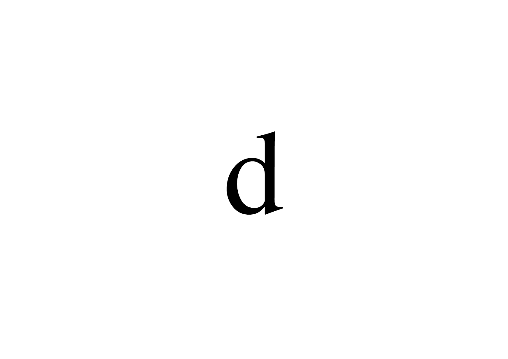
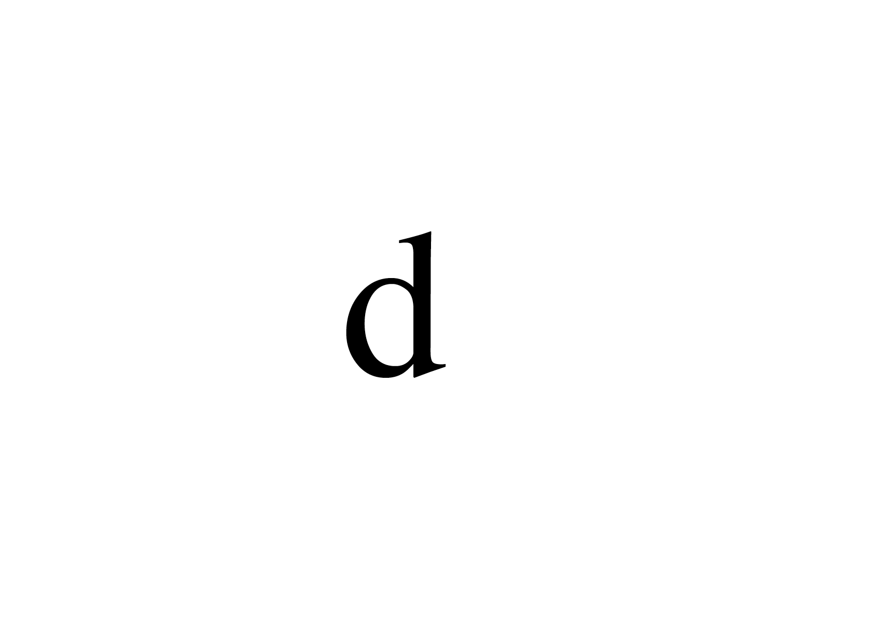
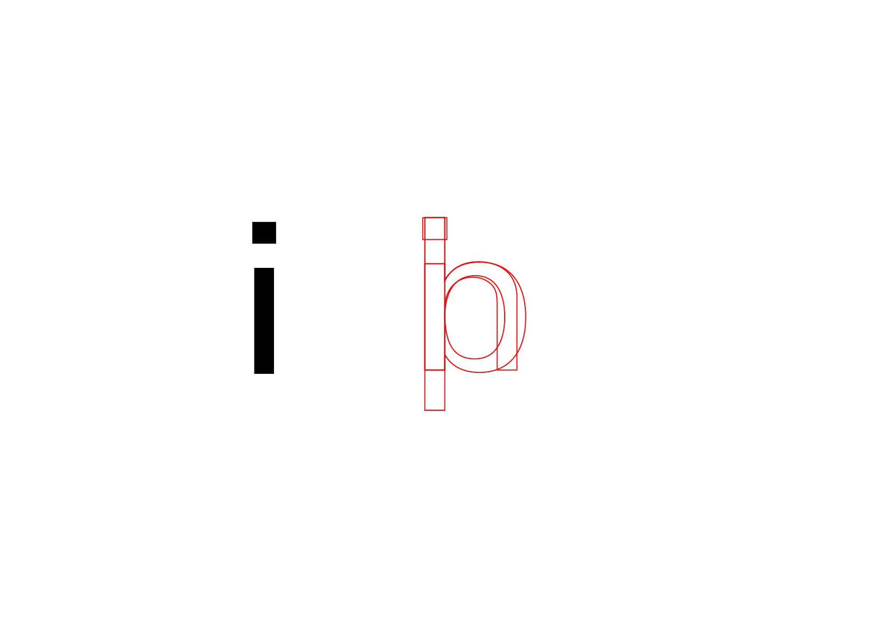
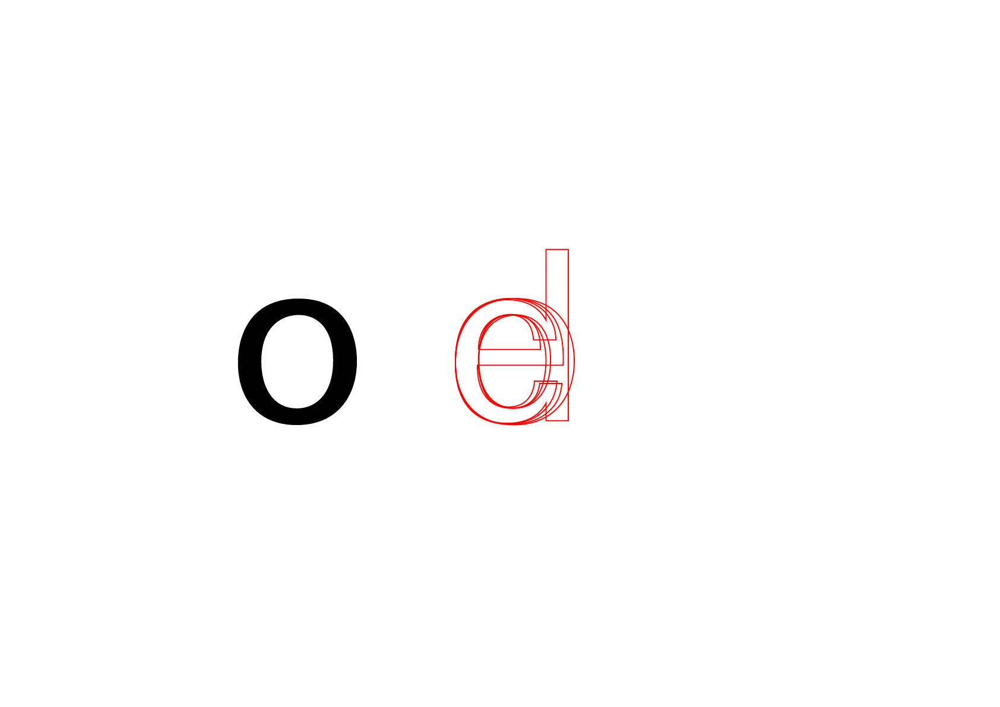
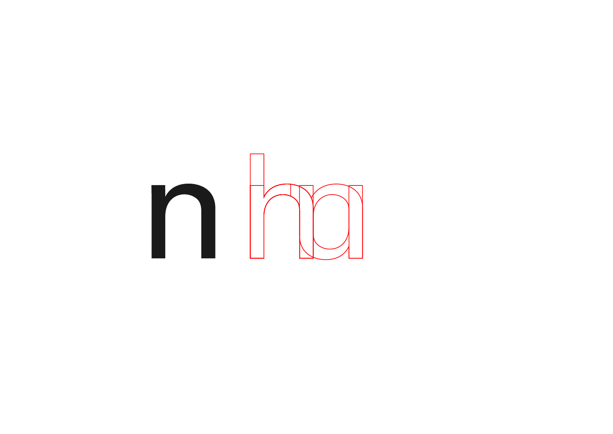
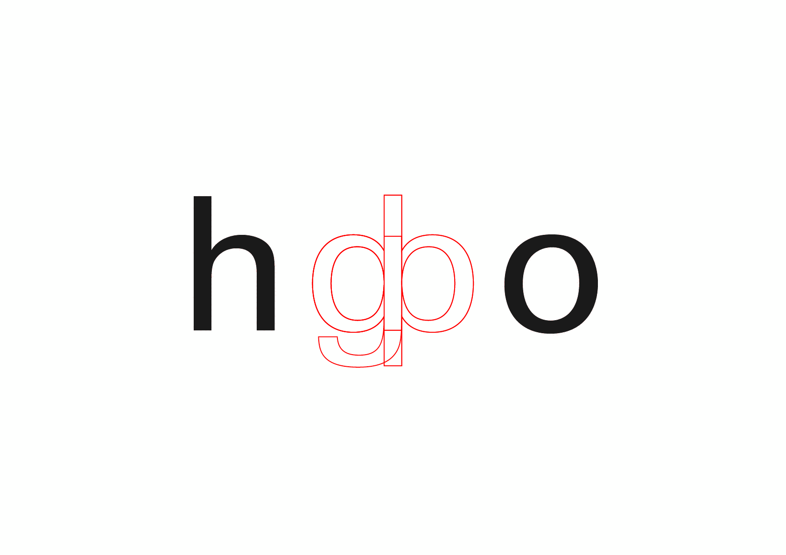
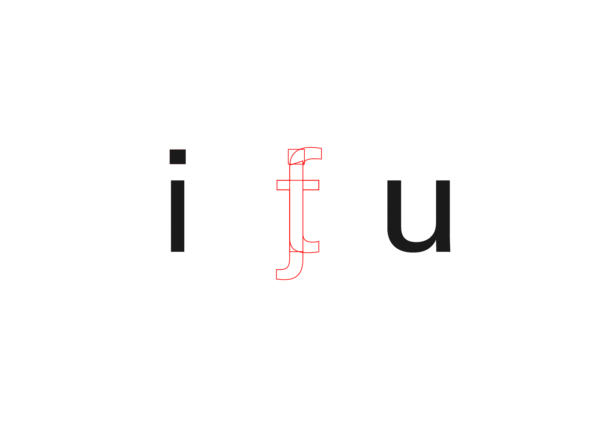
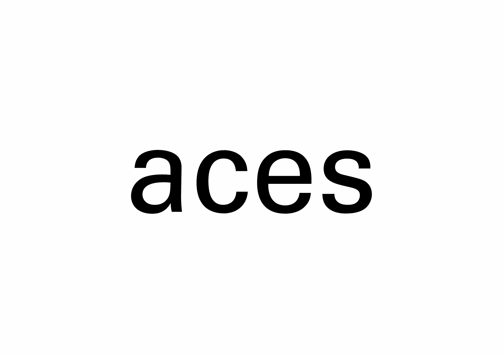
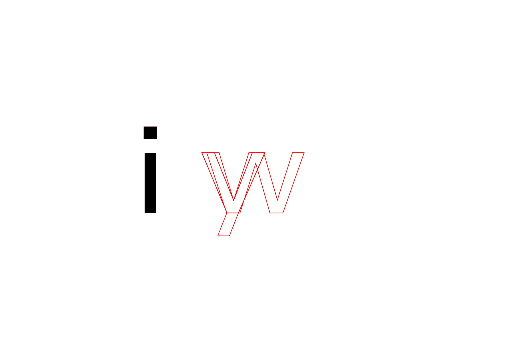
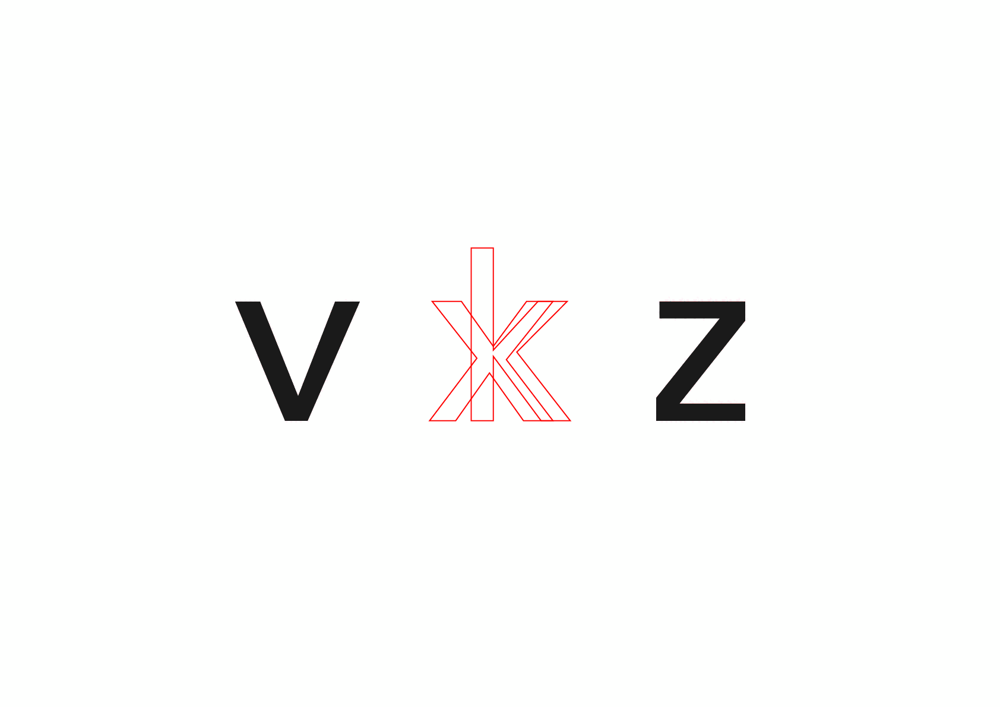

# 🔨 Construct a typeface
  Guidelines pour débuter la construction d’une fonte
### &nbsp;

| |
|:---:|
| Ductus[^1]: mode d'emploi pour dessiner un caractère spécifique(ordre, direction et nombre de segments)           |

# 🚨 Règles

Plusieurs principes de dessin (ductus) hérités de la calligraphie régissent encore la construction de nos alphabets modernes.
Ces principes permettent de maintenir une cohérence des lettres entre elles, de sorte à ce qu'elles aient l'air d'avoir été «tracées» avec le même outil (ce qui était le cas en calligraphie).  

Voici une correspondance entre les règles mentionnées par Irene Wellington ci-dessus et leur application contemporaine:

1. l’angle de la plume est constant  
   → la répartition de la graisse entre les pleins et les déliés est systématique à travers les caractères d'une même fonte (fûts, traverses, pleins, déliés)
4. l’alphabet entier est basée sur le cercle [ou autre forme]  
   → l’alphabet est «construit», dans le sens ou il ré-utilise des tracés similaires dans plusieures lettres
6. une bonne hauteur (de x) moyenne est de […]  
   → les proportions sont constantes à travers les caractères d'une même police (hauteur de x, ascendante, descendante, etc.)

| |
|:---:|
| La rotation est autorisée: réalisabe à la plume (cohérent)           |

| |
|:---:|
| La symétrie est interdite: impossible à réaliser à la plume (et donc incohérent)             |

# 🪵 Fûts

| |
|:---:|
| La fûts ont la même largeur à travers les caractères d'une même fonte            |

# ⚽️ Courbes

| |
|:---:|
| La répartition de la graisse entre les pleins et les déliés est systématique à travers les caractères           |

# 📐 Proportions

| |
|:---:|
| Les proportions sont constantes à travers les caractères d'une même police (hauteur de x, ascendante, descendante, etc.)           |

# 🔡 Minuscules

| |
|:---:|
| n → h, m, r, u          |

| |
|:---:|
| h + o → b, d, p, q, g           |

| |
|:---:|
| i, u → j, f, t            |

| |
|:---:|
| a, c, e, s           |

| |
|:---:|
| v → w, y            |

| |
|:---:|
| v → x, k           |

# 📎 Sources

- **Walter Käch**  
  *Die Gezeichnete Schrift*, 1949
- **Adrian Frutiger**  
  *Type, Sign, Symbol*, 1980

[^1]: Irene Wellington, *The Foundational Hand*, 1920
