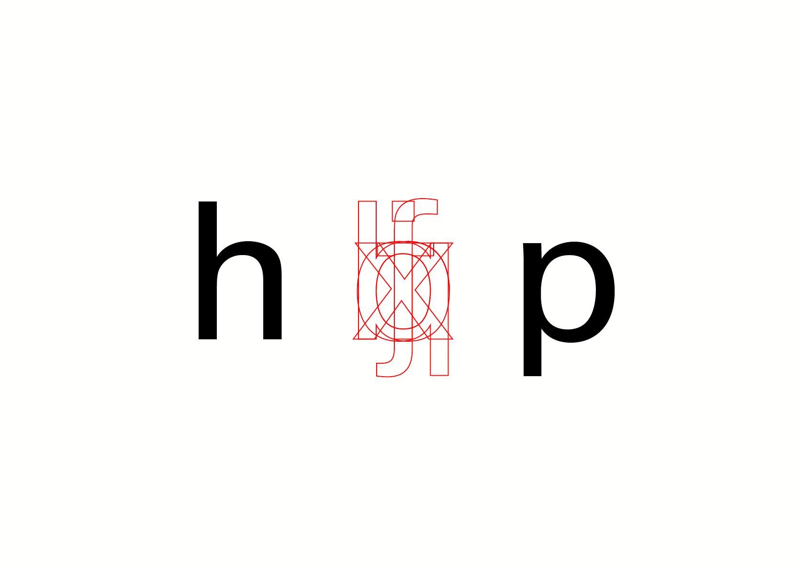

# 🔨 *Construct a typeface*
  Guidelines pour commencer
#  

| |
|:---:|
| Ductus           |

# 🚨 Règles

| |
|:---:|
| Ductus           |

| |
|:---:|
| Ductus           |

# 🪵 Fûts

| |
|:---:|
| Ductus           |

# ⚽️ Courbes

| |
|:---:|
| Ductus           |

# 📐 Proportions

| |
|:---:|
| Ductus           |

# 🔡 Minuscules

| |
|:---:|
| Ductus           |

| |
|:---:|
| Ductus           |

| |
|:---:|
| Ductus           |

| |
|:---:|
| Ductus           |

| |
|:---:|
| Ductus           |

| |
|:---:|
| Ductus           |
