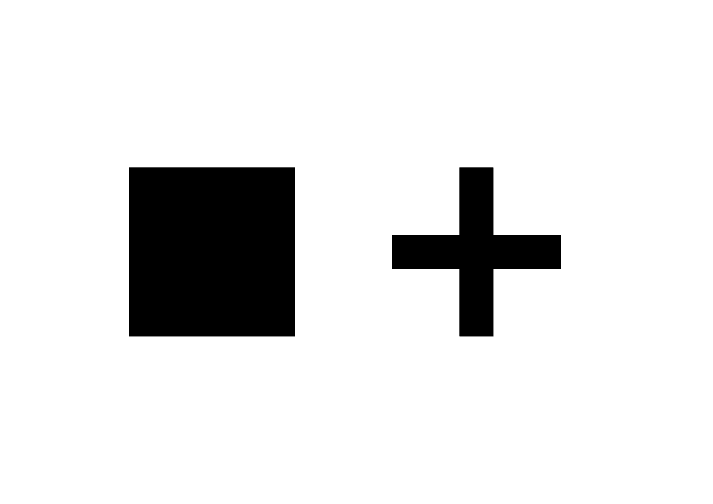

# 🌀 *Correct a typeface*
  Corrections optiques
# &nbsp;

| |
|:---:|
| Abc [^1]           |

# 🧩 Formes primaires

### Carré

| |
|:---:|
| Abc           |

## Rond

| |
|:---:|
| Abc          |

## Trianle

| |
|:---:|
| Abc           |

## Croix

| |
|:---:|
| Abc           |

# 🚃 Espacement

## Alignement

| |
|:---:|
| Abc           |

## Espacement

| |
|:---:|
| Abc           |

# 🪩 Effets d'optique

[^1]: Test
