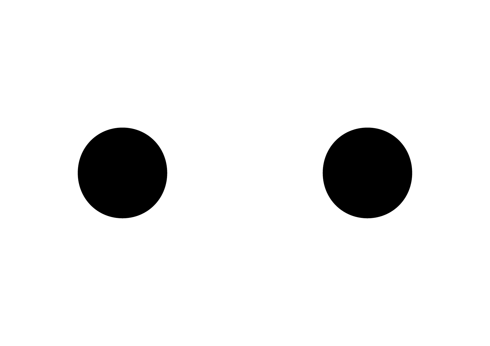
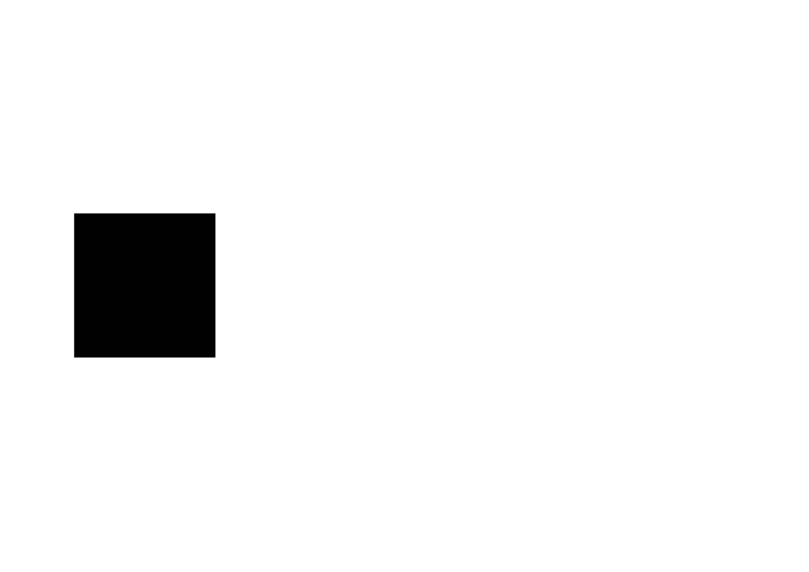

# 🌀 *Correct a typeface*
  Corrections optiques
# &nbsp;

| |
|:---:|
| Abc [^1]           |

La création de caractères est une bataille contre les illusions d'optique, que nous ne gagnons qu'en y renonçant complètement que nous ne gagnons qu'au prix d'une capitulation totale. Nous convainquons l'œil de voir les choses clairement, non pas en créant des rationnels, mais par des dessins irrationnels, en introduisant des distorsions étranges qui déjouent l'œil : façonner non pas ce que nous pas ce que nous voyons, mais ce que nous croyons voir.

# 👀 Principes d'optique

### Biais de proportions

| |
|:---:|
| Abc           |

### Carré

| |
|:---:|
| Abc           |

### Rond

| |
|:---:|
| Abc           |

### Biais de dimensions

| |
|:---:|
| Abc           |

### Courbes

| |
|:---:|
| Abc          |

### Pointes

| |
|:---:|
| Abc           |

# 🎼 Composition

### Contraste

| |
|:---:|
| Abc           |

### Position

| |
|:---:|
| Abc           |

### Alignement

| |
|:---:|
| Abc           |

### Rotation

| |
|:---:|
| Abc           |

# 🚃 Séquence

### Alignement

| |
|:---:|
| Abc           |

### Espacement

| |
|:---:|
| Abc           |

# 🪩 Optique appliquée aux caractères

### Formes > Caractères

| |
|:---:|
| Abc           |

[^1]: Test
