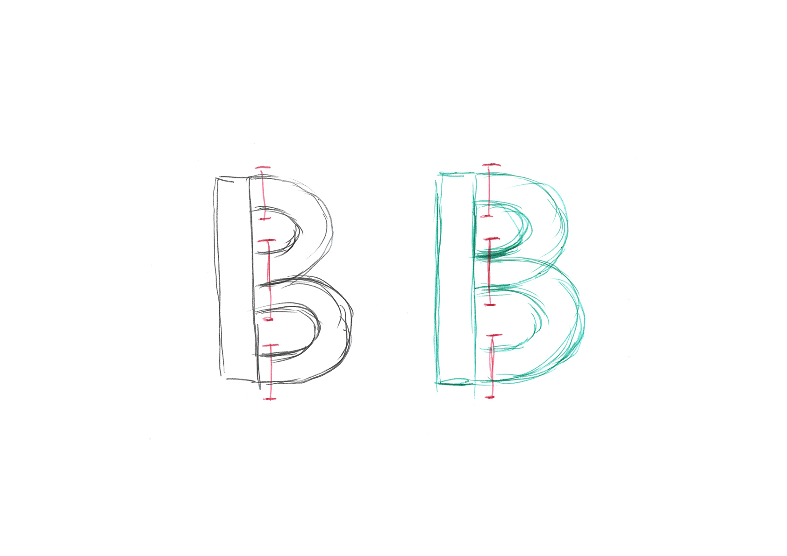
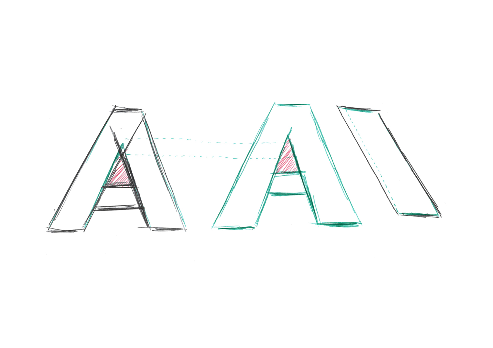
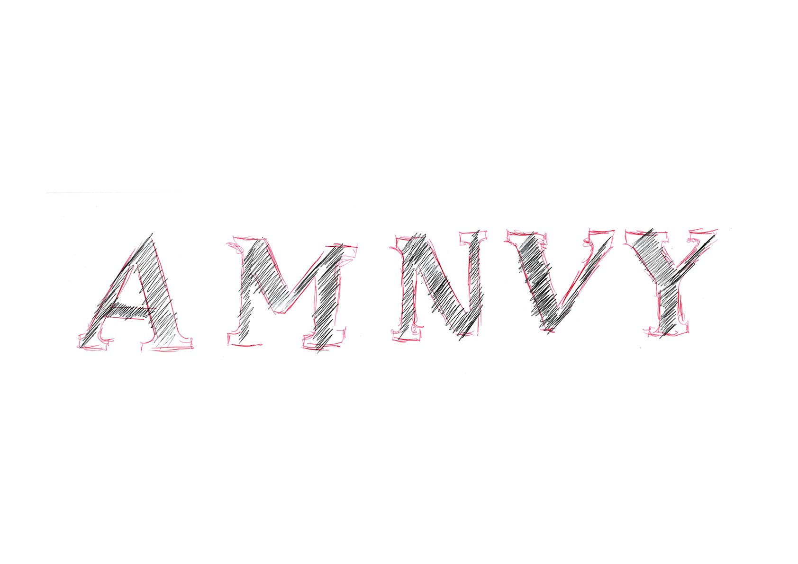
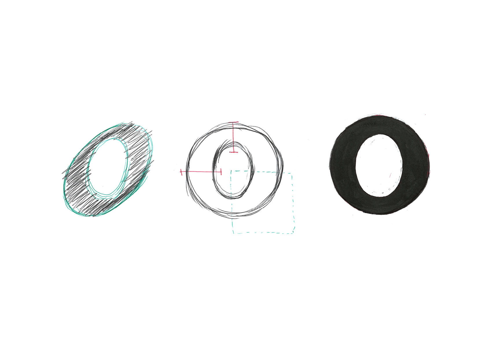
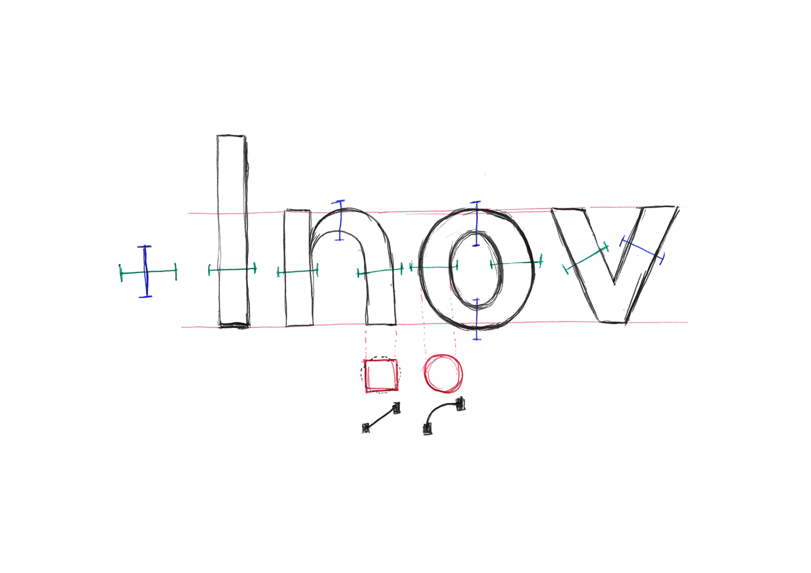

# 🪲 Debug typefaces drawings
  Erreurs communes de dessin dans les lettres
### &nbsp;

| |
|:---:|
| Abc[^1]           |

| |
|:---:|
| Abc[^1]           |

| |
|:---:|
| Abc[^1]           |

| |
|:---:|
| Abc[^1]           |

| |
|:---:|
| Abc[^1]           |

| |
|:---:|
| Abc[^1]           |

| |
|:---:|
| Abc[^1]           |
