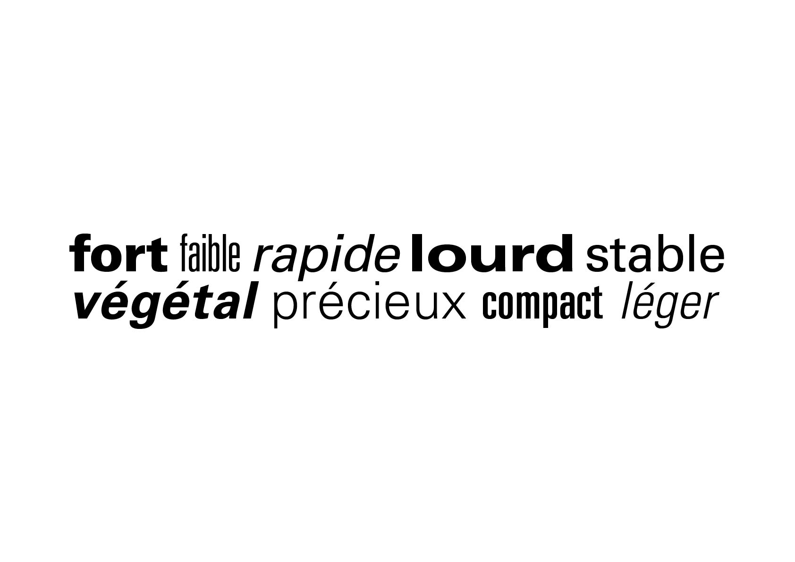
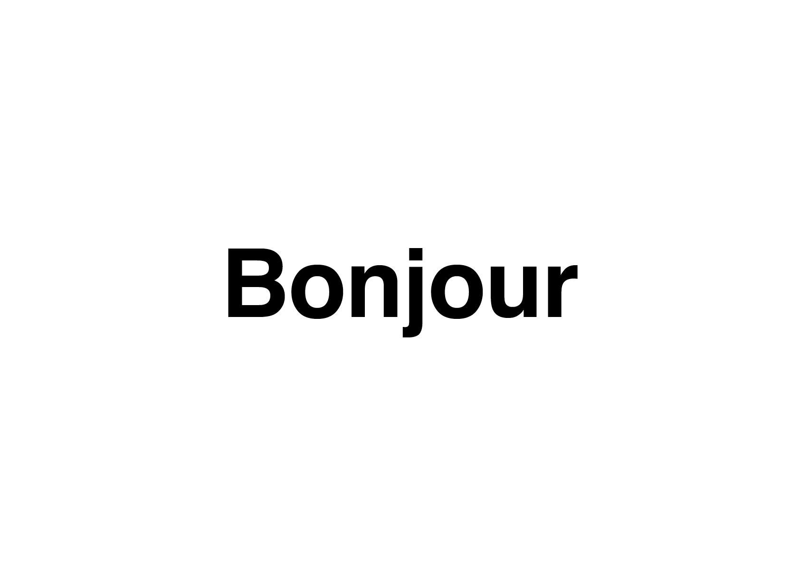
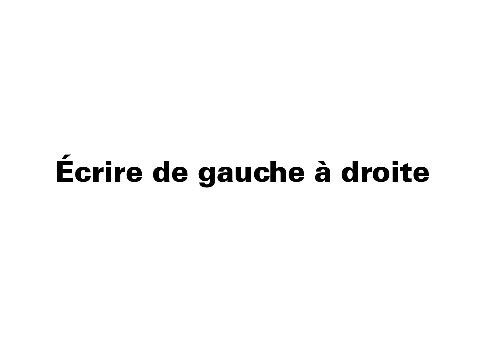
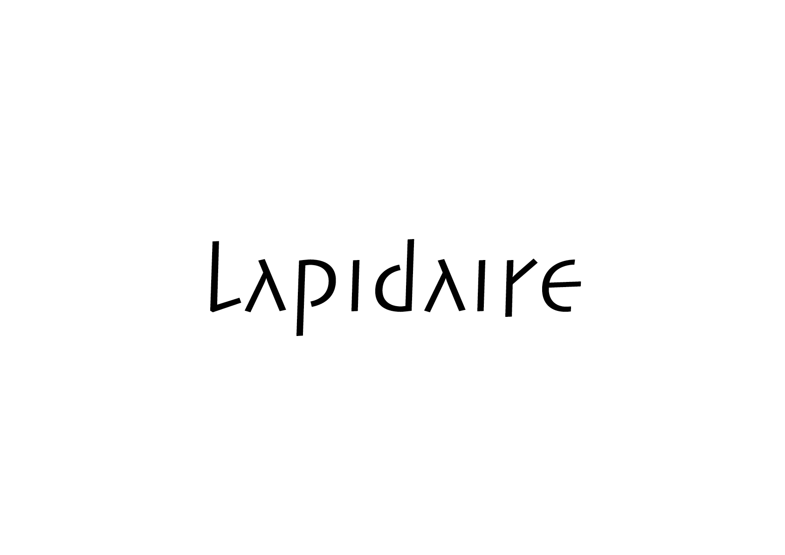
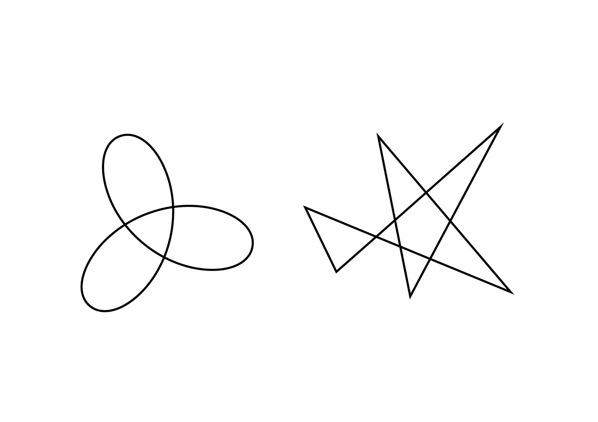

# 💥 *Denote a typeface*
  Sémiotique en typographie
	1.	Dénotation: la signification littérale et objective d’un texte.
 	2.	Connotation : les significations subjectives et culturelles associées à la forme typographique utilisée.
  
### &nbsp;

| |
|:---:|
| La forme des caractères change la connotation du texte[^1]           |

# 💬 Langage

###  Script

| |
|:---:|
| L'alphabet est une sorte d'écriture, un script phonétique, dont il existe de nombreuses variétés           |

###  Direction

| |
|:---:|
| La manière dont les symboles sont liés entre eux (séquence)           |

# ⚙️ Technique

| |
|:---:|
| L'écriture peut prendre autant de formes différentes qu'il y a d’outils pour la tracer           |

# 💥 Images

###  Lettre

| |
|:---:|
| L'image de la lettre est avant tout l'expression d'un style, d'une époque           |

###  Mot
###  Composition

# 🫥 Expression

| |
|:---:|
| «Maluma» ou «Takete»?           |

<!---
# 🧠 Système[^2]

| 💬 Langage | ⚙️ Technique | 💥 Images | 🫥 Expression |
|:---|:---|:---|:---|
| [Script]()           | [Écriture]()           | [Lettre]()           | [Coordonnées]()           |
| [Direction]()           | [Peinture]()           | [Mot]()           | [Articulation]()           |
|            | [Dessin]()           | [Composition]()           |            |
|            | [Construction]()           |            | [Arrangement]()           |
|            | [Combinaison]()           |            | [Soulignement]()           |
|            | [Gravure]()           |            | [Soulignement]()           |
|            |            |            | [Dérivation]()           |
|            |            |            | [Visualisation]()           |
|            |            |            | [Jeux]()           |
--->

### 📎 Sources

- **Karl Gerstner**  
  *Compendium for Literates, A System of Writing*, 1974
- **Adrian Frutiger**  
  *Type, Sign, Symbol*, 1980

[^1]: Adrian Frutiger, *Type, Sign, Symbol*, 1980
[^2]: Karl Gerstner, *Compendium for Literates, A System of Writing*, 1974

