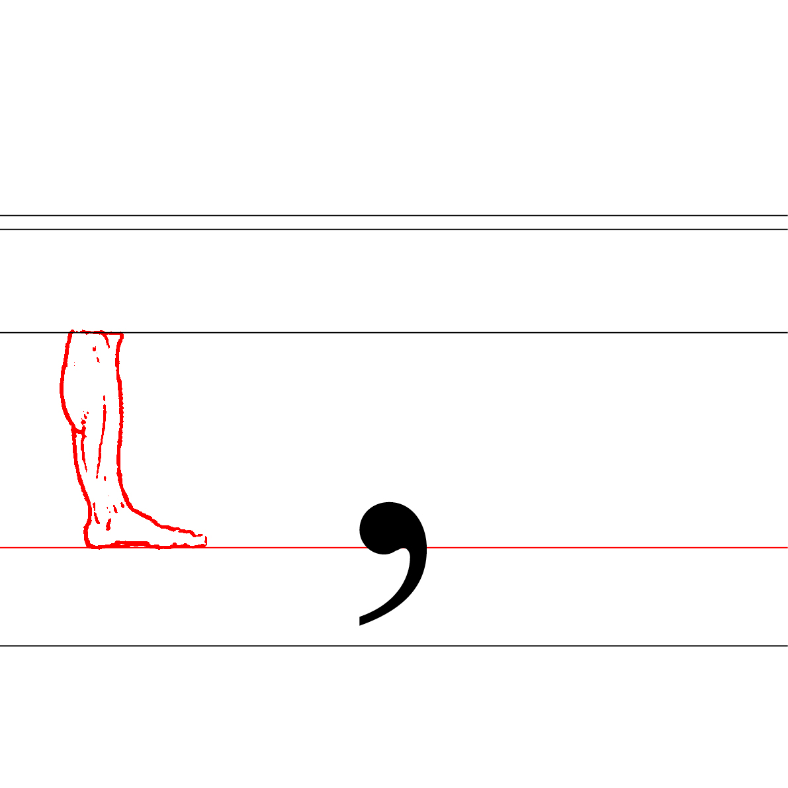

# 👁️ *Describe a typeface*
  Anatomie d'une police de caractères
# &nbsp;

## 🦴 Anatomie

| |
|:---:|
| Abc[^1]           |

| 📐 Proportions | 👂🏻 Parties | 🪨 Masses | ☝🏻 Terminaisons | 🎭 Substitutions |
|:---|:---|:---|:---|:---|
| [Ligne de base](#ligne-de-base)           | [Oeil](#oeil)           | [Pleins & déliés](#pleins--déliés)           | [Apex](#apex)           | [Ligature](#ligature)             |
| [Hauteur de x](#hauteur-de-x)           | [Oreille](#oreille)           | [Fût](#fût)           | [Empattement](#Empattement-serif)           | [Chiffres proportionels](#chiffres-proportionels)             |
| [Hateur des capitales](#hateur-des-capitales)           | [Épaule](#epaule)           | [Traverse](#traverse)           | [Goutte](#goutte)           | [Chiffres tabulaires](#chiffres-tabulaires)             |
| [Hateur des ascendantes](#hateur-des-ascendantes)           | [Panse](#panse)           | [Contre-forme](#contre-forme)           | [Boucle](#boucle)           | [Chiffres elzéviriens](#chiffres-elzéviriens-old-style)             |
| [Hateur des descendantes](#hateur-des-descendantes)           | [Colonne](#colonne)           | [Espace blanc](#espace-blanc)           | [Sortie](#sortie)           | [Chiffres numérateurs & dénominateurs](#chiffres-numérateurs--dénominateurs-superscripts--subscripts)             |
| [Bas de casse](#bas-de-casse)           | [Bras](#bras)           |            |           | [Italique](#Italique)             |
| [Capitales](#capitales)           | [Jambe](#jambe)           |            |            | [Petites capitales](#petites-capitales-small-caps)             |
| [Chasse](#chasse)           | [Pied](#pied)           |            |            |              |
| [Espacement](##espacement-spacing)           | [Queue](#queue)           |            |            |              |
| [Crénage](#crénage-kerning)           |            |           |            |             |
| [Mesures verticales](#mesures-verticales-vertical-metrics)           |            |            |           |             |
| [Corps](#Corps)           |            |           |            |             |
| [Em square](#em-square)           |            |            |            |              |

## 📐 Proportions

| |
|:---:|
|            |

### Ligne de base

| |
|:---:|
| La ligne de base est la ligne sur laquelle reposent toutes les lettres. C’est le repère principal pour l’alignement des caractères         |

### Hauteur de x

| |
|:---:|
| La hauteur de x correspond à la hauteur des lettres minuscules sans ascendantes ni descendantes, tel que le « x »            |

### Hateur des capitales

| |
|:---:|
| La hauteur des capitales est la hauteur des lettres majuscules, qui est normalement plus haute que celle des minuscules           |

### Hateur des ascendantes

| |
|:---:|
| La hauteur des ascendantes est la distance des parties de lettres minuscules qui s’élèvent au-dessus de la hauteur de x. Elle peut être égale ou inférieure à la hauteur des capitales           |

### Hateur des descendantes

| |
|:---:|
| La hauteur des descendantes est la distance entre la ligne de base et le point le plus bas des parties de lettres qui descendent en dessous de celle-ci           |

### Bas de casse

| |
|:---:|
| Le terme « bas de casse » fait référence aux lettres minuscules           |

### Capitales

| |
|:---:|
| Le terme « capitales » fait référence aux lettres majuscules           |

### Chasse

| |
|:---:|
| La chasse est la largeur totale occupée par un caractère, incluant l’espace autour du caractère lui-même           |

### Espacement (spacing)

| |
|:---:|
| L’espacement désigne la gestion des espaces autour d’un caractère au sein même de sa chasse           |

### Crénage (kerning)

| |
|:---:|
| Le crénage désigne la gestion de l’espace entre certaines paires de lettres pour en améliorer l’harmonie visuelle           |

### Mesures verticales (vertical metrics)

| |
|:---:|
| Les mesures verticales regroupent toutes les dimensions de hauteur dans une police, allant du glyphe le plus bas au plus haut           |

### Corps

| |
|:---:|
| Le corps est la taille totale de la police de caractères, mesurée de la ligne des ascendantes à celle des descendantes           |

### Em square

| |
|:---:|
| Abc           |

## 👂🏻 Parties

| |
|:---:|
| Abc           |

### Oeil

| |
|:---:|
| Abc           |

### Oreille

| |
|:---:|
| Abc           |

### Épaule

| |
|:---:|
| Abc           |

### Panse

| |
|:---:|
| Abc           |

### Colonne

| |
|:---:|
| Abc           |

### Bras

| |
|:---:|
| Abc           |

### Jambe

| |
|:---:|
| Abc           |

### Pied

| |
|:---:|
| Abc           |

### Queue

| |
|:---:|
| Abc           |

## 🪨 Masses

| |
|:---:|
| Abc           |

### Pleins & déliés

| |
|:---:|
| Abc           |

### Fût

| |
|:---:|
| Abc           |

### Traverse

| |
|:---:|
| Abc           |

### Contre-forme

| |
|:---:|
| Abc           |

### Espace blanc

| |
|:---:|
| Abc           |

## ☝🏻 Terminaisons

| |
|:---:|
| Abc           |

### Apex

| |
|:---:|
| Abc           |

### Empattement (sérif)

| |
|:---:|
| Abc           |

### Goutte

| |
|:---:|
| Abc           |

### Boucle

| |
|:---:|
| Abc           |

### Sortie

| |
|:---:|
| Abc           |

## 🎭 Substitutions

| |
|:---:|
| Abc           |

### Ligature

| |
|:---:|
| Abc           |

### Chiffres proportionels

| |
|:---:|
| Abc           |

### Chiffres tabulaires

| |
|:---:|
| Abc           |

### Chiffres elzéviriens (old style)

| |
|:---:|
| Abc           |

### Chiffres numérateurs & dénominateurs (superscripts & subscripts)

| |
|:---:|
| Abc           |

### Italique

| |
|:---:|
| Abc           |

### Petites capitales (small caps)

| |
|:---:|
| Abc           |
