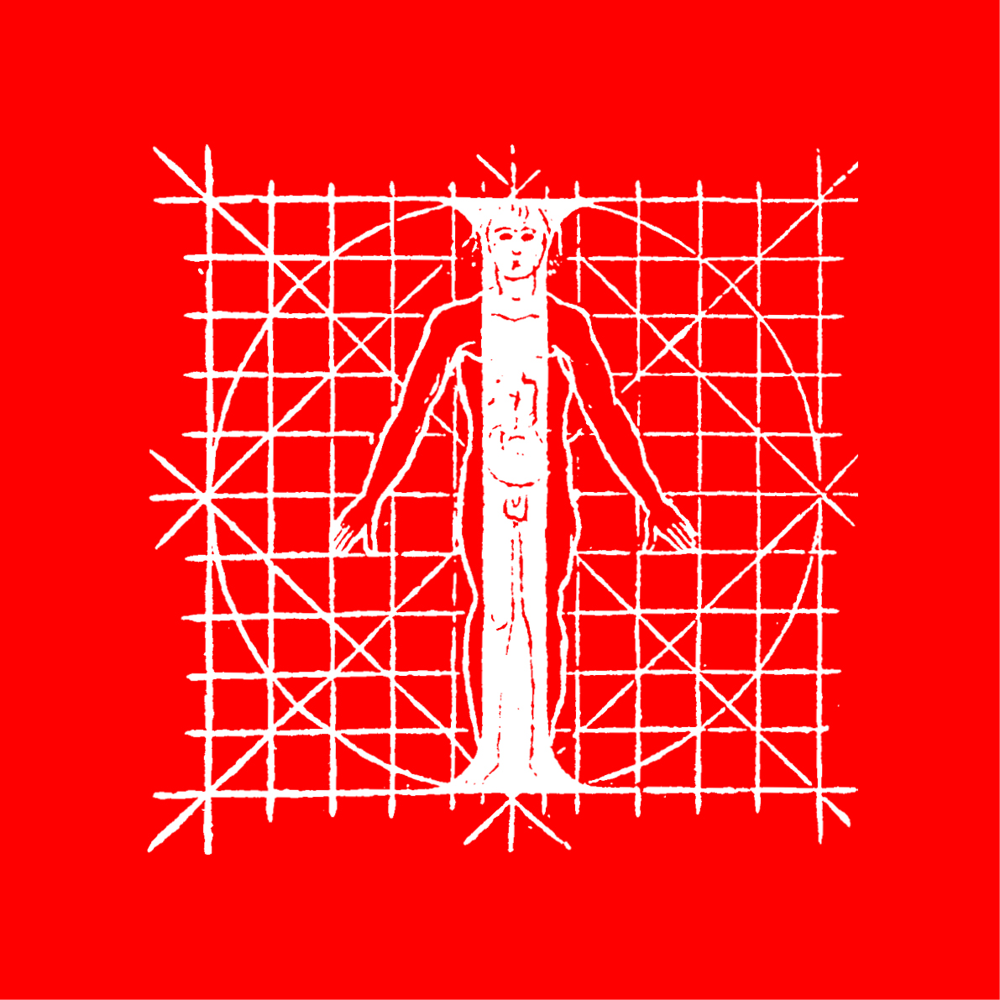
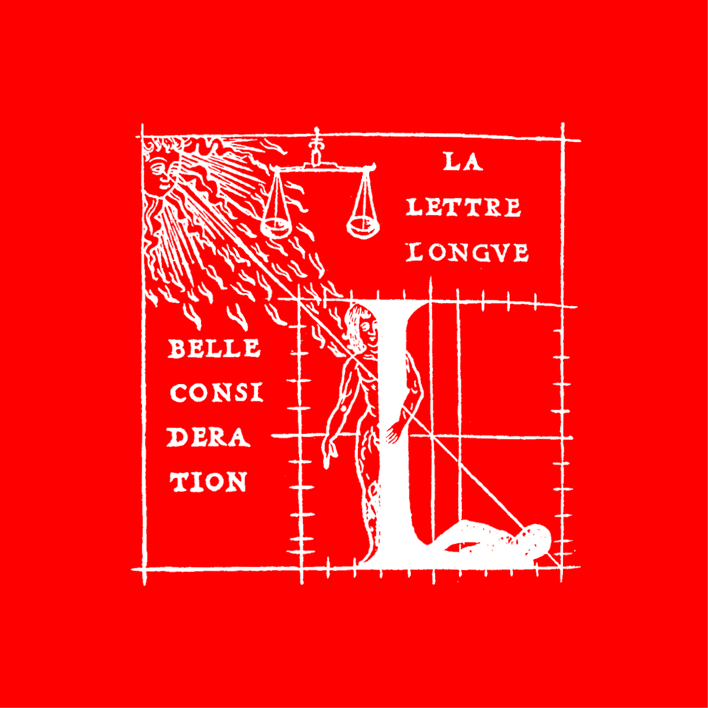

# 👁️ *Describe a typeface*
  Anatomie d'une police de caractères
# &nbsp;

## 🦴 Anatomie

| |
|:---:|
| Abc[^1]           |

| 📐 Proportions | 👂🏻 Parties | 🪨 Masses | ☝🏻 Terminaisons | 🎭 Substitutions |
|:---|:---|:---|:---|:---|
| [Ligne de base](#ligne-de-base)           | [Oeil](#oeil)           | [Pleins & déliés](#pleins--déliés)           | [Apex](#apex)           | [Ligature](#ligature)             |
| [Hauteur de x](#hauteur-de-x)           | [Oreille](#oeil)           | [Fût](#pleins--déliés)           | [Empattement](#apex)           | [Chiffres proportionels](#ligature)             |
| [Hateur des capitales](#hateur-des-capitales)           | [Épaule](#oeil)           | [Traverse](#pleins--déliés)           | [Goutte](#apex)           | [Chiffres tabulaires](#ligature)             |
| [Hateur des ascendantes](#hateur-des-ascendantes)           | [Panse](#oeil)           | [Contre-forme](#pleins--déliés)           | [Boucle](#apex)           | [Chiffres elzéviriens](#ligature)             |
| [Hateur des descendantes](#hateur-des-descendantes)           | [Colonne](#oeil)           | [Espace blanc](#pleins--déliés)           | [Sortie](#apex)           | [Chiffres numérateurs & dénominateurs](#ligature)             |
| [Bas de casse](#bas-de-casse)           | [Bras](#oeil)           |            |           | [Italique](#ligature)             |
| [Capitales](#capitales)           | [Jambe](#oeil)           |            |            | [Petites capitales](#ligature)             |
| [Chasse](#ehasse)           | [Pied](#oeil)           |            |            |              |
| [Espacement](##espacement-spacing)           | [Queue](#oeil)           |            |            |              |
| [Crénage](#crénage-kerning)           |            |           |            |             |
| [Mesures verticales](#mesures-verticales-vertical-metrics)           |            |            |           |             |
| [Corps](#Corps)           |            |           |            |             |
| [Em square](#em-square)           |            |            |            |              |

## 📐 Proportions

| |
|:---:|
| Abc           |

### Ligne de base

| |
|:---:|
| Abc           |

### Hauteur de x

| |
|:---:|
| Abc           |

### Hateur des capitales

| |
|:---:|
| Abc           |

### Hateur des ascendantes

| |
|:---:|
| Abc           |

### Hateur des descendantes

| |
|:---:|
| Abc           |

### Bas de casse

| |
|:---:|
| Abc           |

### Capitales

| |
|:---:|
| Abc           |

### Chasse

| |
|:---:|
| Abc           |

### Espacement (spacing)

| |
|:---:|
| Abc           |

### Crénage (kerning)

| |
|:---:|
| Abc           |

### Mesures verticales (vertical metrics)

| |
|:---:|
| Abc           |

### Corps

| |
|:---:|
| Abc           |

### Em square

| |
|:---:|
| Abc           |

## 👂🏻 Parties

| |
|:---:|
| Abc           |

### Oeil

| |
|:---:|
| Abc           |

### Oreille

| |
|:---:|
| Abc           |

### Épaule

| |
|:---:|
| Abc           |

### Panse

| |
|:---:|
| Abc           |

### Colonne

| |
|:---:|
| Abc           |

### Bras

| |
|:---:|
| Abc           |

### Jambe

| |
|:---:|
| Abc           |

### Pied

| |
|:---:|
| Abc           |

### Queue

| |
|:---:|
| Abc           |

## 🪨 Masses

| |
|:---:|
| Abc           |

### Pleins & déliés

| |
|:---:|
| Abc           |

### Fût

| |
|:---:|
| Abc           |

### Traverse

| |
|:---:|
| Abc           |

### Contre-forme

| |
|:---:|
| Abc           |

### Espace blanc

| |
|:---:|
| Abc           |

## ☝🏻 Terminaisons

| |
|:---:|
| Abc           |

### Apex

| |
|:---:|
| Abc           |

### Empattement (sérif)

| |
|:---:|
| Abc           |

### Goutte

| |
|:---:|
| Abc           |

### Boucle

| |
|:---:|
| Abc           |

### Sortie

| |
|:---:|
| Abc           |

## 🎭 Substitutions

| |
|:---:|
| Abc           |

### Ligature

| |
|:---:|
| Abc           |

### Chiffres proportionels

| |
|:---:|
| Abc           |

### Chiffres tabulaires

| |
|:---:|
| Abc           |

### Chiffres elzéviriens (old style)

| |
|:---:|
| Abc           |

### Chiffres numérateurs & dénominateurs (superscripts & subscripts)

| |
|:---:|
| Abc           |

### Italique

| |
|:---:|
| Abc           |

### Petites capitales (small caps)

| |
|:---:|
| Abc           |
