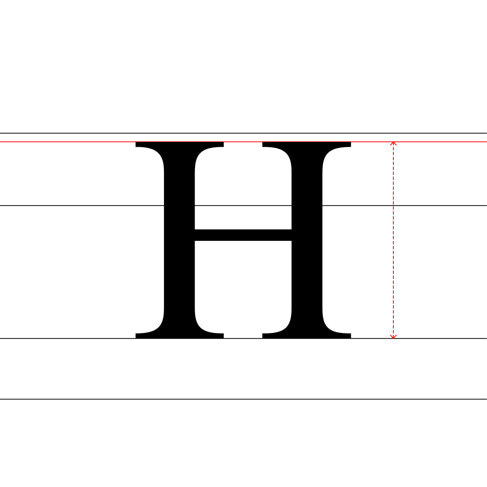
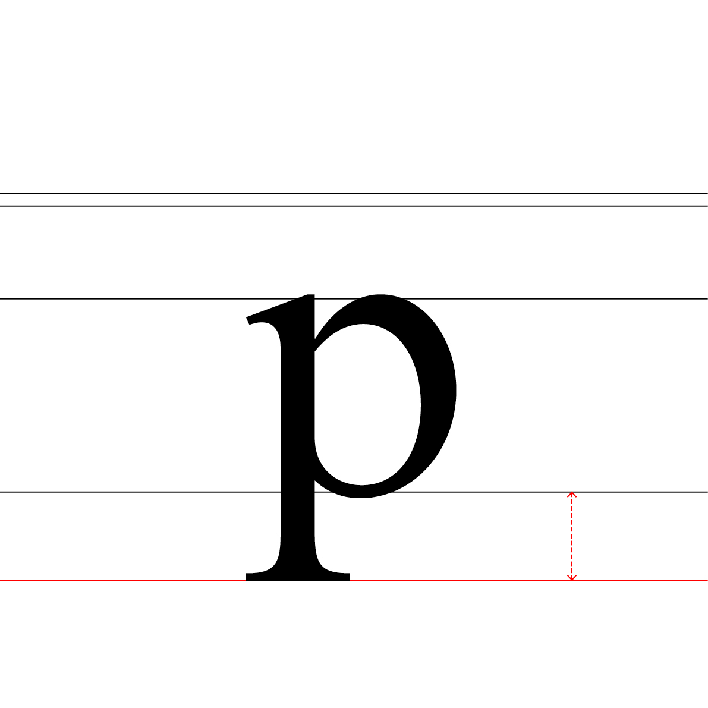
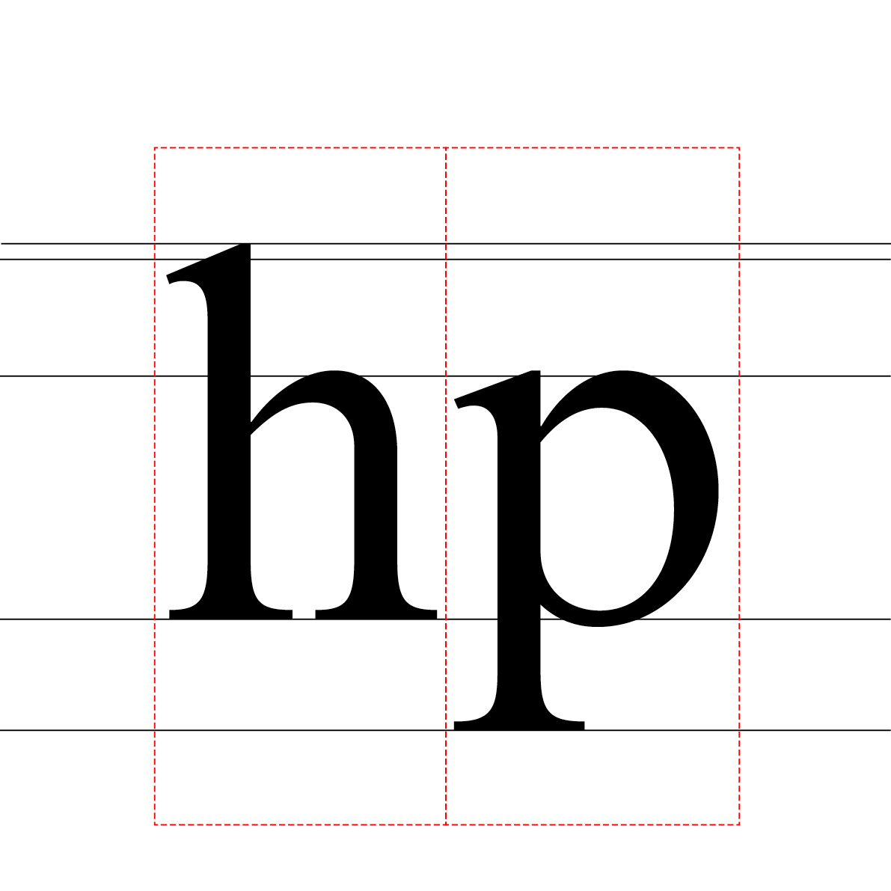
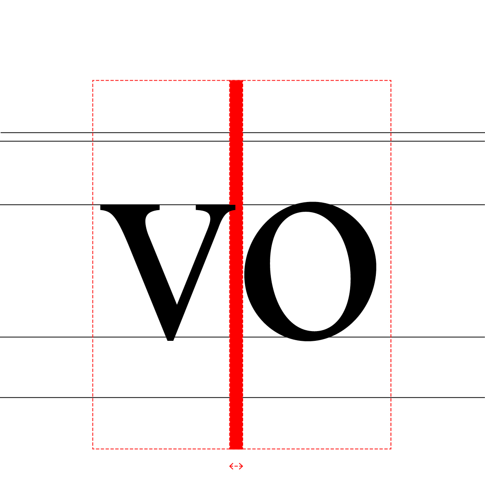
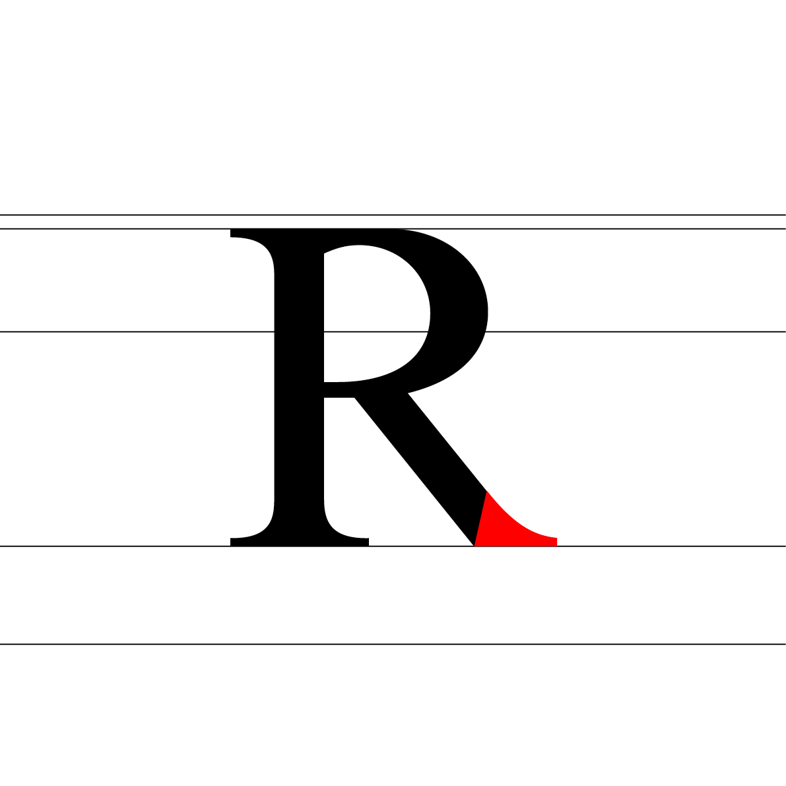
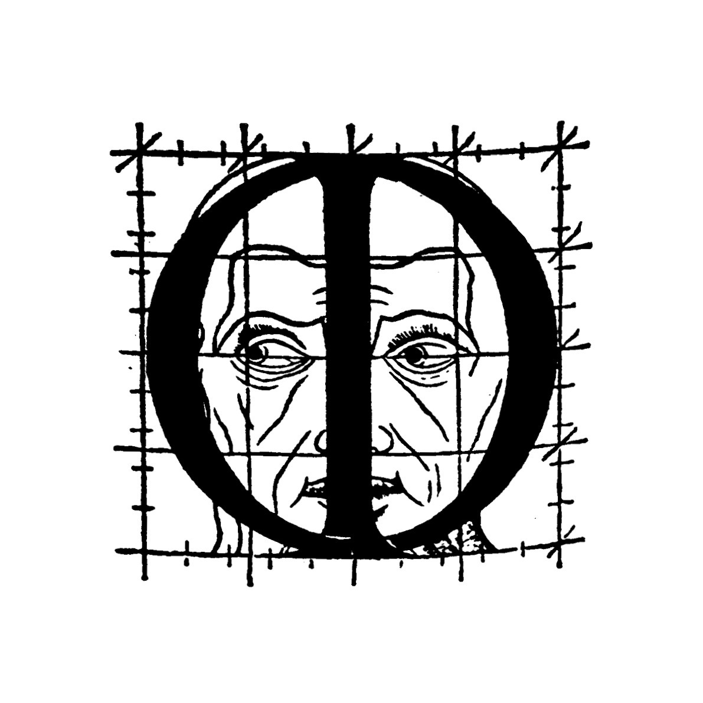

# 👁️ *Describe a typeface*
  Anatomie d'une police de caractères
# &nbsp;

## 🦴 Anatomie

| |
|:---:|
| Abc[^1]           |

## 📐 Proportions

| |
|:---:|
| Abc           |

### Ligne de base

| |
|:---:|
| Abc           |

### Hauteur de x

| |
|:---:|
| Abc           |

### Hateur des capitales

| |
|:---:|
| Abc           |

### Hateur des ascendantes

| |
|:---:|
| Abc           |

### Hateur des descendantes

| |
|:---:|
| Abc           |

### Bas de casse

| |
|:---:|
| Abc           |

### Capitales

| |
|:---:|
| Abc           |

### Chasse

| |
|:---:|
| Abc           |

### Spacing

| |
|:---:|
| Abc           |

### Kerning

| |
|:---:|
| Abc           |

### Vertical metrics

| |
|:---:|
| Abc           |

### Corps

| |
|:---:|
| Abc           |

### Em square

| |
|:---:|
| Abc           |

## 👂🏻 Parties

| |
|:---:|
| Abc           |

### Oeil

| |
|:---:|
| Abc           |

### Oreille

| |
|:---:|
| Abc           |

### Épaule

| |
|:---:|
| Abc           |

### Panse

| |
|:---:|
| Abc           |

### Colonne

| |
|:---:|
| Abc           |

### Bras

| |
|:---:|
| Abc           |

### Jambe

| |
|:---:|
| Abc           |

### Pied

| |
|:---:|
| Abc           |

### Queue

| |
|:---:|
| Abc           |

## 🪨 Masses

| |
|:---:|
| Abc           |

### Pleins & déliés

| |
|:---:|
| Abc           |

### Fûts

| |
|:---:|
| Abc           |

### Traverses

| |
|:---:|
| Abc           |

### Forme & contre-forme

| |
|:---:|
| Abc           |

### Contre-formes avec et sans sérifs

| |
|:---:|
| Abc           |

### Contre-formes

| |
|:---:|
| Abc           |

## ☝🏻 Terminaisons

## 🎭 Substitutions
