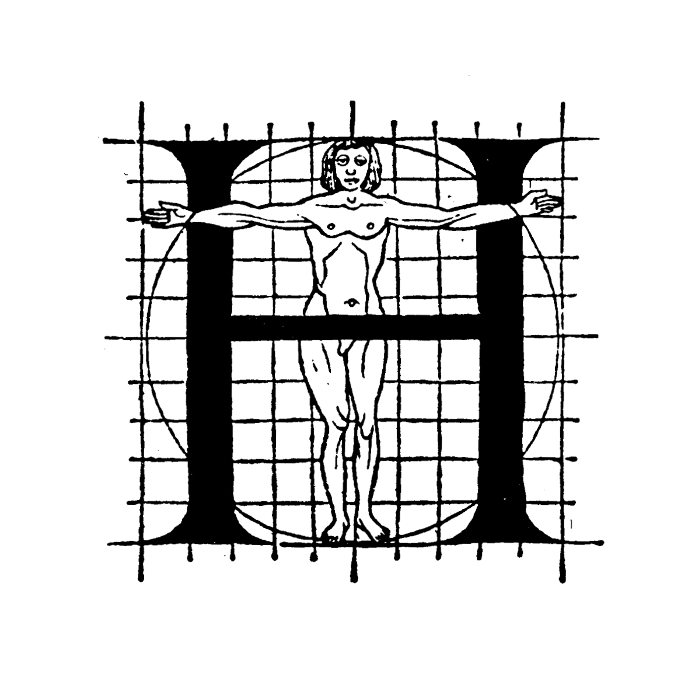
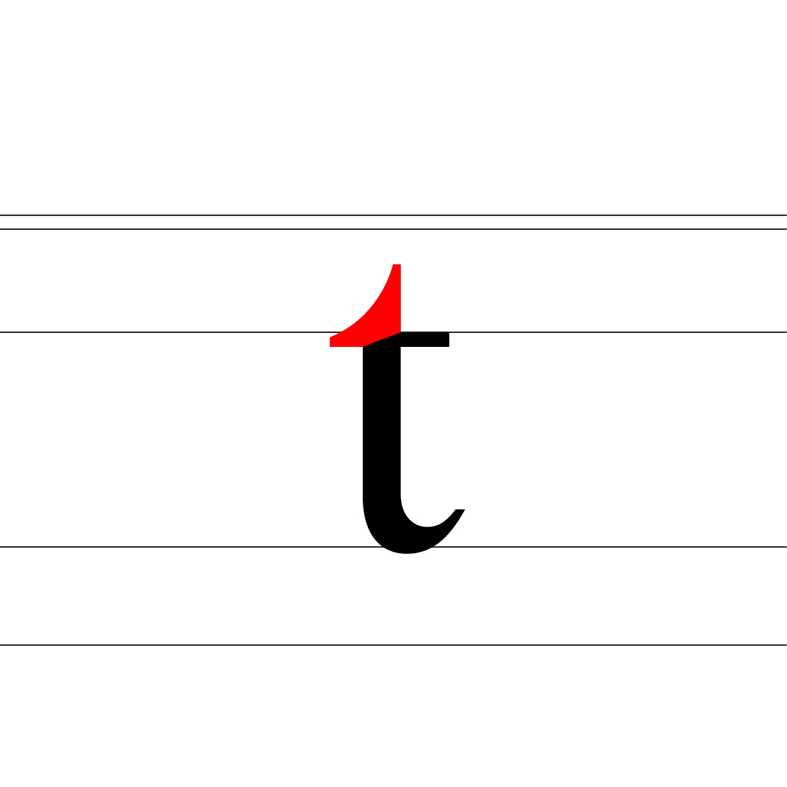

# 👁️ *Describe a typeface*
  Anatomie d'une police de caractères
# &nbsp;

## 🦴 Anatomie

| |
|:---:|
| Abc[^1]           |

## 📐 Proportions

| |
|:---:|
| Abc           |

### Ligne de base

| |
|:---:|
| Abc           |

### Hauteur de x

| |
|:---:|
| Abc           |

### Hateur des capitales

| |
|:---:|
| Abc           |

| |
|:---:|
| Abc           |

| |
|:---:|
| Abc           |

| |
|:---:|
| Abc           |

| |
|:---:|
| Abc           |

| |
|:---:|
| Abc           |

| |
|:---:|
| Abc           |

| |
|:---:|
| Abc           |

| |
|:---:|
| Abc           |

| |
|:---:|
| Abc           |

| |
|:---:|
| Abc           |

## 👂🏻 Parties

| |
|:---:|
| Abc           |

| |
|:---:|
| Abc           |

| |
|:---:|
| Abc           |

| |
|:---:|
| Abc           |

| |
|:---:|
| Abc           |

| |
|:---:|
| Abc           |

| |
|:---:|
| Abc           |

| |
|:---:|
| Abc           |

| |
|:---:|
| Abc           |

| |
|:---:|
| Abc           |

| |
|:---:|
| Abc           |

| |
|:---:|
| Abc           |

## 🪨 Masses

## ☝🏻 Terminaisons

## 🎭 Substitutions
