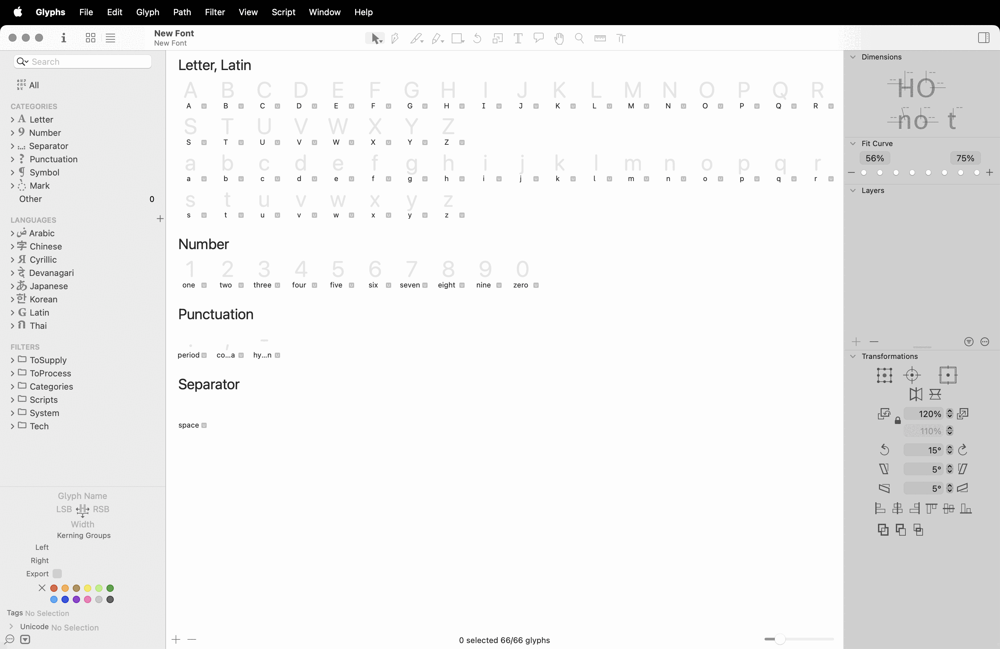
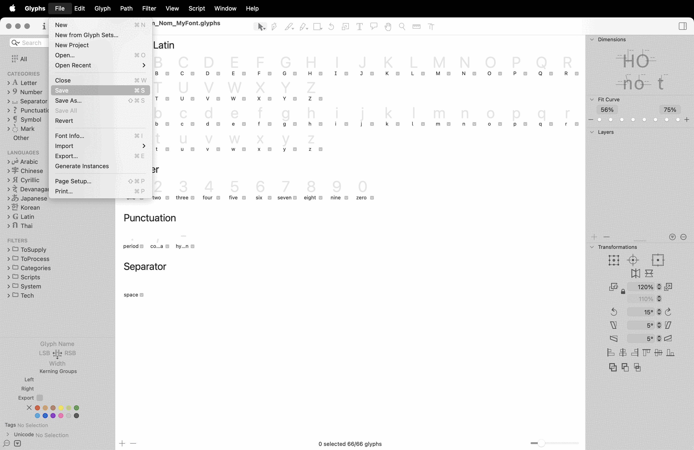
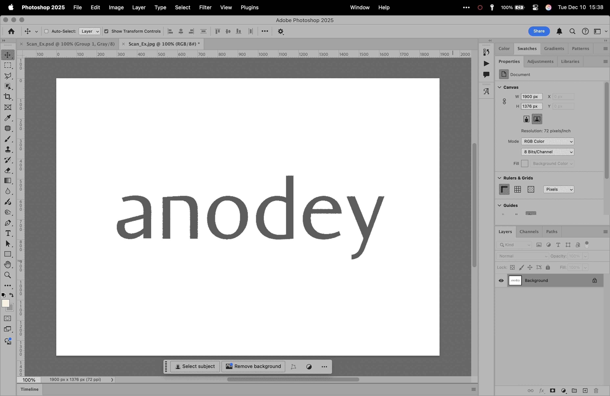
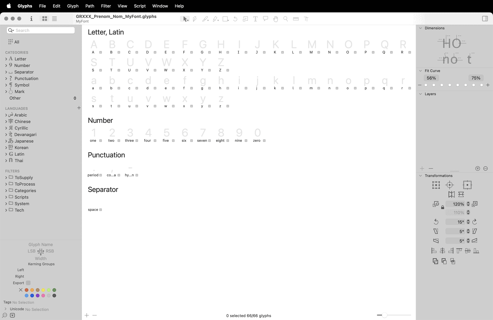
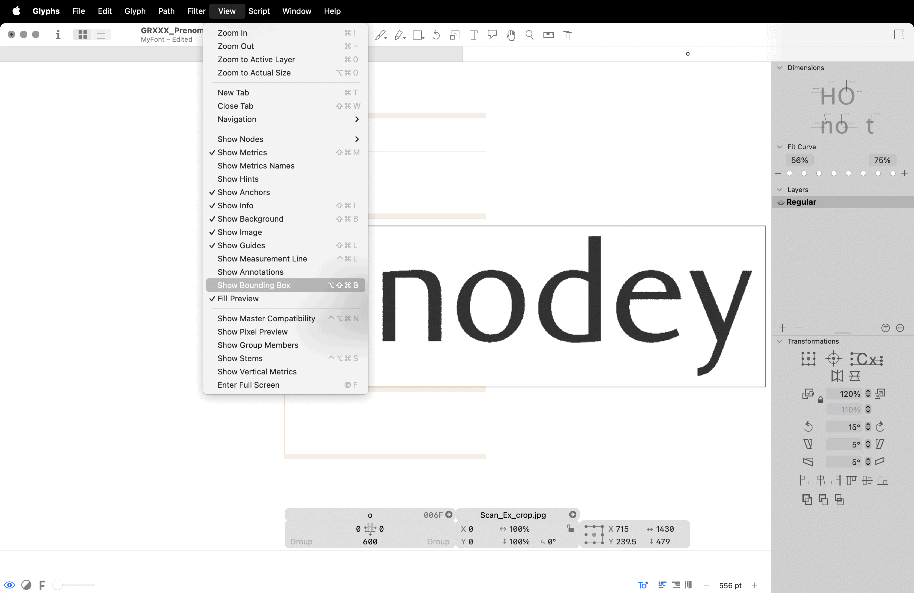
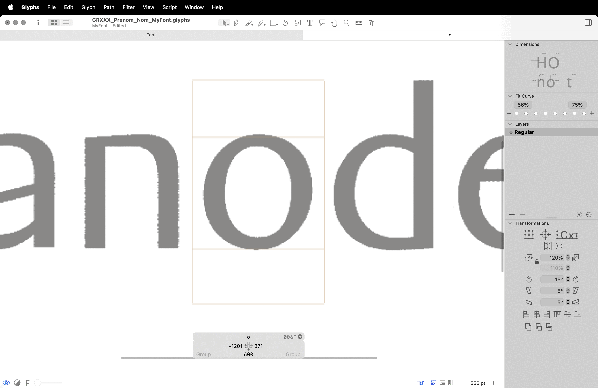
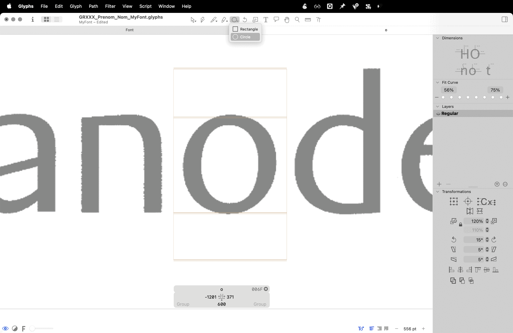
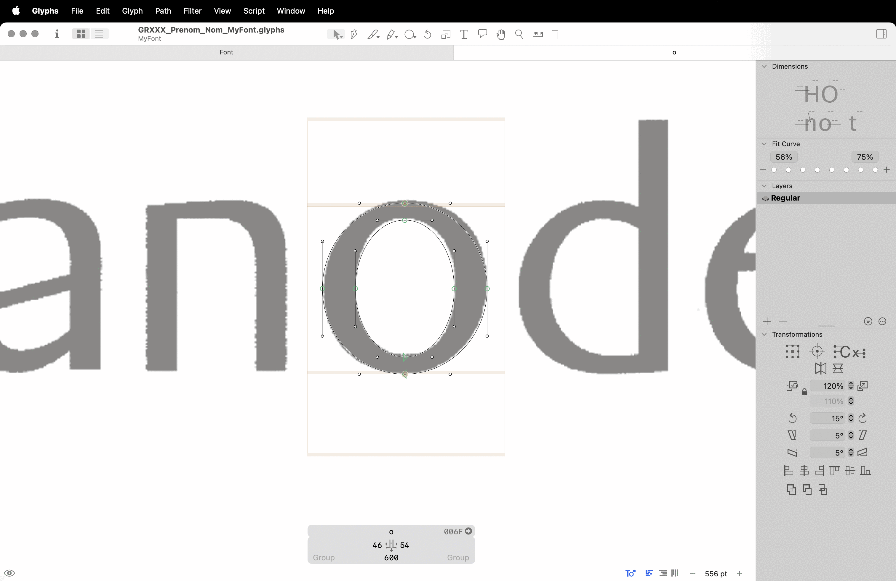
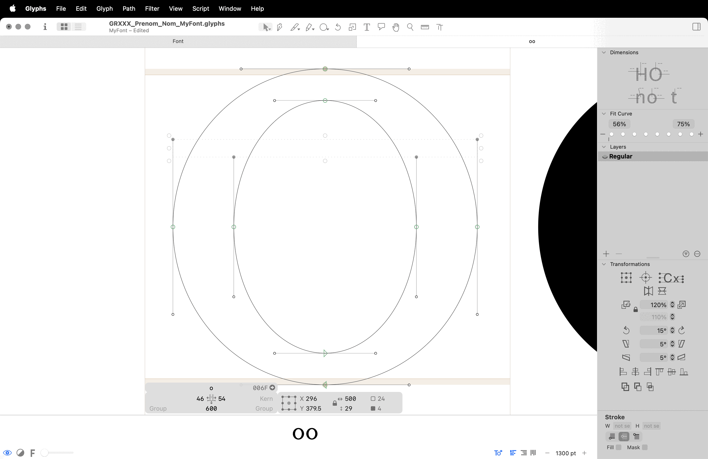
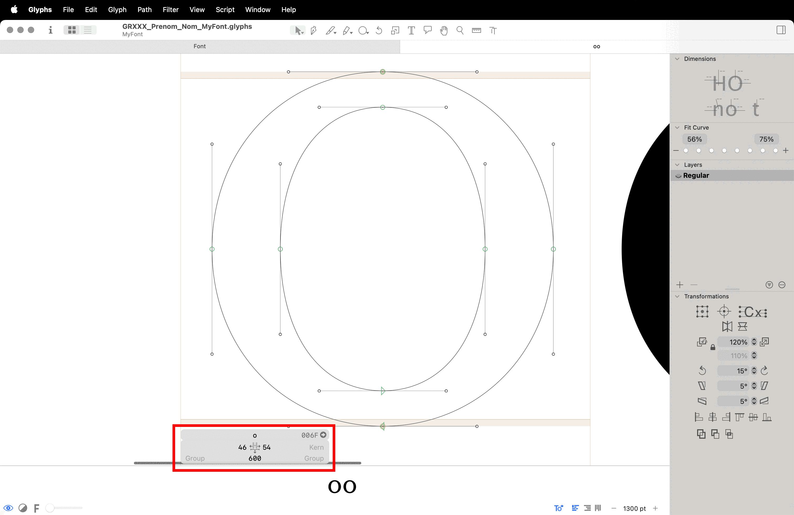

# 🖨️ Digitalization
  Numérisation
### &nbsp;

| |
|:---:|
| abc[^1]           |

Numérisation

# 📝 Créer une nouvelle fonte

### Nouveau fichier

| |
|:---:|
| Fichier > Nouveau document           |

### Nommer la fonte

| |
|:---:|
| Fichier > Informations de la police           |

### Enregistrer le fichier

| |
|:---:|
| Fichier > Enregistrer           |

### Préparer votre scan

| |
|:---:|
| Niveaux + Recadrage dans Photoshop           |

### Importer votre scan

| |
|:---:|
| Drag & drop depuis le finder dans la case du glyphe          |

### Redimenssioner

| |
|:---:|
| Affichage > Afficher la bounding-box          |

### Définissez les proportions

| |
|:---:|
| Fichier > Informations de la police > Masters > Mesures           |

### Vérouiller le scan

| |
|:---:|
| Clic droit > vérouiller l‘image           |

### Dessiner

| |
|:---:|
| Formes privitives           |

### Prévisualiser

| |
|:---:|
| Bouton oeil en bas à gauche           |

### Éditer

| |
|:---:|
| Éditer les formes en déplacer les points de manière systématique           |

### Espacer

| |
|:---:|
| Définir les valeurs d’espacement de manière systématique           |

