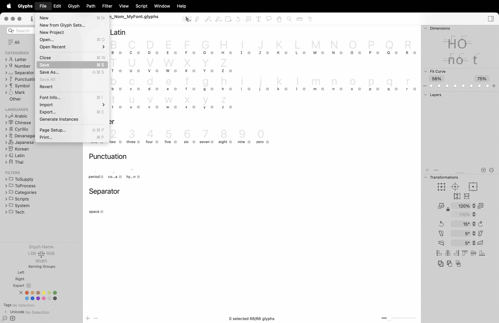
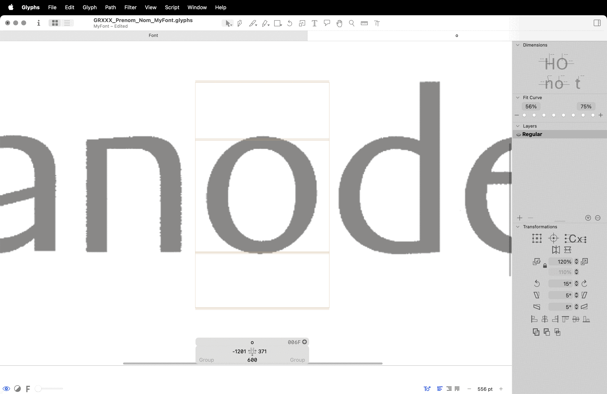
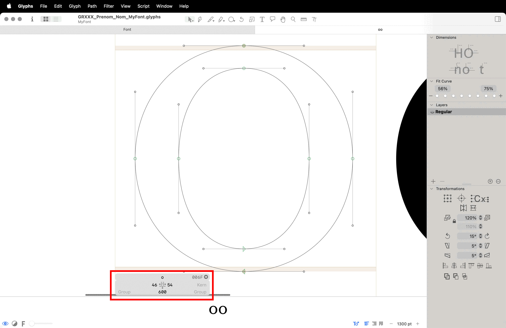

# 📐 *Draw vectors*
  Dessin vectoriel
###  

| |
|:---:|
| Frutiger[^1]           |

Abc

# 📝 Créer une nouvelle fonte

### Nouveau fichier

| |
|:---:|
| Fichier > Nouveau document           |

### Nommer la fonte

| |
|:---:|
| Fichier > Informations de la police           |

### Enregistrer le fichier

| |
|:---:|
| Fichier > Enregistrer           |

### Préparer votre scan

| |
|:---:|
| Niveaux + Recadrage dans Photoshop           |

### Importer votre scan

| |
|:---:|
| Drag & drop depuis le finder dans la case du glyphe          |

### Redimenssioner

| |
|:---:|
| Affichage > Afficher la bounding-box          |

### Définissez les proportions

| |
|:---:|
| Fichier > Informations de la police > Masters > Mesures           |

### Vérouiller le scan

| |
|:---:|
| Clic droit > vérouiller l‘image           |

### Dessiner

| |
|:---:|
| Formes privitives           |

### Prévisualiser

| |
|:---:|
| Bouton oeil en bas à gauche           |

### Éditer

| |
|:---:|
| Éditer les formes en déplacer les points de manière systématique           |

### Espacer

| |
|:---:|
| Définir les valeurs d’espacement de manière systématique           |

# 🖥️ Interfaçe

### Vues

| |
|:---:|
| Characterset, plan de travail           |

### Types de point

| |
|:---:|
| Carré, rond, losange, contrôle           |

### Segments

| |
|:---:|
| Courbes, droites           |

### Plans

| |
|:---:|
| 1er plan, 2eme plan           |

### Calques (sauvegardes)

| |
|:---:|
| Icône "+"           |

### Letterbox

| |
|:---:|
| Largeur, espace à gauche, espace à droite           |

# 🛠️ Outils

### Formes

| |
|:---:|
| Abc           |

### Plume

| |
|:---:|
| Abc           |

### Règle

| |
|:---:|
| Abc           |

### Fusion

| |
|:---:|
| Abc           |

### Déplacement des points

| |
|:---:|
| Abc           |

# ✏️ Principes de dessin

### 1er Point

| |
|:---:|
| Abc           |

### Sens des tracés

| |
|:---:|
| Forme, contreforme           |

### Triangle magique

| |
|:---:|
| Bounding box segment verification           |

### Points aux extrémités

| |
|:---:|
| Ajouter les extrêmes           |

### Points orthogonaux???

| |
|:---:|
| Bounding box?           |

### Minimum de points possible

| |
|:---:|
| Nettoyer les tracés           |

# 📏 Spacing

### Systématiser les valeurs

| |
|:---:|
| Fûts, overshoot, etc           |

### Systématiser le spacing

| |
|:---:|
| =o, =o+10           |

# 📦 Export

### Générer les fonctionnalités OpenType

| |
|:---:|
| Fichier > Informations de la police > Fonctionnalités > Générer + Compiler             |

### Créer le dossier d'export Adobe Fonts

| |
|:---:|
| ~/Library/Application Support/Adobe/Fonts            |

### Exporter

| |
|:---:|
| Fichier > Exporter > PostScriptCFF, .otf, supprimer le chevauchement, autohint, destination: dossier Adobe            |

# 🔍 Test

### Choississez votre fonte dans le menu déroulant de InDesign

| |
|:---:|
| ~/Library/Application Support/Adobe/Fonts            |

# 🐞 Debug des erreurs communes

### Autohinting

| |
|:---:|
| Aller vérifier la lettre mentionnée dans la fenêtre d'erreur (corriger les tracés)            |
