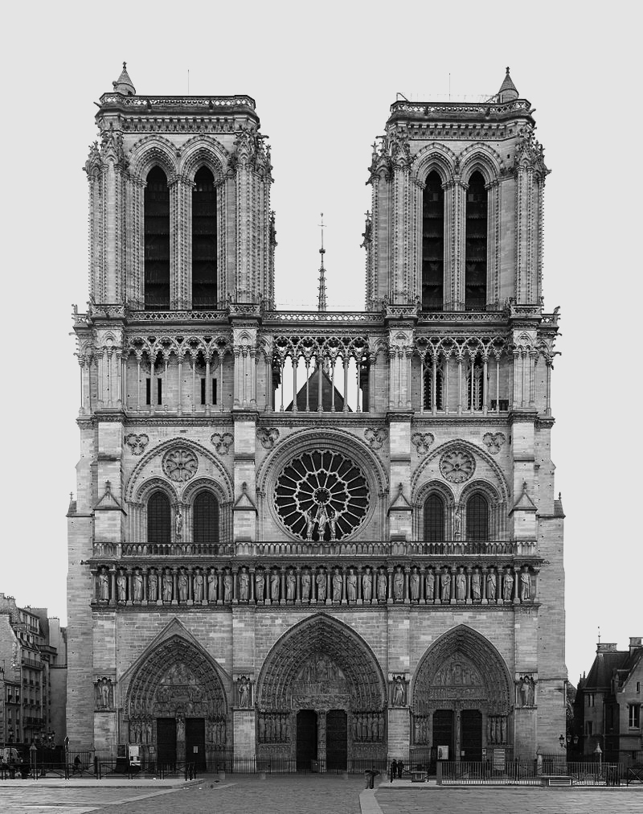
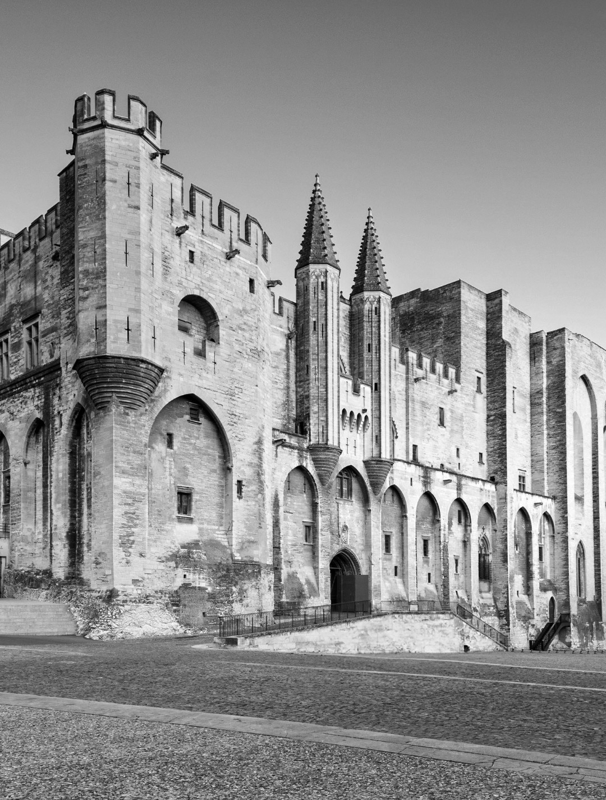
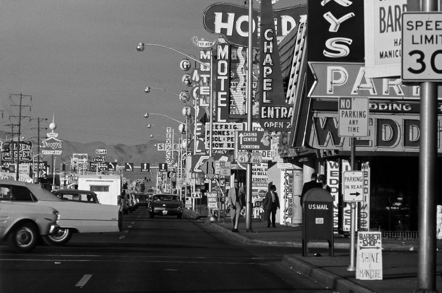
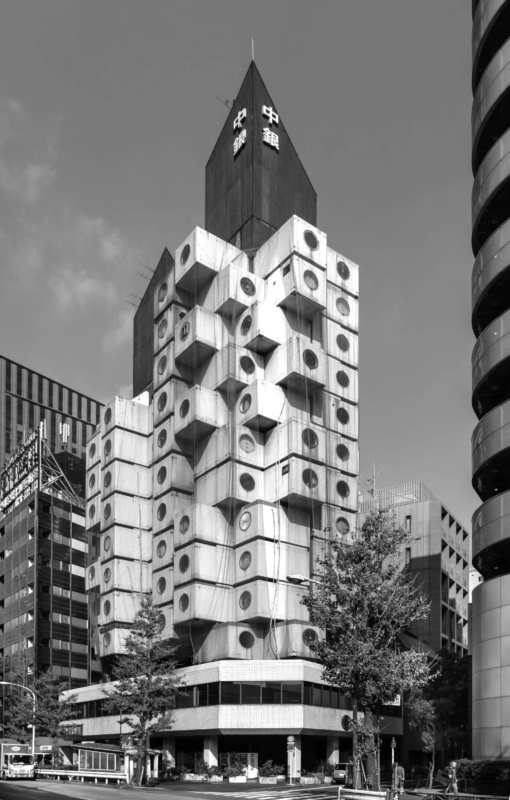
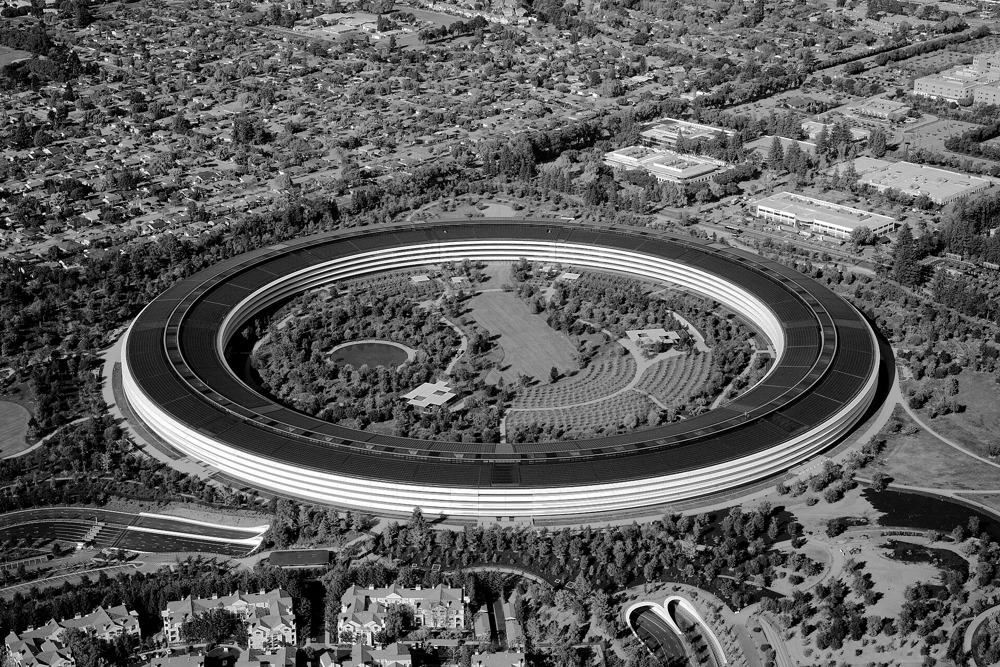

# Typographie 1.1. Lettre: classification

&nbsp;
&nbsp;
&nbsp;

# Brief
    1.  Créer un dossier « Typographie-1-1-Lettre-Classification »
        créer un sous-dossier « Liens »
    2.  Créer un fichier InDesign « Typographie-1-1-Lettre-Classification.indd »
        mode: impression
        nombre de pages: 26
        affichage des pages: vis-à-vis
        format de page: A4 (210 × 297 mm)
        marges: 10 mm
        fonds-perdus: 3 mm
    3.  Page de gauche
        télécharger les photographies des différentes époques architecturales
        placer les images dans le dossier « Liens »
        dans un bloc image, importer 1 image pour chaque double page
        si l’image est horizontale, la tourner de 90° dans le sens contraire des aiguilles d’une montre
        format pleine page
        remplir des fonds perdus
    4.  Page de droite
        localiser dans la typothèque le dossier de la classification concernée par l’image
        choisir et activer une police dans ce dossier
        dans un bloc texte qui épouse les marges, inscrire avec la police activée les informations suivantes

        Classification
        Technique

        ABCDEFGHIJK
        LMNOPQRSTUV
        WXYZ

        abcdefghijk
        lmnopqrstuv
        wxyz

        Bâtiment, ville, année

    5.  Les informations requises se trouvent:
        classification: dans la légende de l’image
        technique: sur la page chronologie
        bâtiment: dans la légende de l’image

# Ressources

| |
|:---:|
| Arc de Constantin, 315, Rome |

| |
|:---:|
| Arc de Constantin, 315, Rome |

| |
|:---:|
| Arc de Constantin, 315, Rome |

| |
|:---:|
| Arc de Constantin, 315, Rome |

| |
|:---:|
| Arc de Constantin, 315, Rome |

| |
|:---:|
| Arc de Constantin, 315, Rome |

| |
|:---:|
| Arc de Constantin, 315, Rome |

| |
|:---:|
| Arc de Constantin, 315, Rome |

| |
|:---:|
| Arc de Constantin, 315, Rome |

| |
|:---:|
| Arc de Constantin, 315, Rome |

| |
|:---:|
| Arc de Constantin, 315, Rome |

| |
|:---:|
| Arc de Constantin, 315, Rome |

| |
|:---:|
| Arc de Constantin, 315, Rome |