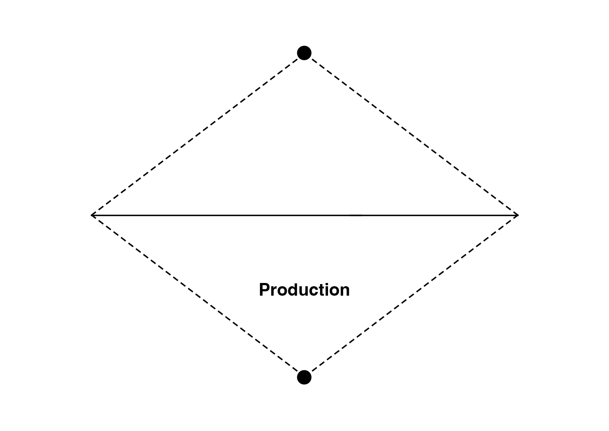

# 📊 Critères d'évaluation

- [Exercice technique](#Exercice-technique)
- [Exercice créatif](#Exercice-créatif)
- [Processus](#Processus)

# &nbsp;
# &nbsp;

# Exercice technique  

| |
|:---:|
| Juste ou faux | 

# Exercice créatif  

| |
|:---:|
| Abc | 

## 6 pts Organisation  

| |
|:---:|
| Abc | 

## 6 pts Développement  

| |
|:---:|
| Abc | 

## 6 pts Production  

| |
|:---:|
| Abc | 

# Produire  

| |
|:---:|
| Il faut produire une idée pour pouvoir l'évaluer |

# Collaborer  

| |
|:---:|
| Il faut produire une idée pour pouvoir l'évaluer |

# Prendre du plaisir  

| |
|:---:|
| Il faut produire une idée pour pouvoir l'évaluer |