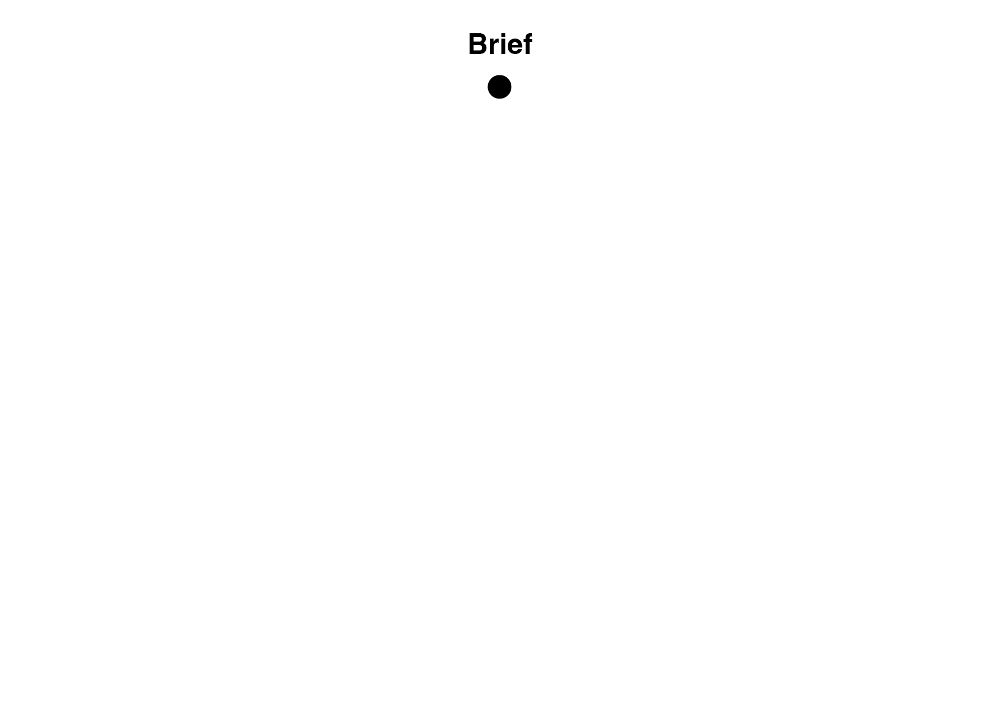
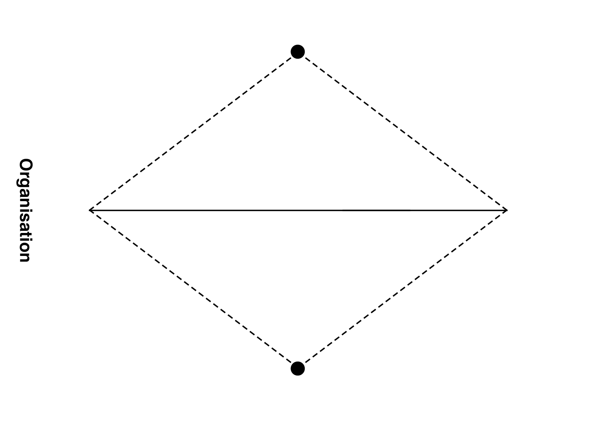
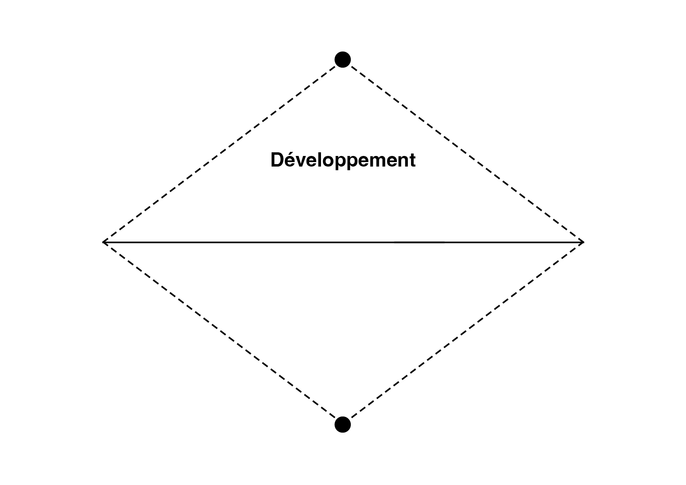

# 📊 Critères de notation

| Domaine | Mot-clé | Indicateurs | Points |
|:---|:---|:---|:---|
| Organisation | Gestion | Autonomie, compréhension du brief, gestion du temps et du matériel | 6 pts |
| Développement | Quantité | Recherche, itérations, variété, regard critique | 6 pts |
| Production | Qualité | Synthèse, impact graphique, propreté technique | 6 pts |

| |
|:---:|
| Processus: organisation, développement, production | 

<!-- # Exercice technique  

| |
|:---:|
| Juste ou faux |  -->

<!-- ## 6 pts Organisation (gestion)  

| |
|:---:|
| Autonomie, compréhension du brief, gestion du temps et du matériel | 

## 6 pts Développement (quantité)  

| |
|:---:|
| Recherche, itérations, variété, regard critique | 

## 6 pts Production (qualité)  

| |
|:---:|
| Synthèse, impact graphique, propreté technique |  -->