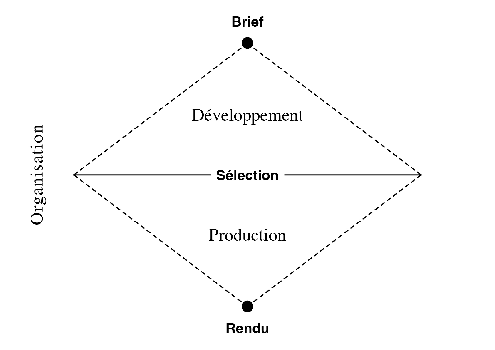

# 📊 Critères de notation

### &nbsp;

  

  <table id="eval-table">
    <thead>
      <tr>
        <th>Domaine</th>
        <th>Mot-clé</th>
        <th>Indicateurs</th>
        <th>Points</th>
        <th>Max</th>
        <th>Note</th>
      </tr>
    </thead>
    <tbody>
      <tr>
        <td><strong>Organisation</strong></td>
        <td>Gestion</td>
        <td>Compréhension, gestion du temps, gestion du matériel, proactivité</td>
        <td><input type="number" min="0" max="6" step="0.1" inputmode="decimal" oninput="recalcEval()"></td>
        <td>6 pts</td>
        <td id="note-cell" rowspan="3" style="text-align:center; vertical-align:middle;">
          

            <button id="" type="button" style="background:none; border:none; padding:0; font:inherit; color:#57606a; cursor:pointer; text-decoration:none;">
              &nbsp;
            </button>
          

          

            0.00
          

          

            <button id="save-btn" type="button" style="background:none; border:none; padding:0; font:inherit; color:#57606a; cursor:pointer; text-decoration:none;">
              export
            </button>
          

        </td>
      </tr>
      <tr>
        <td><strong>Développement</strong></td>
        <td>Quantité</td>
        <td>Recherche, itérations, variété, pertinence, regard critique</td>
        <td><input type="number" min="0" max="6" step="0.1" inputmode="decimal" oninput="recalcEval()"></td>
        <td>6 pts</td>
      </tr>
      <tr>
        <td><strong>Production</strong></td>
        <td>Qualité</td>
        <td>Sélection, aboutissement, impact graphique, précision technique, argumentation</td>
        <td><input type="number" min="0" max="6" step="0.1" inputmode="decimal" oninput="recalcEval()"></td>
        <td>6 pts</td>
      </tr>
    </tbody>
  </table>

  

### &nbsp;

| |
|:---:|
| Processus: organisation, développement, production | 

<!-- # Exercice technique  

| |
|:---:|
| Juste ou faux |  -->

<!-- ## 6 pts Organisation (gestion)  

| |
|:---:|
| Autonomie, compréhension du brief, gestion du temps et du matériel | 

## 6 pts Développement (quantité)  

| |
|:---:|
| Recherche, itérations, variété, regard critique | 

## 6 pts Production (qualité)  

| |
|:---:|
| Synthèse, impact graphique, propreté technique |  -->