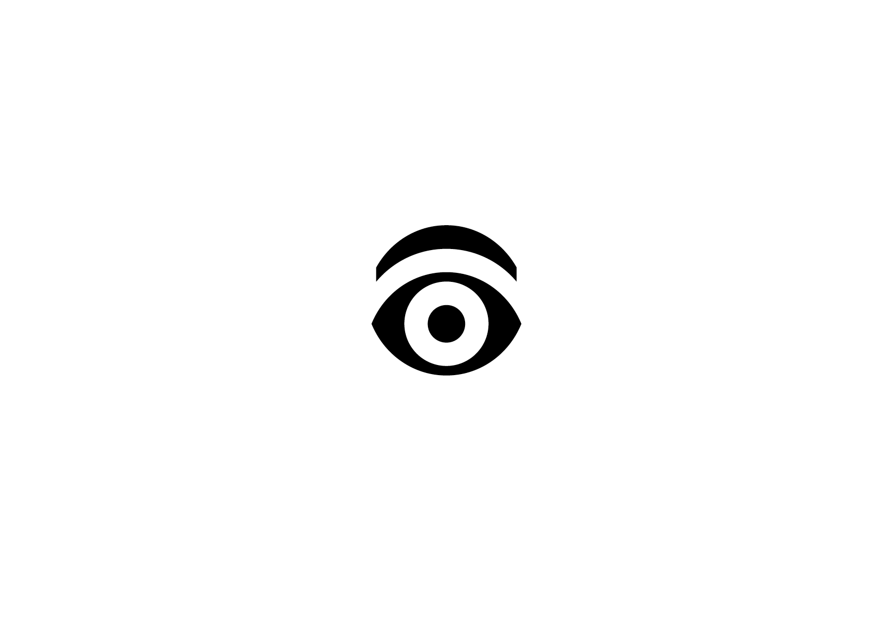

# 🪜 Méthode

&nbsp;

| |
|:---:|
| Chercher de tous les côtés |

# Savoir-faire

En graphisme, comme dans toute forme d’expression créative, l’art découle du savoir-faire. En danse, il s’agit de maîtriser les pas de base; en musique, d’apprendre les gammes ; en mathématiques, de connaître les méthodes fondamentales. En typographie, le savoir-faire concerne les unités typographiques.

# Apprendre les règles / Dépasser les règles

La contrainte est la condition de l’inventivité. On ne peut transgresser une règle qu’en comprenant d’abord sa fonction, et en la remplaçant par un principe tout aussi cohérent. Il faut donc commencer par maîtriser les règles: l’inventivité ne réside pas tant dans leur rupture que dans la manière de les interpréter, de les détourner ou de les questionner.

# Collection de paramètres

Ce cours ne fournit en aucun cas des réponses toutes faites, mais présente un catalogue de paramètre à prendre en compte pour le développememt de tout types de travaux typographiques. Si il parvient à stimuler les apprenants à expérimenter et produire des travaux originaux, systématiques et imaginatifs, il aura atteint son objectif.

# Produire  

Produire, c’est confronter ses intuitions à la réalité. Il est impossible d’évaluer la valeur d’une idée uniquement dans sa tête: il faut la produire, même sous forme d’esquisse, pour en mesurer le potentiel.

# Documenter  

Il est essentiel de documenter (archiver) toutes les étapes du processus de design. Conserver toutes les versions permet de comparer les solutions entre elles, de comprendre le chemin parcouru et de retracer l’évolution du projet.

# Collaborer  

La collaboration enrichit le processus créatif : recueillir des avis, partager ses points de vue et confronter ses travaux permet d’élargir les perspectives et de renforcer la qualité des projets.

<!-- # Prendre du plaisir  

| |
|:---:|
| Il faut produire une idée pour pouvoir l'évaluer | -->