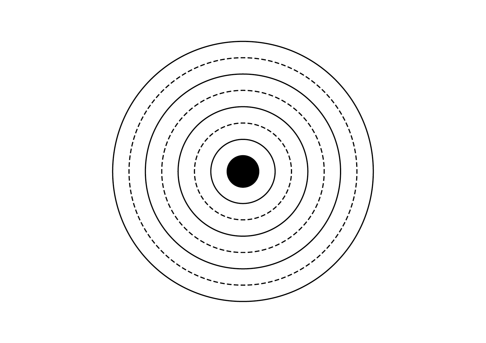

# 🎯 Objectifs

- [Exercice technique](#Exercice-technique)

# &nbsp;
# &nbsp;

# Concevoir la typographie de manière intégrale

Comprendre que la typographie assemble des unités prédéterminés (lettres, mots, phrases) pour créer un tout porteur de sens.  
Identifier comment la combinaison et l’ordre des ces unités influencent la signification.

# Comprendre les deux niveaux de la typographie

Microtypographie: détails des signes, des mots, des lignes et des espaces.  
Macrotypographie: organisation de l’espace du format, des colonnes, de la grille, des hiérarchies.

# Comprendre la tension entre lisibilité et impact visuel

Reconnaître que la forme sert avant tout la réception optimale du message.  
Dépasser l'esthétisme pour privilégier la fonction.

# Savoir faire des choix typographiques pertinents

Comprendre que chaque caractère porte une tonalité et influence la perception du texte.  
Assumer que la neutralité absolue n’existe pas ; toute typographie convoie un sens.

# Développer un regard critique et créatif

Adapter les solutions aux contextes et contraintes spécifiques.

# Maîtriser la composition typographique

Acquérir la connaissance et la maîtrise des outils, techniques et règles permettant de concevoir et réaliser des compositions typographiques professionnelles.

<!-- # Exercice technique  

| |
|:---:|
| Juste ou faux |  -->

<!-- 

La typographie est un art, non pas en dépit de son utilité, mais pour cette raison même. La liberté du concepteur ne se situe pas à la marge d'une tâche, mais en son centre même.
Ce n'est que lorsqu'il comprend et réfléchit à sa tâche dans toutes ses parties que le typographe est libre d'agir en tant qu'artiste. Et chaque solution qu'il trouvera sur cette base sera intégrale, réalisera une unité entre la langue et le caractère, entre le contenu et la forme.
Intégral signifie : qui forme un tout. C'est là qu'intervient le dicton aristotélicien selon lequel le tout est plus grand que la somme des parties. Cela concerne au plus haut point la typographie. La typographie est l'art de faire un tout à partir de parties prédéterminées. Le typographe « met en place ». Il met en place des lettres individuelles en mots, des mots en sen-tences.
Les lettres sont les particules élémentaires de la langue écrite - et donc de la typographie. Ce sont des signes figuratifs pour des sons sans contenu, des parties qui n'acquièrent un sens et une valeur que si elles sont combinées. Cela signifie que les combinaisons de 2, 3 ou plus de lettres montrent dans tous les cas une image de mot, mais que les lettres définies ne rendent une idée définie que dans une certaine séquence ; littéralement, elles constituent un mot. Pour clarifier l'exemple sous l'autre angle, prenons 4 lettres qui peuvent être combinées de 4 manières différentes. Nous constatons alors qu'une seule de ces combinaisons a un sens. Les 23 restantes sont bien lisibles et prononçables, elles contiennent les mêmes éléments et donnent le même total. Mais ils ne constituent pas un ensemble linguistique. Ils restent moyens

 -->