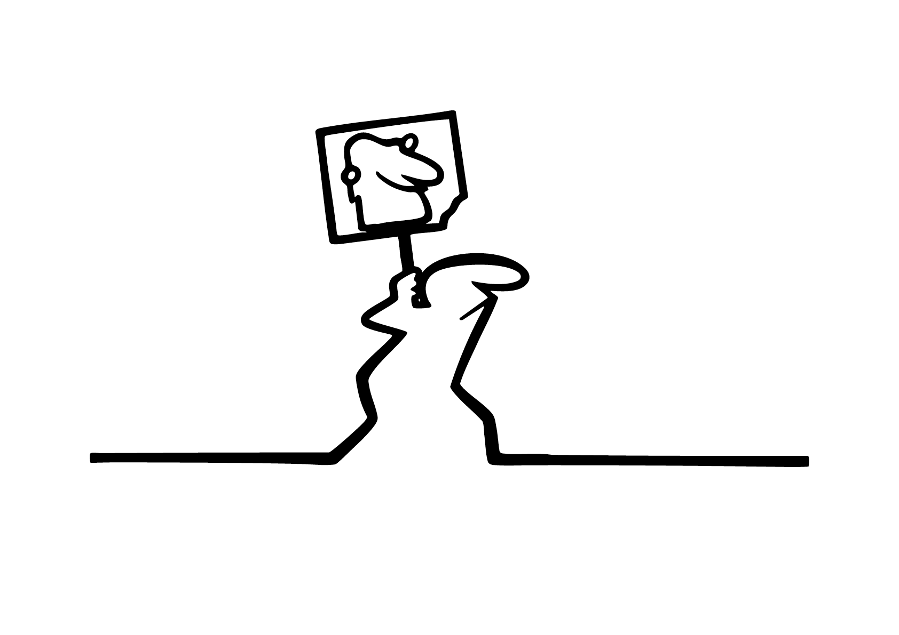

# ☝🏻 Règles du cours

&nbsp;

| |
|:---:|
| Tenir la ligne[^1] | 

# Vouvoiement
Vouvoyer et être vouvoyé en retour.

# Respect
Parler et agir avec respect envers tous.tes.

# Écoute
Laisser chacun s’exprimer sans interruption.

# Silence
Maintenir le silence pendant les sessions d'écoute et de travail. Musique autorisée avec des écouteurs.

# Téléphone
Autorisé uniquement si demandés par le cours, sinon ils doivent être hors de vue.

# Participation
S'impliquer et on contribuer au cours.

# Ponctualité
Arriver à l’heure et être prêt à travailler.

# Organisation
Respecter les échéances fixées pour chaque travail.

# Devoir
Tout travail non finalisé dans le délai imparti doit être achevé hors classe et remis au début de la séance suivante.

# Soin
Rendre des travaux proprement exécutés et correspondant aux normes de rendus.

# Concentration
Rester concentré sur la tâche en cours.

# Responsabilité
Assumer ses actions et leurs conséquences.

# Question
En cas de doute, demander de l'aide plutôt que de rester bloqué. Poser les question directement à l’enseignant plutôt qu’aux collègues.

# Rendus
Si un rendu est transmis après la date prévue, il faut l'envoyer par mail avec une justification du retard (et non le mettre sur teams)

# Imprévu
En cas de retard, d’absence ou de difficulté à respecter un délai, avertir le plus tôt possible par e-mail. En cas d’absence lors d’une évaluation, envoyer une justification par mail et se présenter au cours suivant pour effectuer le rattrapage. Sans nouvelle de votre part à votre retour en classe, la note attribuée sera 1.

### Sources

[^1]: Cavandoli, Osvaldo, *La Linea*, Italie : Cavandoli / Gamma Film, 1969.

<!-- | |
|:---:|
| Juste ou faux |  -->