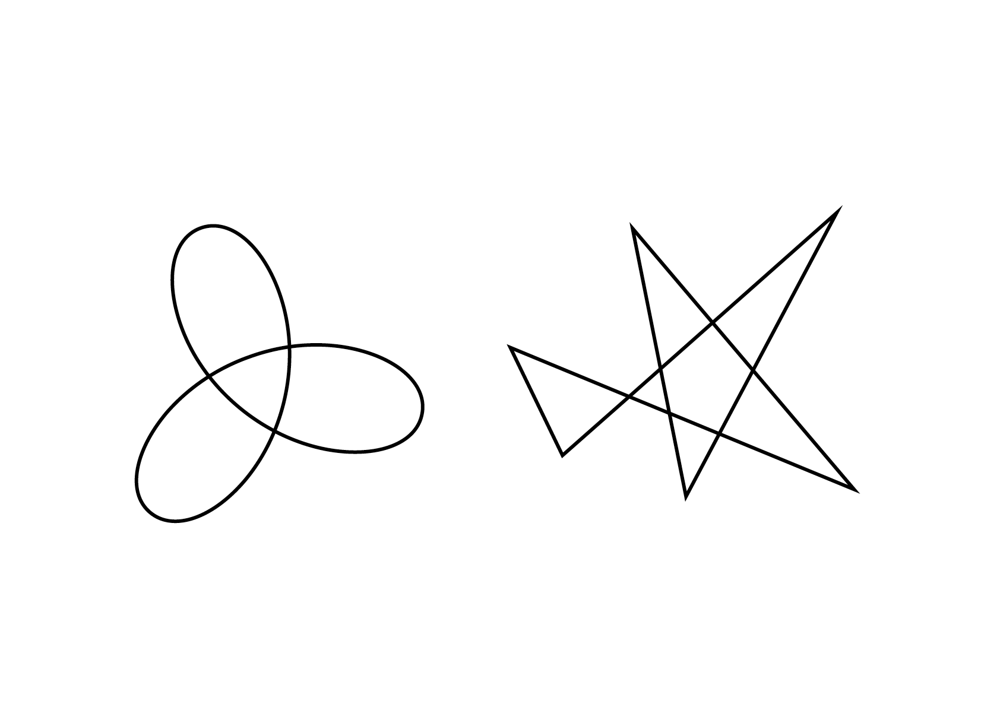
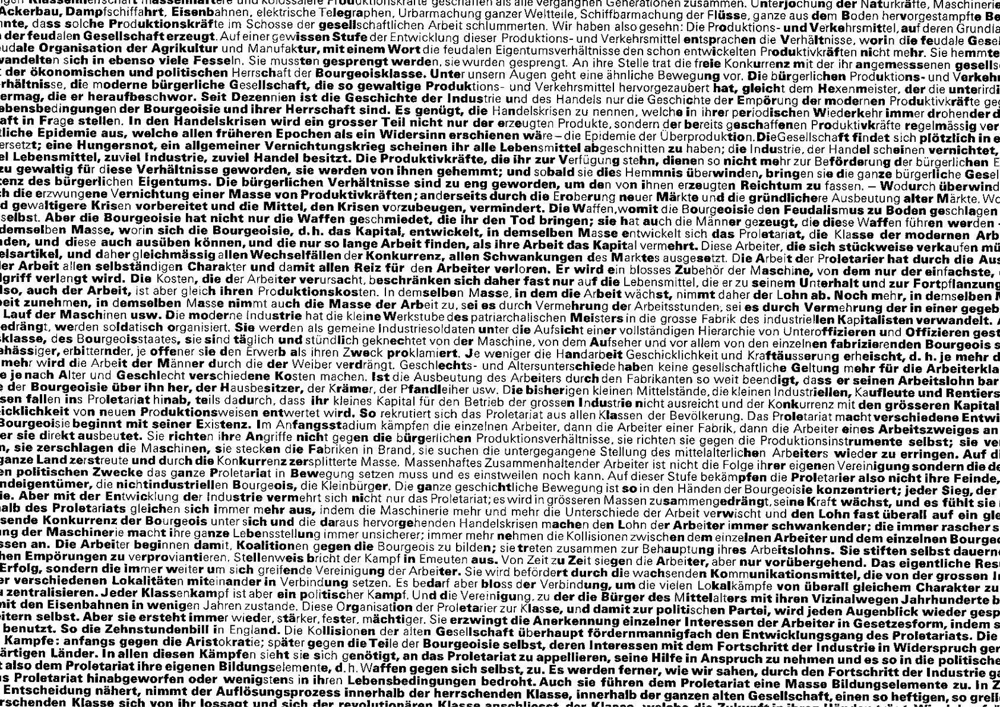
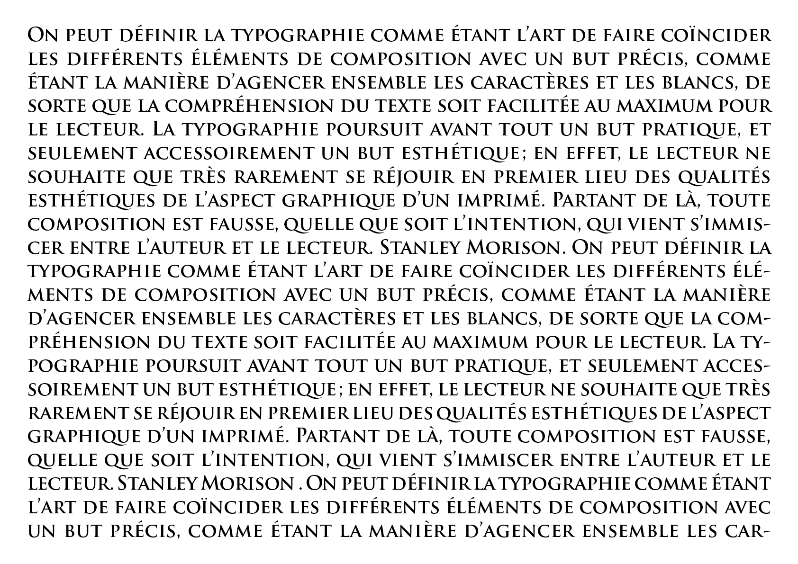

# 💥 Sémiotique

- [Booba vs Kiki](#Booba-vs-Kiki)
- [Voir vs Lire](#Voir-vs-Lire)
- [Caractère](#Caractère)
- [Lisibilité vs Impact](#Lisibilité-vs-Impact)
- [Explicite vs Implicite](#Explicite-vs-Implicite)

# &nbsp;
# &nbsp;

# Booba vs Kiki  

| |
|:---:|
| Abc |

# Voir vs Lire  

| |
|:---:|
| L'utilisation des deux niveaux d'information, textuel et pictural |

# Caractère  

| |
|:---:|
| Abc |

| |
|:---:|
| Abc |

# Dénotation vs Conotation  

| |
|:---:|
| Abc |

# Explicite vs Implicite  

| |
|:---:|
| Abc |

### Sources

<!-- - **Prénom Nom**  
  *Titre*, 0000 -->

<!-- [^1]: Adrian Frutiger, *Type, Sign, Symbol*, 1980 -->

