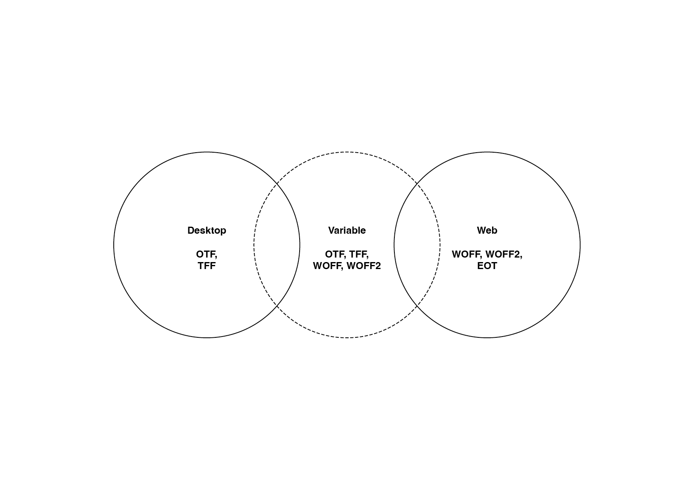
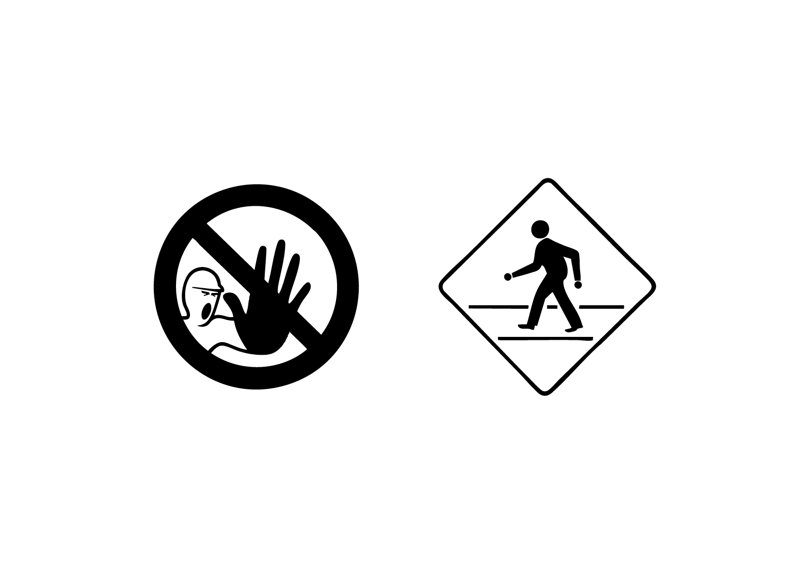
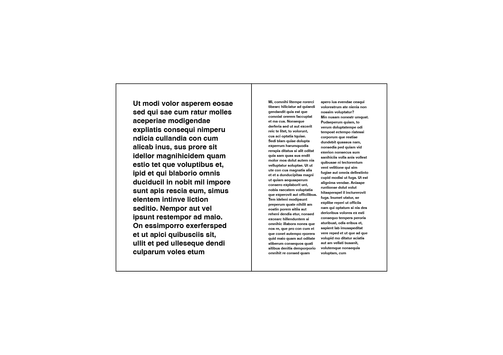
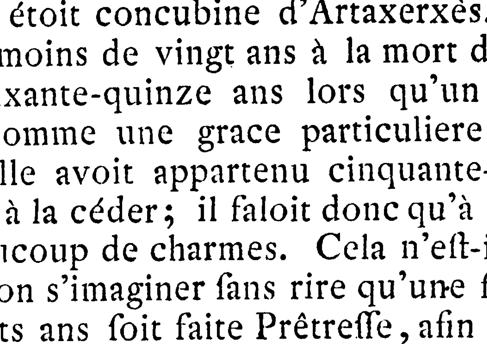
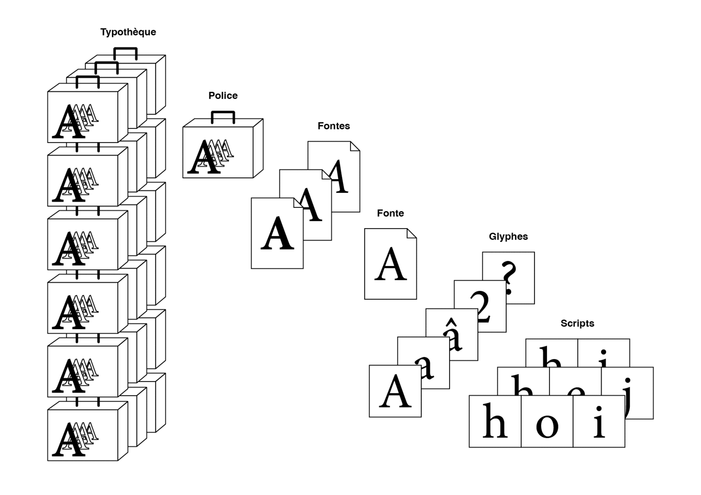

# 🌐 Vocabulaire

&nbsp;

# Casse  

Ensemble des caractères d’une police ; désigne aussi l’usage des majuscules et minuscules.

# Colonne

Une colonne est une division verticale d'une page ou d'un texte, utilisée pour organiser le contenu en sections plus lisibles et esthétiques.

# Contre-forme  

L’espace vide à l’intérieur ou autour des lettres (par ex. l’intérieur du «o»).

# Corps  

Taille de la police mesurée en points typographiques, du sommet des ascendantes au bas des descendantes.

# Ductus  

Les «modes d'emploi» des différentes écritures manuscrites qui sont à l’origine de la construction des formes typographiques.

# Espace  

Les espaces sont des intervalles typographiques de différentes sortes (fine, insécable, cadratin, etc.), qui permettent d’organiser le texte avec précision et de rythmer la composition.

# Format Desktop  

[ OTF, TTF ] Les polices destinées à un usage desktop sont installées localement sur l’ordinateur d’un utilisateur et utilisées dans des logiciels comme les applications de traitements de texte (Word, Pages,…) et de mise en page (InDesign, Illustrator,…).

# Format Variable  

[ OTF, TTF, WOFF, WOFF2 ] Les polices variables sont une nouvelle technologie qui permet d’inclure plusieurs styles (par ex., graisse, largeur, angle, etc.) dans un seul fichier de police. Cela permet aux designers de créer des variations infinies entre des styles définis sans avoir à installer plusieurs fichiers de police distincts. Ce format de police peut être utilisé pour de la mise en page, du développement web ou encore de l’animation vidéo.

# Format Web  

[ WOFF, WOFF2, EOT ] Les polices destinées à un usage web sont compressées pour être utilisées directement sur des sites internet grâce à des langages comme le HTML et le CSS. Elles sont hébergées sur un serveur et chargées par le navigateur des utilisateurs lorsqu’ils visitent une page web.

# &nbsp;  

| |
|:---:|
| Formats digitaux de police de caractères |

# Folio  

Le numéro de page tel qu’il apparaît dans une mise en page.

# Fonctionnalités OpenType

Les fonctionnalités OpenType sont des fonctions intégrées dans une police qui permettent d’activer des substitutions typographiques: ligatures, alternatives contextuelles, petites capitales, chiffres elzéviriens, fractions, etc. Elles enrichissent la mise en page et assurent une meilleure cohérence graphique.

# Glyphe 

Un glyphe est un signe typographique (un symbole). Cela peut inclure non seulement les lettres et les chiffres, mais aussi les accents, les ligatures (comme « fi » ou « fl »), et d’autres symboles.

# Gabarit  

Organisation prédéfinie de la page (marges, colonnes, zones de composition) servant de guide à la mise en page.

# Gris de texte 

Impression visuelle produite par la densité et la régularité du texte en bloc, avant même la lecture des mots.

# License libre  

Une licence libre (open-source) permet généralement à l’utilisateur.rice d’utiliser, copier, modifier et redistribuer une fonte, souvent de manière gratuite et sans restriction. Elle garantit l’accès au code source et la liberté de l’adapter selon les besoins. Néamoins, il est toujours nécessaire d’aller vérifier ce qui est autorisé dans le contrat de license.

# License propriétaire  

Une licence propriétaire est un contrat qui accorde à l’utilisateur.rice le droit d’utiliser une fonte, mais sans en posséder le code source ou les droits de modification et de redistribution. Les restrictions sont souvent strictes: l’utilisateur.rice ne peut pas copier, modifier, ni partager le produit sans autorisation explicite.

# &nbsp;  

| |
|:---:|
| License libre vs propriétaire |

# Ligne

Une ligne est une rangée horizontale de texte dans une composition, formant une unité de lecture.

# Macro-Typographie

La macro-typographie désigne l’organisation globale d’un texte dans l’espace du format: disposition des colonnes, choix des marges, hiérarchie des titres, gabarits, proportions, etc. Elle structure la lecture à grande échelle.

# Micro-Typographie

La micro-typographie concerne le soin apporté aux détails fins du contenu texte : gestion des espaces, ponctuation, césures, ligatures, interlettrage, justification, etc. Elle vise à optimiser la lisibilité et l’élégance d’un texte au niveau microscopique.

# &nbsp;  

| |
|:---:|
| Micro vs Macro typographie |

# Miroir de page  

Schéma visuel créé par la disposition des marges et du bloc de texte, qui définit l’équilibre général de la page.

# Mot

Un mot est une unité lexicale composée d’une ou plusieurs lettres, formant un élément signifiant dans le texte.

# Police 

Une police désigne un ensemble de fontes (un dossier de fontes) qui partagent une identité commune (« le même squelette »). Une police inclut toutes les variations possibles (gras, italique, etc.) d’une même famille de fontes.

# Revival classique

Un revival classique est une digitalisation d’une fonte historique de l’histoire de la typographie, conçue avant l’ère numérique. La digitalisation consiste à convertir une police physique (par exemple, dessinée à la main ou gravée) en un format numérique, en numérisant les dessins existants et en les transformant en courbes vectorielles. Cela permet de préserver le caractère original tout en le rendant utilisable dans les environnements numériques.

# Revival moderne

Un revival moderne, en revanche, désigne une fonte contemporaine créée à partir du début du XXIe siècle. Il peut s’agir soit d’une réinterprétation d’un modèle classique, soit d’un design totalement original. La réinterprétation implique d’adapter une fonte existante à un nouveau contexte en modifiant certains aspects du dessin (formes des glyphes, graisse, contraste, espacement, jeu de caractères, etc.), afin d’actualiser son usage et son esthétique.

# &nbsp;  

| |
|:---:|
| Caractères en plomb → Revival classique vs Revival moderne |

# Section  

Mention placée en bas de page, généralement près du folio, qui indique le chapitre ou la partie courante du texte.

# Scripte 

Un scripts fait référence à un système d’écriture (une langue) que l’on peut utiliser avec une certaine police en fonction des glyphes présents au sein de celle-ci (on parle alors de son « jeu de caractères »). Par exemple, une police peut prendre en charge plusieurs scripts, comme le latin, le cyrillique, l’arabe ou le chinois.

# Signe

Un signe est un symbole graphique utilisé en typographie pour représenter une idée, un son, ou une fonction spécifique dans le texte.

# Typothèque

Une typothèque est une collection organisée de polices de caractères. Elle peut être personnelle (regroupant les polices installées sur l’ordinateur d’un designer) ou collective (bibliothèques en ligne, plateformes de fonderies, catalogues d’écoles). Elle permet de gérer, comparer et sélectionner des polices pour différents usages.

# &nbsp;  

| |
|:---:|
| Typothèque |

<!-- ### Sources -->
