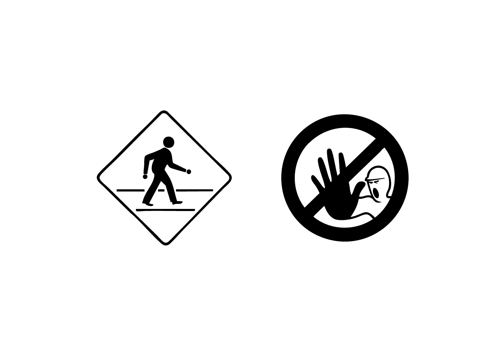

# 📖 Vocabulaire

  
###  

# Gabarit  

Organisation prédéfinie de la page (marges, colonnes, zones de composition) servant de guide à la mise en page.

# Miroir de page  

Schéma visuel créé par la disposition des marges et du bloc de texte, qui définit l’équilibre général de la page.

# Gris de texte 

Impression visuelle produite par la densité et la régularité du texte en bloc, avant même la lecture des mots.

# Contre-forme  

L’espace vide à l’intérieur ou autour des lettres (par ex. l’intérieur du «o»).

# Ductus  

Les «modes d'emploi» des différentes écritures manuscrites qui sont à l’origine de la construction des formes typographiques.

# Folio  

Le numéro de page tel qu’il apparaît dans une mise en page.

# Section  

Mention placée en bas de page, généralement près du folio, qui indique le chapitre ou la partie courante du texte.

# Espace  

Les espaces sont des intervalles typographiques de différentes sortes (fine, insécable, cadratin, etc.), qui permettent d’organiser le texte avec précision et de rythmer la composition.

# Corps  

Taille de la police mesurée en points typographiques, du sommet des ascendantes au bas des descendantes.

# Casse  

Ensemble des caractères d’une police ; désigne aussi l’usage des majuscules et minuscules.

# Police 

Une police désigne un ensemble de fontes (un dossier de fontes) qui partagent une identité commune (« le même squelette »). Une police inclut toutes les variations possibles (gras, italique, etc.) d’une même famille de fontes.

# Fonte 

Une fonte désigne l’ensemble des glyphes (contenu dans un fichier) correspondant aux mêmes caractéristiques (de style) au sein d’une même police (on peut aussi parler d’un caractère). Par exemple, la police « Times », inclut notamment les fontes « Times Regular », « Times Bold », ou « Times Italic ».

# Glyphe 

Un glyphe est un signe typographique (un symbole). Cela peut inclure non seulement les lettres et les chiffres, mais aussi les accents, les ligatures (comme « fi » ou « fl »), et d’autres symboles.

# Scripte 

Un scripts fait référence à un système d’écriture (une langue) que l’on peut utiliser avec une certaine police en fonction des glyphes présents au sein de celle-ci (on parle alors de son « jeu de caractères »). Par exemple, une police peut prendre en charge plusieurs scripts, comme le latin, le cyrillique, l’arabe ou le chinois.

# Typothèque  

Une typothèque est une collection organisée de polices.

| |
|:---:|
| Abc |

# License propriétaire  

Une licence propriétaire est un contrat qui accorde à l’utilisateur.rice le droit d’utiliser une fonte, mais sans en posséder le code source ou les droits de modification et de redistribution. Les restrictions sont souvent strictes: l’utilisateur.rice ne peut pas copier, modifier, ni partager le produit sans autorisation explicite.

| |
|:---:|
| Abc |

# License libre  

Une licence libre (open-source) permet généralement à l’utilisateur.rice d’utiliser, copier, modifier et redistribuer une fonte, souvent de manière gratuite et sans restriction. Elle garantit l’accès au code source et la liberté de l’adapter selon les besoins. Néamoins, il est toujours nécessaire d’aller vérifier ce qui est autorisé dans le contrat de license.

# Micro-Typographie

La micro-typographie concerne le soin apporté aux détails fins du texte : gestion des espaces, ponctuation, césures, ligatures, interlettrage, justification, etc. Elle vise à optimiser la lisibilité et l’élégance d’un texte au niveau microscopique.

| |
|:---:|
| Abc |

# Macro-Typographie

La macro-typographie désigne l’organisation globale d’un texte dans l’espace de la page ou de l’écran : disposition des colonnes, choix des marges, hiérarchie des titres, gabarits, proportions, etc. Elle structure la lecture à grande échelle.

# Revival 

Cette catégorie inclut les digitalisations des fontes classiques de l’histoire de la typographie, qui datent d’avant l’ère digitale. La digitalisation fait référence au processus de conversion d’une police de caractères physique (par exemple, une police dessinée à la main ou gravée) en un format numérique. Ce processus implique la numérisation de dessins existants et leur conversion en courbes vectorielles, ce qui permet une mise à l’échelle sans perte de qualité.

# Moderne  

Cette catégorie inclut les fontes contemporaines qui ont été conçues à partir du début du XXIe siècle. Ces fontes résultent soit d’une réinterprétation d’un classique, soit d’un design original. La réinterprétation d’une police de caractères consiste à créer une nouvelle version d’une fonte existante en introduisant différentes altérations de design dans le but de l’adapter à un contexte spécifique. Cela peut inclure des modifications dans la forme des glyphes, la graisse, le contraste, l’espacement ou même le character-set.

| |
|:---:|
| Abc |

# Format Desktop  

Les polices destinées à un usage desktop sont installées localement sur l’ordinateur d’un utilisateur et utilisées dans des logiciels comme les applications de traitements de texte (Word, Pages,…) et de mise en page (InDesign, Illustrator,…).

OTF, TTF

| |
|:---:|
| Abc |

# Format Web  

Les polices destinées à un usage web sont compressées pour être utilisées directement sur des sites internet grâce à des langages comme le HTML et le CSS. Elles sont hébergées sur un serveur et chargées par le navigateur des utilisateurs lorsqu’ils visitent une page web.

WOFF, WOFF2, EOT

# Format Variable  

Les polices variables sont une nouvelle technologie qui permet d’inclure plusieurs styles (par ex., graisse, largeur, angle, etc.) dans un seul fichier de police. Cela permet aux designers de créer des variations infinies entre des styles définis sans avoir à installer plusieurs fichiers de police distincts. Ce format de police peut être utilisé pour de la mise en page, du développement web ou encore de l’animation vidéo.

OTF, TTF, WOFF, WOFF2

# Fonctionnalités OpenType

Les fonctionnalités OpenType sont des fonctions intégrées dans une police qui permettent d’activer des substitutions typographiques: ligatures, alternatives contextuelles, petites capitales, chiffres elzéviriens, fractions, etc. Elles enrichissent la mise en page et assurent une meilleure cohérence graphique.

### Sources

<!-- - **Prénom Nom**  
  *Titre*, 0000 -->

<!-- [^1]: Adrian Frutiger, *Type, Sign, Symbol*, 1980 -->

