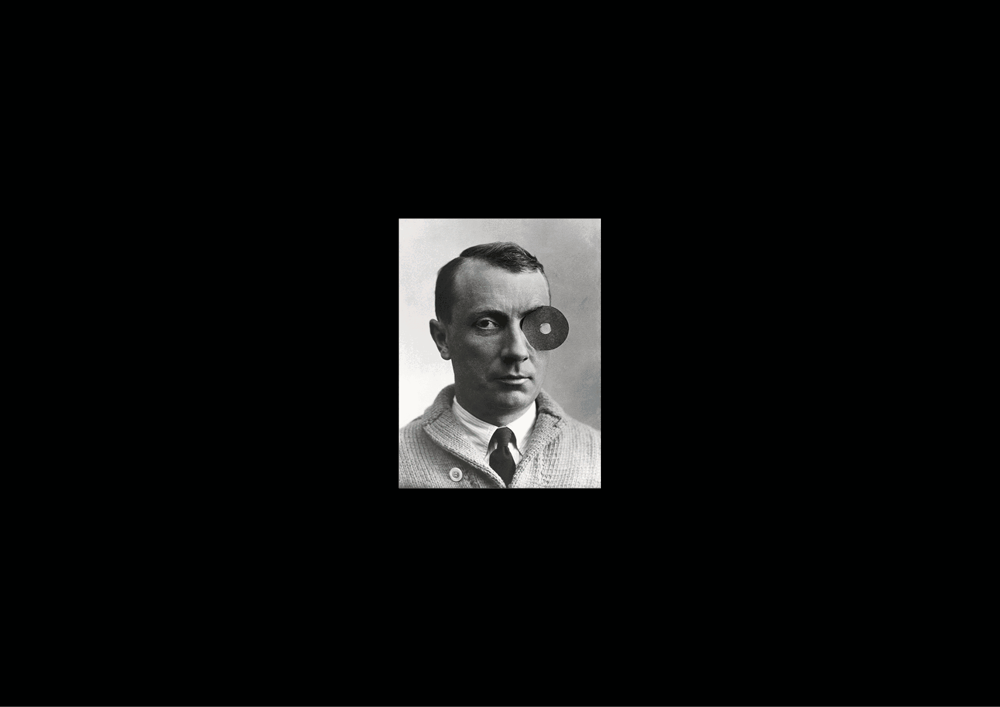
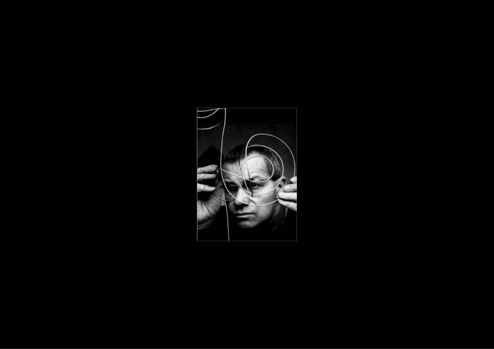

# ☎️ Index of designers
  Annuaire graphique
### &nbsp;

# Aicher, Otl

# Arp, Hans

| |
|:---:|
| Hans Arp (1886-1966)           |

# Bass, Saul

# Bayer, Herbert

# Behrens, Peter

# Bennewith, David

# Bill, Max

| |
|:---:|
| Max Bill (1908-1994)           |

# Carson, David

# Carter, Matthew

# Corbusier, Le

# Crouwel, Wim

# Depero, Fortunato

# Eidenbenz, Hermann

# Elliman, Paul

# Excoffon, Roger

# Frutiger, Adrian

# Gerstner, Karl

# Gill, Eric

# Glaser, Milton

# Greiman, April

# Gropius, Walter

# Gürtler, André

# Haettenschweiler, Walter

# Hochuli, Jost

# Hofmann, Armin

# Holder, Will

# Itten, Johannes

# Johnston, Edward

# Käch, Walter

# Kent, Corita

# Kim, Na

# Klee, Paul

# Lubalin, Herbert

# Lutz, Hans-Rudolf

# Martens, Karel

# Matta-Clark, Gordon

# Meier, Hans Eduard

# Moholy-Nagy, László

# Müller-Brockmann, Josef

# Munari, Bruno

# Nawrot, Karl

# Neurath, Otto

# Norzij, Gerrit

# Novarese, Aldo

# Rand, Paul

# Ray, Man

# Renner, Paul

# Ruder, Emil

# Saville, Peter

# Scher, Paula

# Schmidt, Helmut

# Schwitters, Kurt

# Sinister, Dexter

# Tanaka, Ikko

# Tauber-Arp, Sophie

# Team77

# Troxler, Niklaus

# Tschichold, Jan

# Unger, Gehard

# van Doesburg, Theo

# Vignelli, Massimo

# Von Arx, Peter

# Weiner, Laurence

# Wellington, Irene

# Weingart, Wolfgang

# Widmer, Jean

# Zapf, Hermann

# Zwart, Piet
