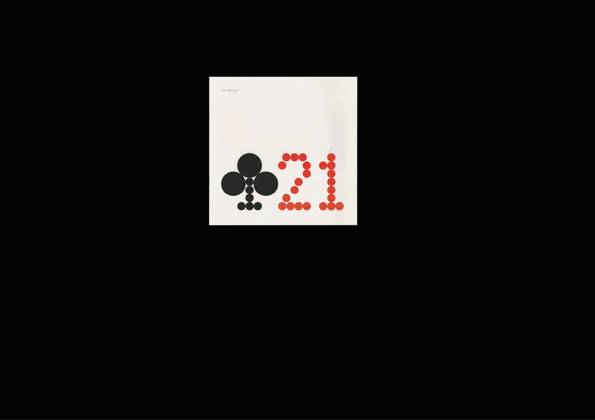

# 📘 Index des specimens

### &nbsp;

        |
# Daylight Fonts
https://e-daylight.jp/fonts

# Design Reviewed
https://designreviewed.com/type-specimens

| |
|:---:|
| Sélection de specimens[^1]  

# Internet Archive
https://archive.org/details/typecatalogs

# Flickr
https://www.flickr.com/groups/type_specimen

# Klingspor
https://klingspor-type-archive.de/archive?document=6482f62c4cc069edfa025bfb

# Luc Devroye
https://luc.devroye.org/fonts.html

# Typographica
https://library.typographica.org/specimen-books-of-metal-wood-type