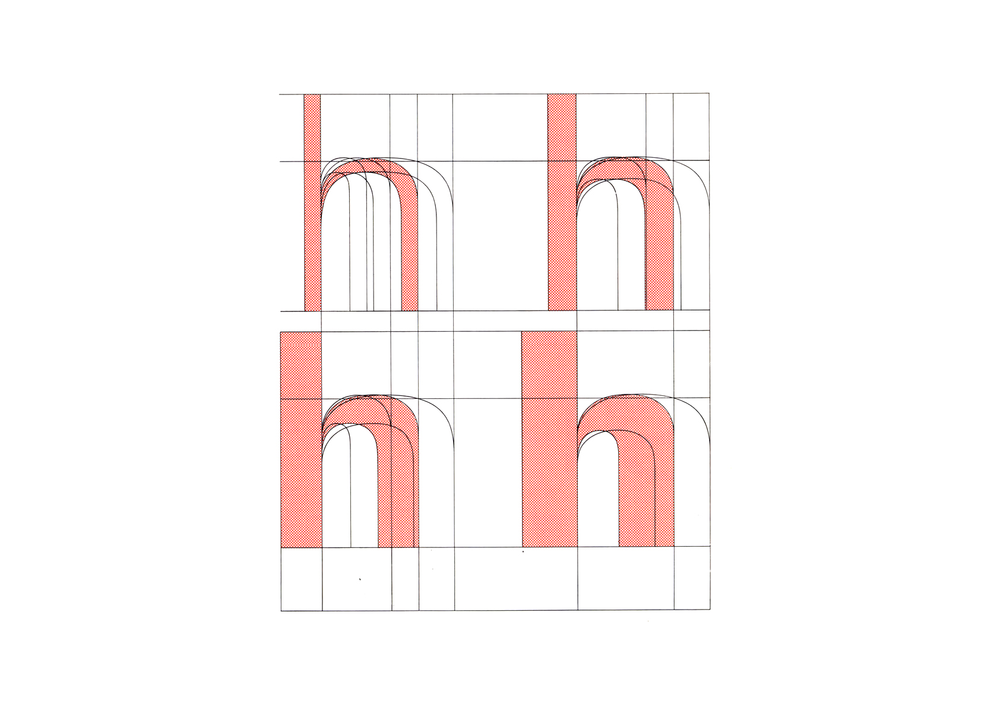
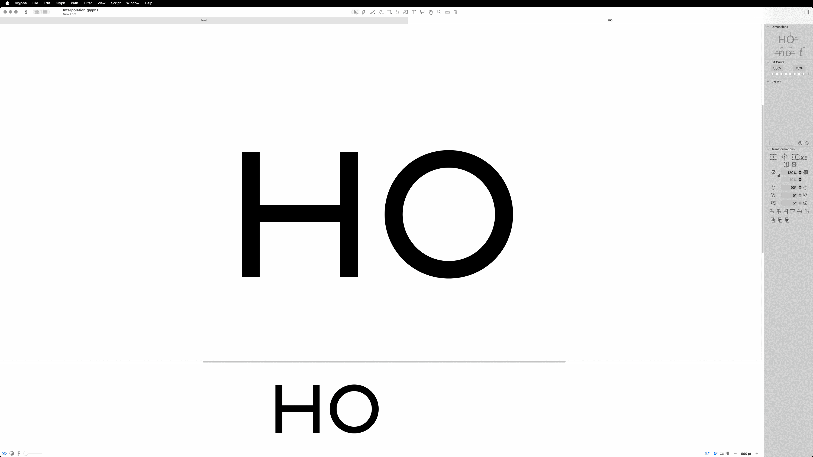
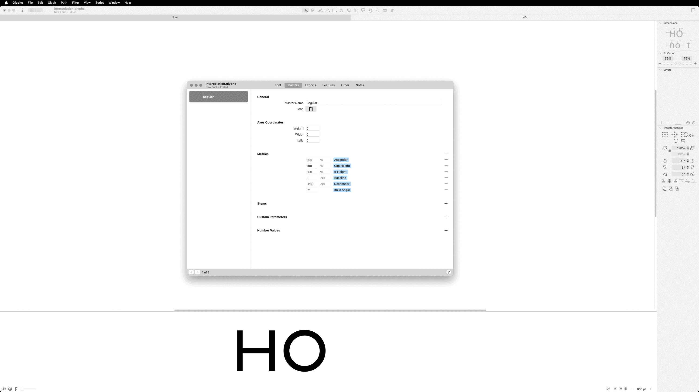
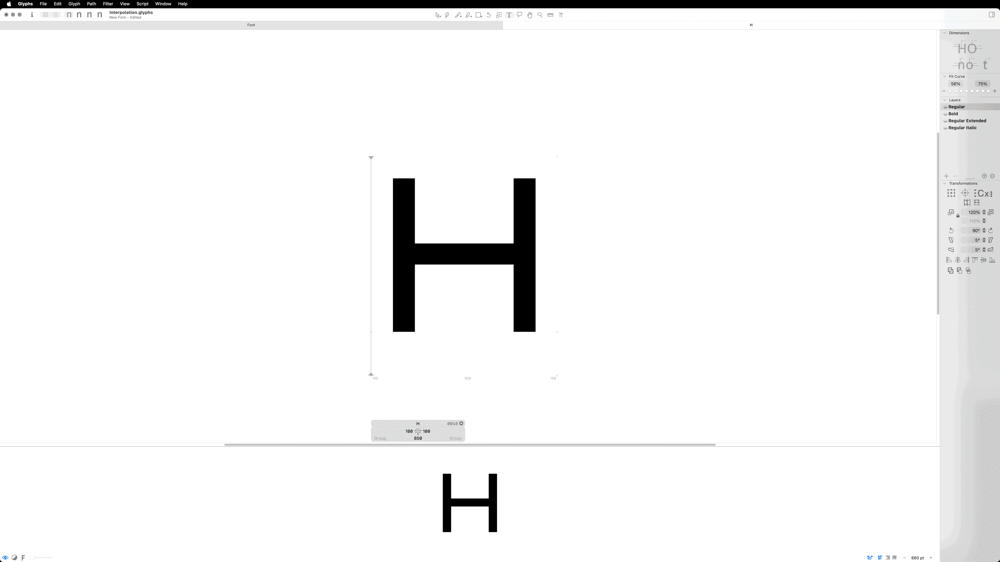
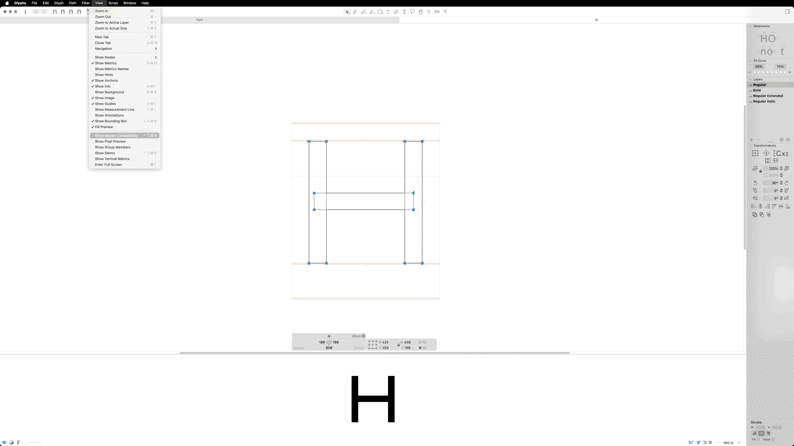
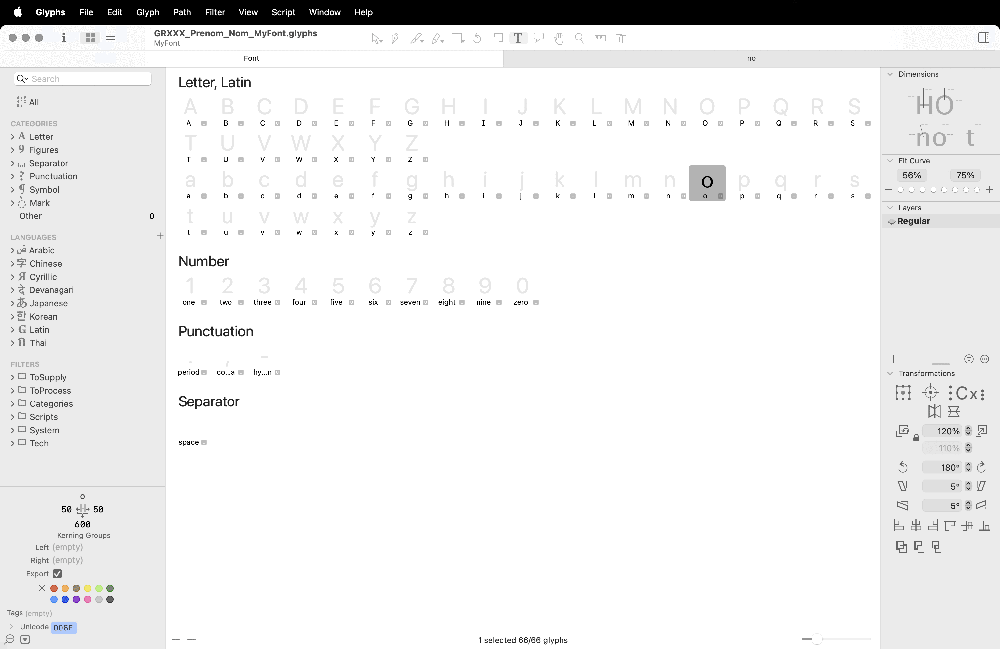
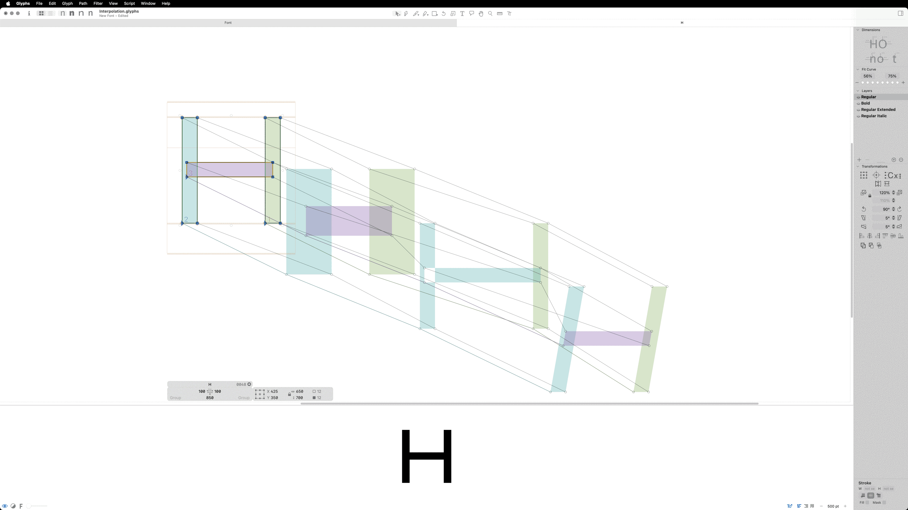
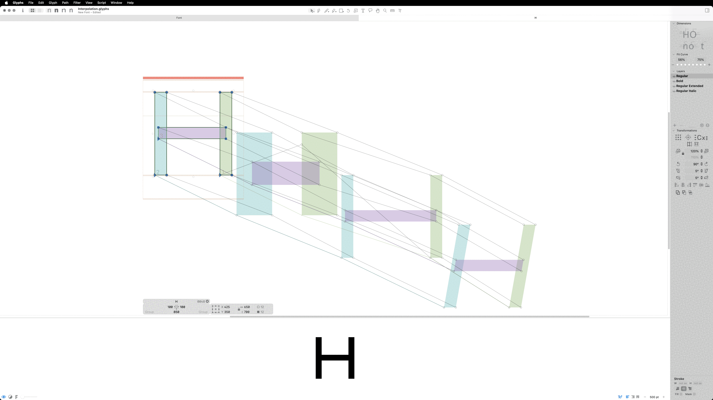
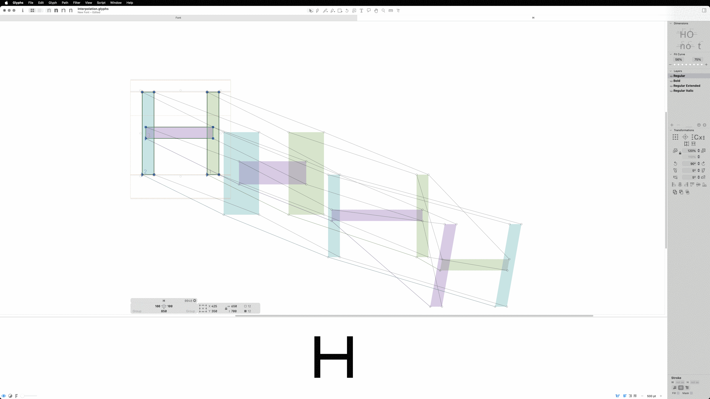
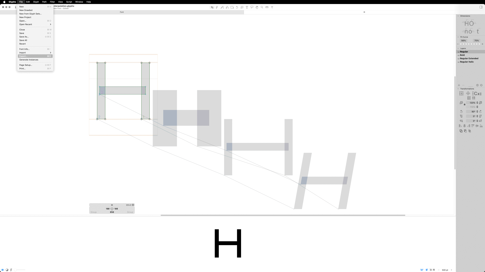

# 🎛️ *Interpolate vectors*
  Interpolation vectorielle
### &nbsp;

| |
|:---:|
| Frutiger[^1]           |

Dessin vectoriel

# 🎚️ Axes

| |
|:---:|
| Informations de la Police > Police > Axes           |

# 🧱 Masters

### Créer les masters

| |
|:---:|
| Informations de la Police > Masters            |

### Visualiser les masters

| |
|:---:|
| Barre Glyphs \| Fenêtre Layers          |

### Adapter les dessins des masters

| |
|:---:|
| cmd + 1 \| cmd + 2 \| cmd + 3 \| cmd + 4        |

# 🪲 Debug dessins

### Outil de debug

| |
|:---:|
| Présentation > Afficher la compatibilité des masters           |

### Sens des tracés

| |
|:---:|
| Tracé > Corriger le sens des tracés           |

### Nombre de points

| |
|:---:|
| Effacer \| Ajouter des points           |

### Ordre des formes

| |
|:---:|
| Filtre > Ordre des formes           |

# 📦 Export

| |
|:---:|
| Fichier > Exporter > Variable           |

# 🛠️ Tester

[Font Gauntlet](https://fontgauntlet.com)
[Axis-Praxis](https://www.axis-praxis.org/specimens/__DEFAULT__)