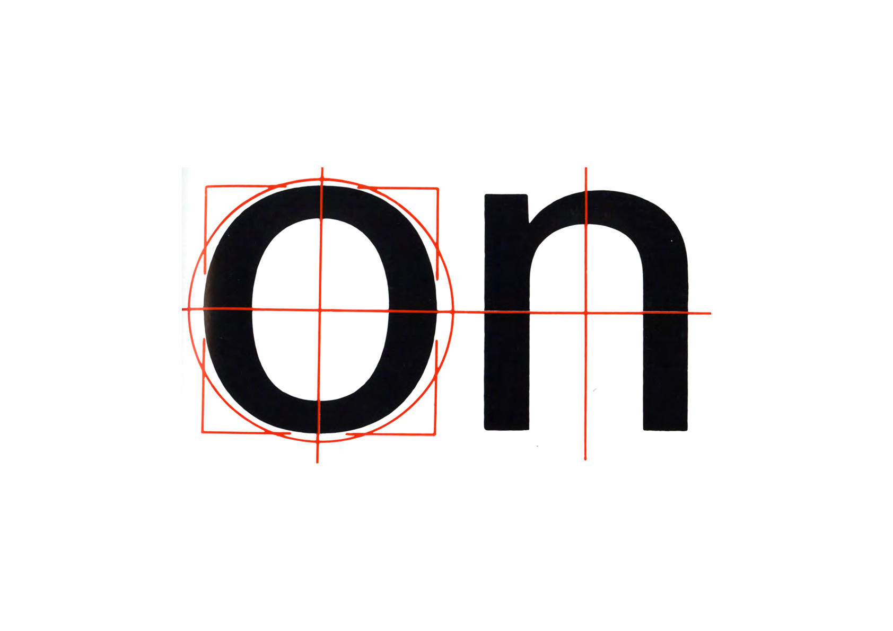
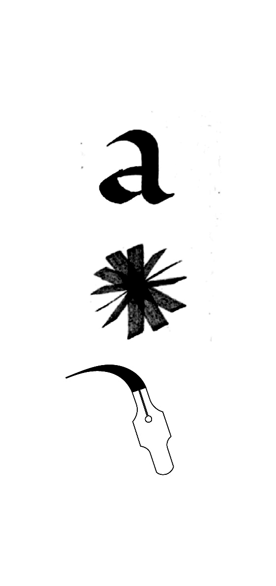
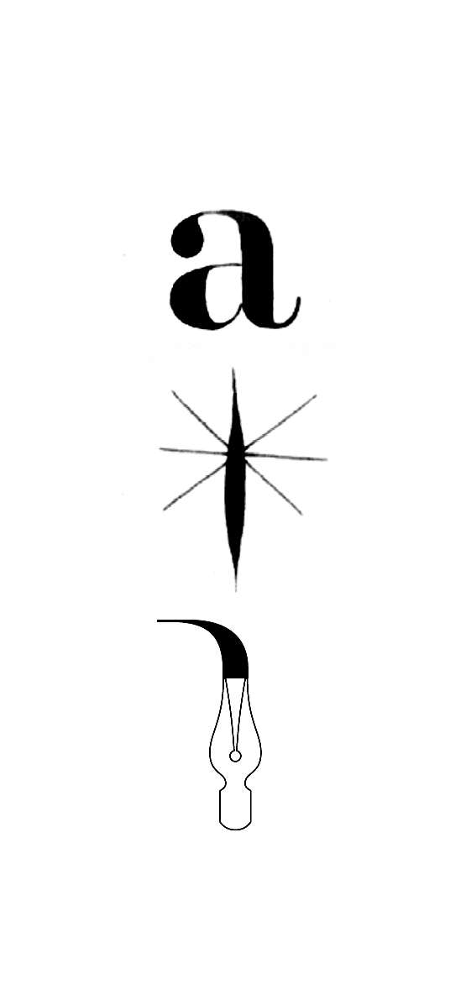
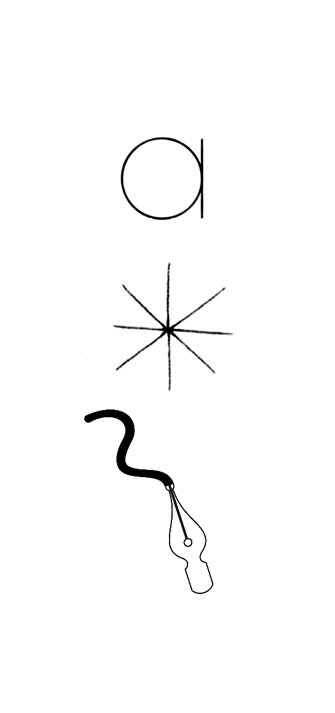
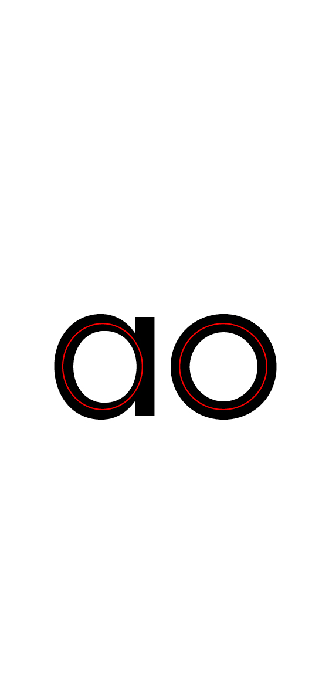
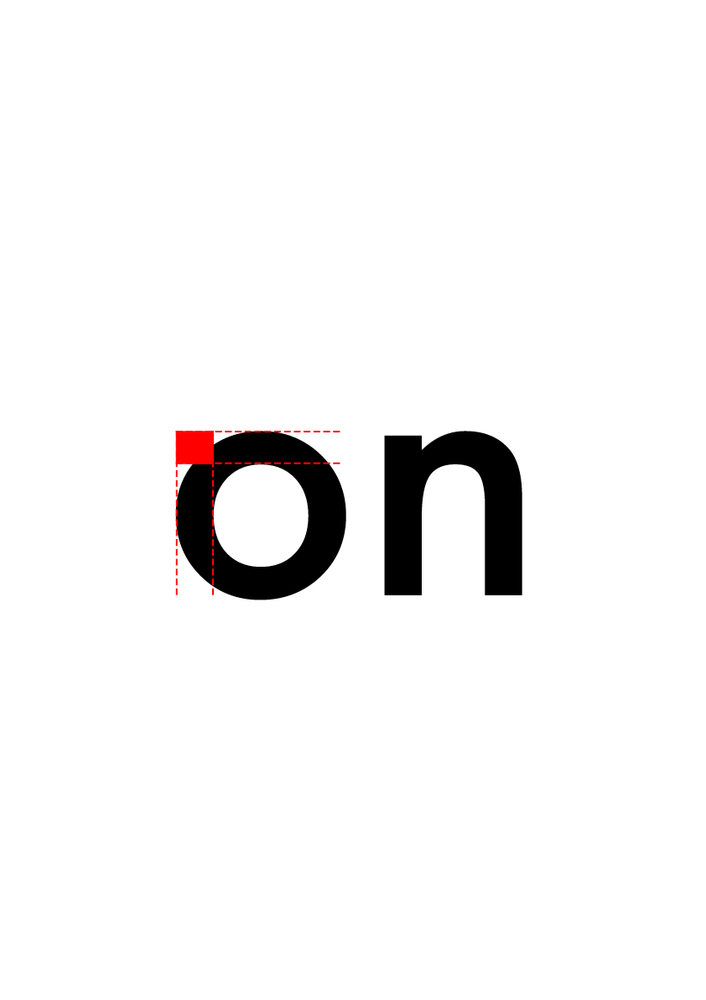
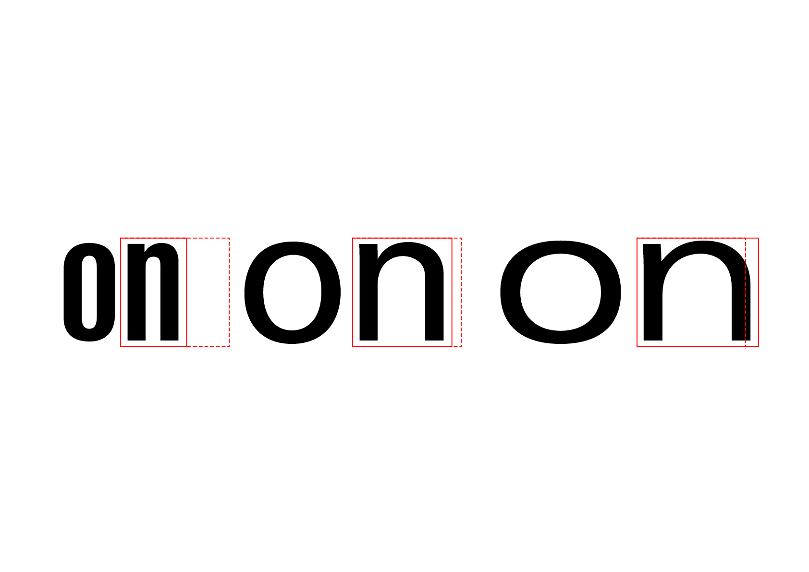
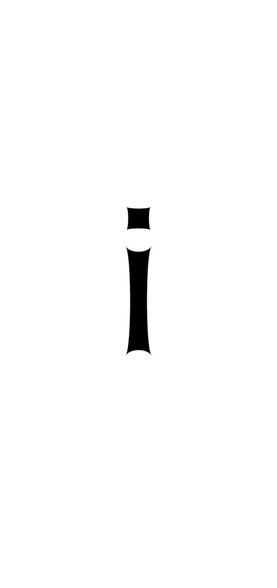

# 🧬 *Parameter a typefaces*
  ADN d'une police de caractères
# &nbsp;
||
|:------------------------------------------:|
| Le «n» et le «o» contiennent l'ADN d'une fonte           |
## 🪚 Forme
## Principe
||||
|:------------------------------------------:|:------------------------------------------:|:------------------------------------------:|
| Principe dynamique           | Principe statique           | Principe géométrique           |

||||
|:------------------------------------------:|:------------------------------------------:|:------------------------------------------:|
| Principe dynamique           | Principe statique           | Principe géométrique           |
## Contraste
|||
|:------------------------------------------:|:------------------------------------------:|
| Contrasté          | Linéaire           |
## Terminaisons
|||
|:------------------------------------------:|:------------------------------------------:|
| Avec (empattements)           | Sans (empattements)             |
## 📐 Proportions
## Rapports
||
|:------------------------------------------:|
| Cohérence visuelle des fûts, des ascendantes et descendantes            |
## Graisse
||
|:------------------------------------------:|
| L’épaisseur du tracé           |
## Largeur
||
|:------------------------------------------:|
| La largeur des lettres (par rapport à la hauteur de x)          |
## Hauteur
||
|:------------------------------------------:|
| La hauteur des lettres (par rapport à la hauteur de x)           |
## Angle
||
|:------------------------------------------:|
| L’angle des lettres, italique (cursive dessinée) ou slanted (mathématiquement penchée)            |
## 🗜️ Style
## Fûts
||||
|:------------------------------------------:|:------------------------------------------:|:------------------------------------------:|
| Concaves           | Rectilignes           | Convexes          |
## Empattements
||
|:------------------------------------------:|
| Variation de la forme des empattements (sans, rectangulaire, triangulaire, transitionel, intersection)            |
## Ornements
||
|:------------------------------------------:|
| Variation de l'effet général appliqué au dessin (outline, inline, hachure, ombre, gravure)            |

