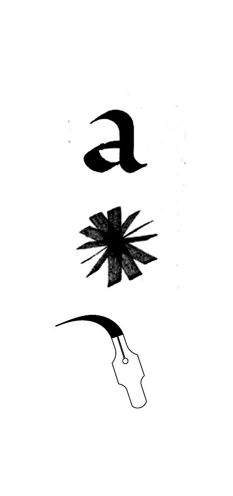
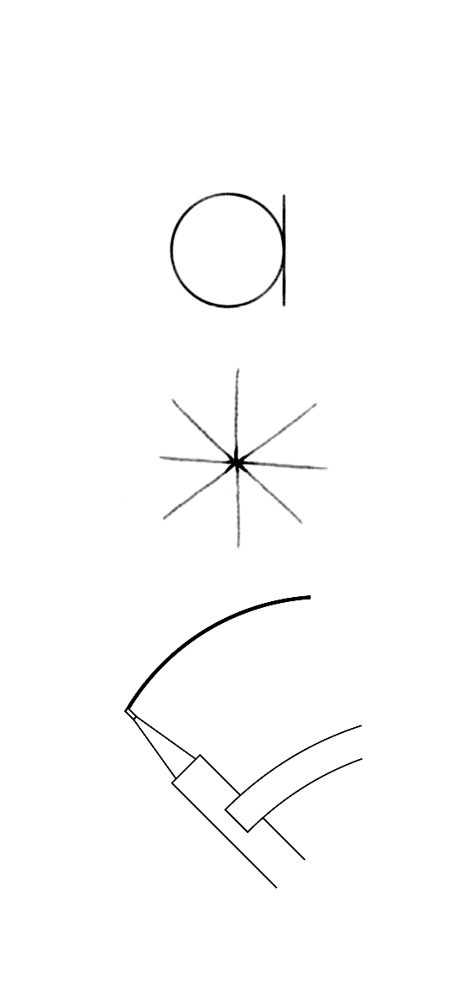
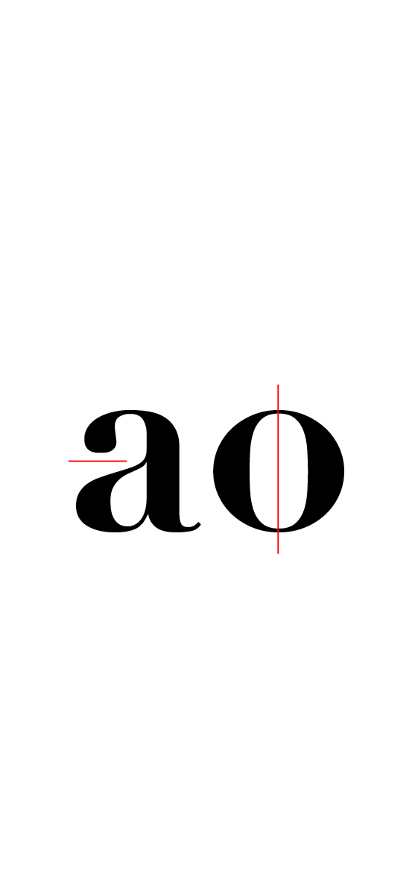
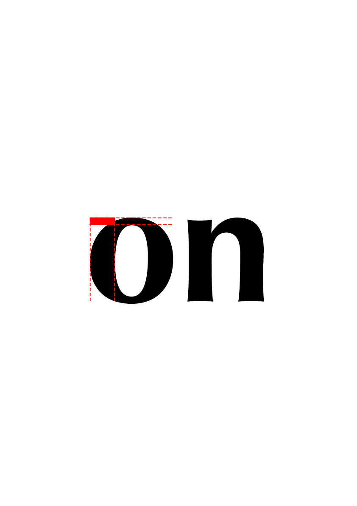
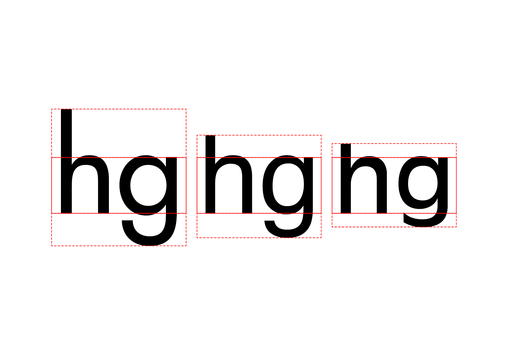
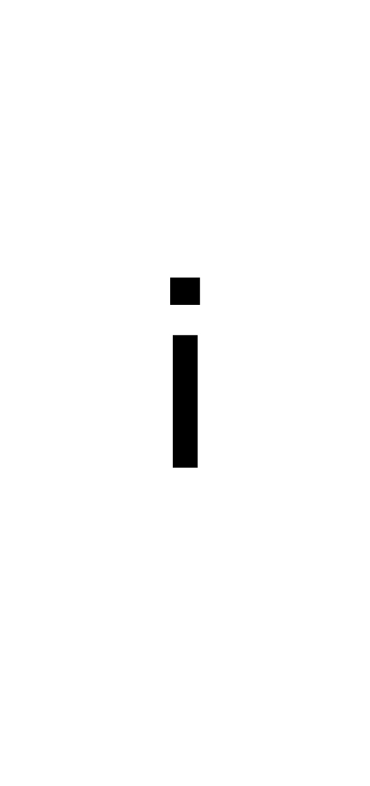

# 🧬 *Parameter a typeface*
  ADN d'une police de caractères
#  

| |
|:---:|
| Le «n» et le «o» contiennent l'ADN d'une fonte[^1]           |

## 🪚 Forme

## Principe

|  |  |  |
|:---:|:---:|:---:|
| Principe dynamique           | Principe statique           | Principe géométrique           |

|  |  |  |
|:---:|:---:|:---:|
| Principe dynamique           | Principe statique           | Principe géométrique           |

## Contraste

|  |  |
|:---:|:---:|
| Principe dynamique           | Principe statique           |

## Terminaisons

|  |  |
|:---:|:---:|
| Principe dynamique           | Principe statique           |

## 📐 Proportions

## Rapports

|  |
|:---:|
| Principe dynamique           |

## Graisse

|  |
|:---:|
| Principe dynamique           |

## Largeur

|  |
|:---:|
| Principe dynamique           |

## Hauteur

|  |
|:---:|
| Principe dynamique           |

## Angle

|  |
|:---:|
| Principe dynamique           |

## 🗜️ Style

## Fûts

|  |  |  |
|:---:|:---:|:---:|
| Principe dynamique           | Principe statique           | Principe géométrique           |

## Empattements

|  |
|:---:|
| Principe dynamique           |

## Ornements

|  |
|:---:|
| Principe dynamique           |^

[^1]: Adrian Frutiger, *Type, Sign, Symbol*, 1980

