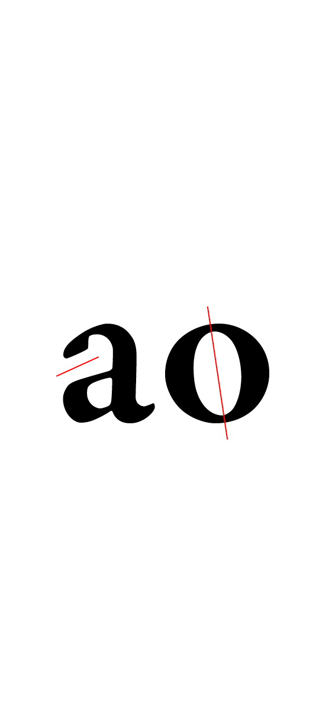

# 🧬 *Parameter typefaces*
  Paramètres de dessin d'une police de caractères
#  
||
|:------------------------------------------:|
| Le «n» et le «o» contiennent l'ADN d'une fonte           |
## 🔍 Forme
## Principe
||||
|:------------------------------------------:|:------------------------------------------:|:------------------------------------------:|
| Principe dynamique           | Principe statique           | Principe géométrique           |
||||
## Contraste
|||
|:------------------------------------------:|:------------------------------------------:|
| Principe dynamique           | Principe statique           |
## Terminaisons
|||
|:------------------------------------------:|:------------------------------------------:|
| Principe dynamique           | Principe statique           |
## 📐 Proportions
## Largeur
## Hauteur
## Angle
## 🎛️ Style
## Fûts
## Empatements
## Ornements
## 💥 Sémiotique
## Tags

