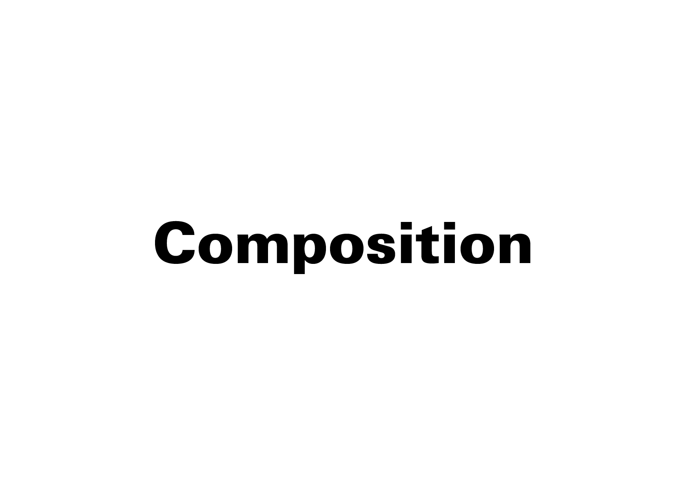

# 🎼 Développement de compositions

- Comment associer les différentes variations (paramètres) pour créer une proposition cohérente et pertinente?  
- Est-ce possible de simplifier (un paramètre à la fois)?  

## &nbsp;  

La composition combine les différentes variations pour formuler une ou plusieurs propositions de design. C’est seulement à ce stade qu’il est possible de modifier plusieurs paramètres en même temps, ceux-ci ayant été préalablement évalués séparément dans la phase des variations. La composition apporte ainsi une réponse pertinente au cadre défini par les contraintes du projet. 
  
&nbsp;

| |
|:---:|
| Orientation, position, dimension, rythme,… |

<!--

# Contrastes  

| |
|:---:|
| Abc |

1 Contrastes foncé-clair, gras-maigre, surface-ligne.
2 Contrastes perpendiculaire-horizontal et actif-passif. Répond le mieux à la technique tvooarahique.
3 Contrastes droit-oblique, statique-dynamique, géométrique-
organique et symetrie-asymetrie. Les caracteres obliques cor-respondent à l'écriture manuelle et sont d'un effet organique et dynamique plus prononcé que les caractères droits.
4 Contrastes grand-petit, foncé-clair et ligne-point.
5 Contrastes foncé-clair, gras-maigre et surface-ligne
¡ Contrastes ligne-point et animé-paisible
7 Contrastes asymétrie-symétrie et animé-paisible.
8 Contrastesrond-droit. doux-dur et illimité.limité
9 Contrastes précis-diffus, dur-doux et foncé-clair.
10 Contrastes instable-stable. Le triangle posé sur son sommet est incertain, il vacille; posé sur sa base, il donne l'impression d'extrême stabilité (pyramide).
11 Contrastes surface-point, grand-petit et foncé-clair.
12 Contrastes animé-tranquille, foncé-clair et surface-ligne.
13 Contrastes large-etroit, excentrique-concentrique.
14 Contrastes concentrique-excentrique et fermé-ouvert.
15 Contrastes minuscules-majuscules et dynamique-statique.

# Hiérarchies  

| |
|:---:|
| Abc |

# Grille  

| |
|:---:|
| Abc |

# Coins  

| |
|:---:|
| Abc |

-->

<!-- ### Sources

- Karl Gerstner, *Kompendium für Alphabeten: Systematik der Schrift*, Sulgen/Frankfurt: Arthur Niggli, 1972 
- Ruedi Rüegg, *Basic Typography: Design with Letters / Typografische Grundlagen mit Schrift*, Zurich: Delta & Spes, 1980  
- Jost Hochuli, *Le détail en typographie*, London: Hyphen Press, 2005 [éd. orig. 1987]   -->

