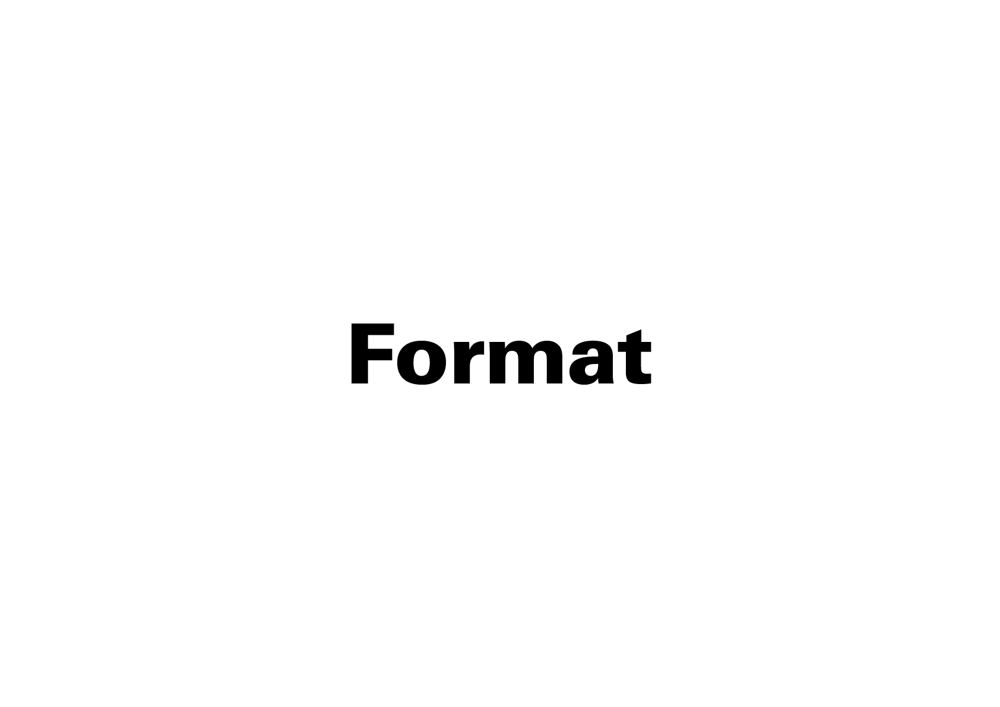

# ⏱️ Contraintes

- Quel est le sujet? Quel est le message à transmettre?  
- Quelle est l'échelle typographique du contenu?    
- À qui s’adresse-t-il?  
- Quelles sont les contraintes techniques? financières? etc.  

## &nbsp;  

Avant toute chose, il s’agit de définir clairement le message (contenu) et le public. Quel est le message à transmettre? Quelle idée, émotion ou information centrale doit être comprise ou ressentie? À qui s’adresse-t-il? Identifier le destinataire permet d’ajuster le ton, le niveau de complexité, les références ainsi que le registre visuel et verbal. C’est aussi identifier les contraintes techniques telles que le format ou la technique
  
&nbsp;

# Contenu

| |
|:---:|
| Le signe, le mot, la phrase, la colonne |

# Public 

| |
|:---:|
| Les variables de lisibilité peuvent être opposée à celles de l’impact graphique |

# Langue 

| |
|:---:|
| Chaque langue possède ses codes typographiques propres |

# Format  

| |
|:---:|
| Le format, l'orientation et les marges conditionnent les possibités de design |

# Technique  

| |
|:---:|
| Chaque technique a ses contraintes (notamment la plus corps qu'il est possible d'imprimer) |

<!-- ### Sources

- Karl Gerstner, *Kompendium für Alphabeten: Systematik der Schrift*, Sulgen/Frankfurt: Arthur Niggli, 1972 
- Ruedi Rüegg, *Basic Typography: Design with Letters / Typografische Grundlagen mit Schrift*, Zurich: Delta & Spes, 1980  
- Jost Hochuli, *Le détail en typographie*, London: Hyphen Press, 2005 [éd. orig. 1987]   -->

