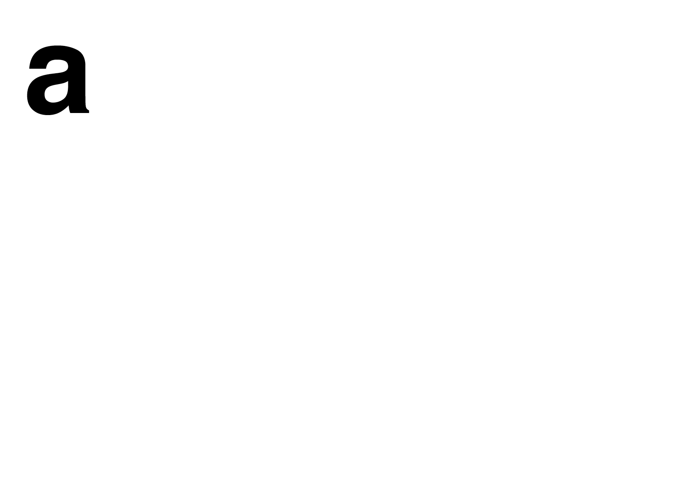

# ⏱️ Contraintes

Définir le contexte, c’est identifier les contraintes telles que le format, le type de contenu à traiter ainsi que les contraintes techniques qui orientent le processus de création.
  
&nbsp;

# Échelle typographie

| |
|:---:|
| Le signe, le mot, la phrase, la colonne |

# Langue 

| |
|:---:|
| Chaque langue possède ses codes typographiques propres |

# Format  

| |
|:---:|
| Le format, l'orientation et les marges conditionnent les possibités de design |

# Technique  

| |
|:---:|
| Chaque technique a ses contraintes (notamment la plus corps qu'il est possible d'imprimer) |

# Audience 

| |
|:---:|
| Les variables de lisibilité peuvent être opposée à celles de l’impact graphique |

<!-- ### Sources

- Karl Gerstner, *Kompendium für Alphabeten: Systematik der Schrift*, Sulgen/Frankfurt: Arthur Niggli, 1972 
- Ruedi Rüegg, *Basic Typography: Design with Letters / Typografische Grundlagen mit Schrift*, Zurich: Delta & Spes, 1980  
- Jost Hochuli, *Le détail en typographie*, London: Hyphen Press, 2005 [éd. orig. 1987]   -->

