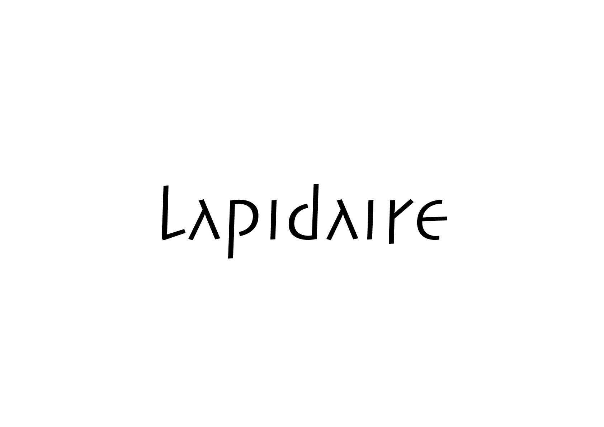
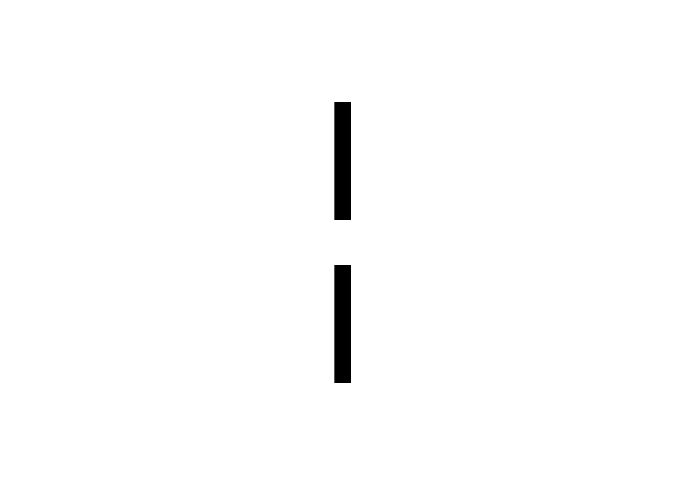

# 🎭 Caractère
?   Quel ton ou registre sert le mieux le propos (avant même qu'il soit lu)?
#
Le choix du caractère typographique fixe le ton du message. Il s’agit d’articuler le rapport entre fond et forme, en tenant compte des connotations portées par la typographie.
  
&nbsp;

# Morphologie  

| |
|:---:|
| La morphologie des lettres se manifeste par des variations de style : italique (incliné), gras (épais), light (fin), etc. |

# Connotation  

| |
|:---:|
| Différentes formes de lettres sont associées à différentes valeurs culturelles: une linéale suggère la neutralité, une sérif classique évoque la tradition, une didone peut connoter le luxe, une script exprime la spontanéité, une gothique rappelle l’histoire médiévale, une géométrique suggère la modernité |

# Axes sémantiques

•	Fort ↔ Faible  
•	Dur ↔ Doux  
•	Sérieux ↔ Ludique  
•	Traditionnel ↔ Moderne  
•	Luxueux ↔ Populaire  
•	Amical ↔ Autoritaire  
•	Chaud ↔ Froid  
•	Stable ↔ Dynamique  
•	Lisible ↔ Expressif  
•	Formel ↔ Informel  

# Typologie

•	Émotions: chaleureux, froid, joyeux, triste, rassurant, menaçant.  
•	Société: prestigieux, populaire, féminin, masculin, enfantin, neutre.  
•	Fonction: lisible, confus, stable, dynamique, clair, lourd, léger.  
•	Culture: moderne, classique, rétro, futuriste, artisanal, technologique.  
•	Esthétique: élégant, brut, raffiné, décoratif, minimaliste, grotesque. 

# Gris de texte  

| |
|:---:|
| Le gris de texte correspond à la densité visuelle produite par un bloc de texte. Un gris homogène favorise la lisibilité, tandis qu’un contraste marqué peut être utilisé à des fins expressives. |

# Contrastes 

| |
|:---:|
| Les contrastes créent la tension et l’harmonie essentielles à l'impact graphique et à la lisibilité d’une composition. Combinés avec discernement, ils renforcent mutuellement leur effet, tandis qu’une absence de contraste engendre la monotonie. |

•	animé - paisible  
•	animé - tranquille  
•	asymétrie - symétrie  
•	actif - passif  
•	concentrique - excentrique  
•	droit - oblique  
•	doux - dur  
•	dynamique - statique  
•	excentrique - concentrique  
•	fermé - ouvert  
•	foncé - clair  
•	géométrique - organique  
•	grand - petit  
•	gras - maigre  
•	illimité - limité  
•	instable - stable  
•	large - étroit  
•	ligne - point  
•	perpendiculaire - horizontal  
•	précis - diffus  
•	rond - droit  
•	statique - dynamique  
•	surface - ligne  
•	surface - point  
•	symétrie - asymétrie  
•	minuscules - majuscules  

### Sources

— Emil Ruder, *Typographie: Ein Gestaltungslehrbuch*. Teufen: Niggli, 1967  