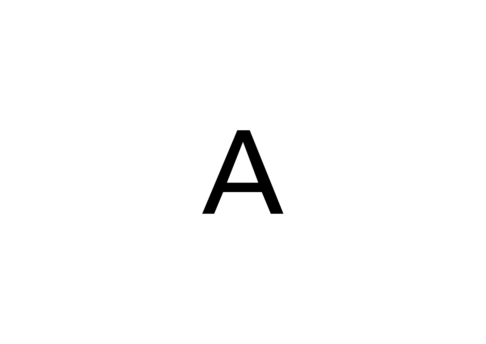
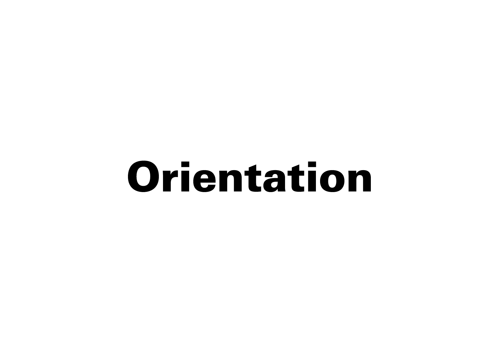
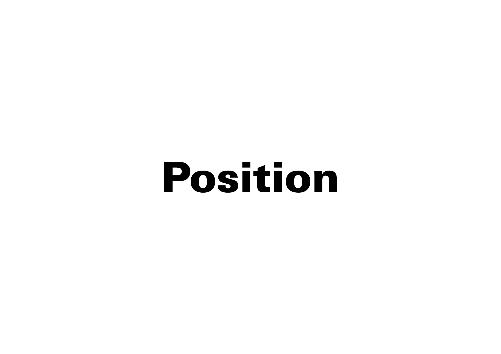
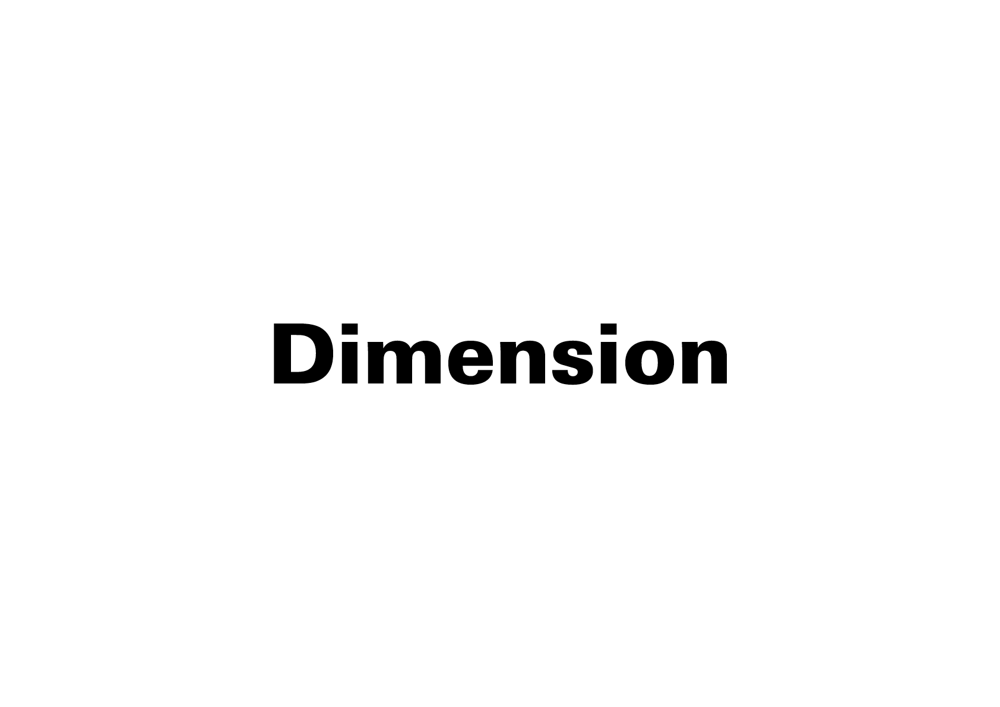
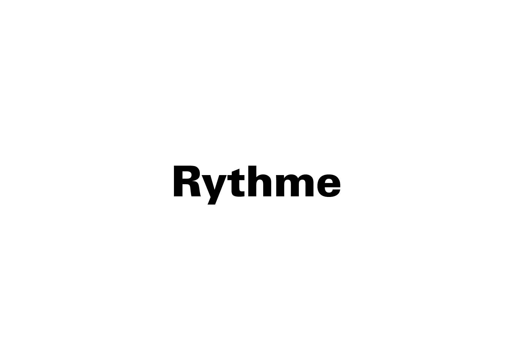

# 🎚️ Variations
# ⁉️ Comment peut-on traduire le propos en variant uniquement la forme, l'orientation, la position,…?

Explorer un maximum de variations, en modulant un paramètre visuel à la fois. En effet, si plusieurs paramètres changent simultanément, il devient impossible d’identifier clairement l’effet de chacun. En isolant les variables, on peut évaluer objectivement la pertinence et l’impact de chaque solution graphique.
  
&nbsp;

# Forme  

| |
|:---:|
| Le blanc (contreforme) participe autant à l’équilibre que les signes imprimés (formes). |

# Orientation  

| |
|:---:|
| L’orientation agit sur la lisibilité et peut évoquer le mouvement, la stabilité ou l’instabilité d’une composition. |

# Position  

| |
|:---:|
| La position influence la hiérarchie visuelle et l’équilibre spatial d’une composition. |

# Dimension  

| |
|:---:|
| La dimension modifie le rapport d’échelle et l’importance perçue des éléments. |

# Rythme  

| |
|:---:|
| Le rythme, déterminé par les espacements, agit sur la cadence de lecture et la perception de la densité visuelle. |

<!-- ### Sources

- Karl Gerstner, *Kompendium für Alphabeten: Systematik der Schrift*, Sulgen/Frankfurt: Arthur Niggli, 1972 
- Ruedi Rüegg, *Basic Typography: Design with Letters / Typografische Grundlagen mit Schrift*, Zurich: Delta & Spes, 1980  
- Jost Hochuli, *Le détail en typographie*, London: Hyphen Press, 2005 [éd. orig. 1987]   -->

