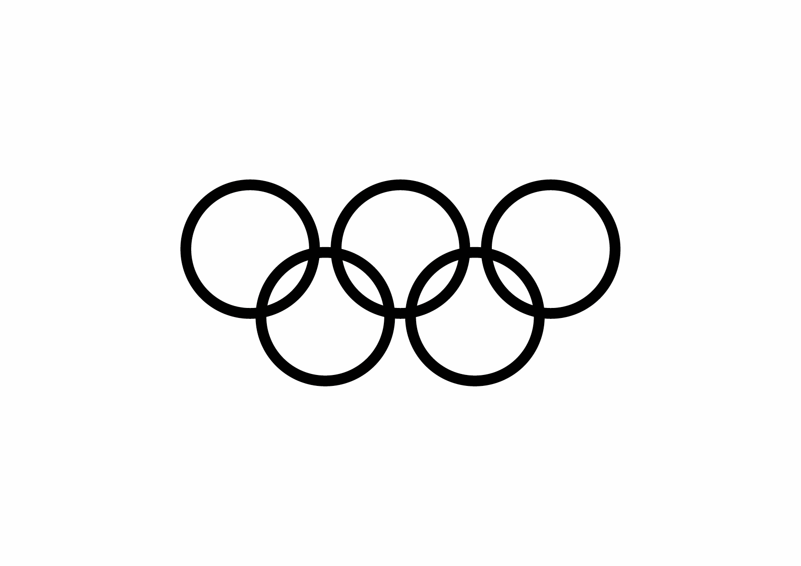
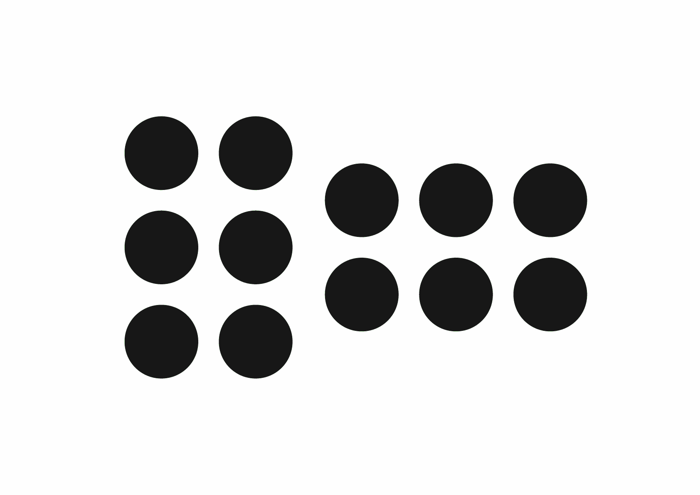
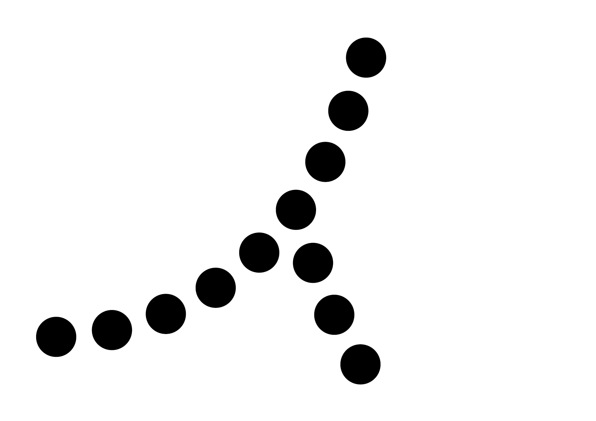
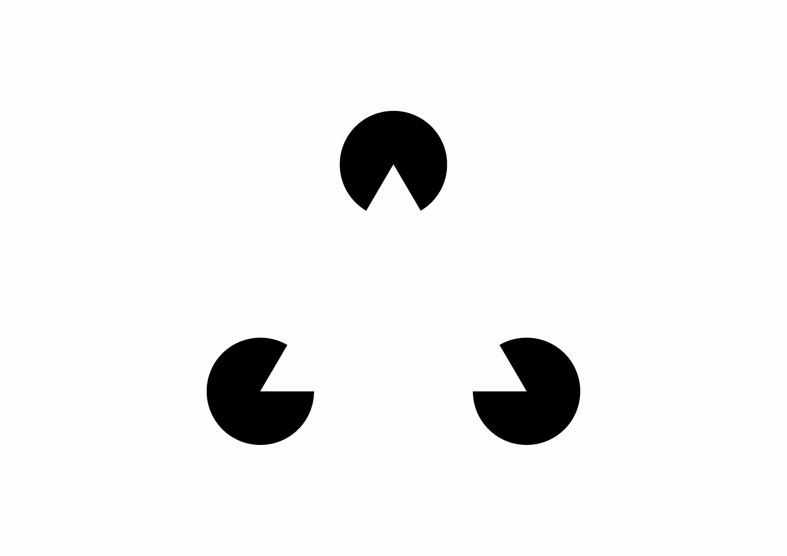
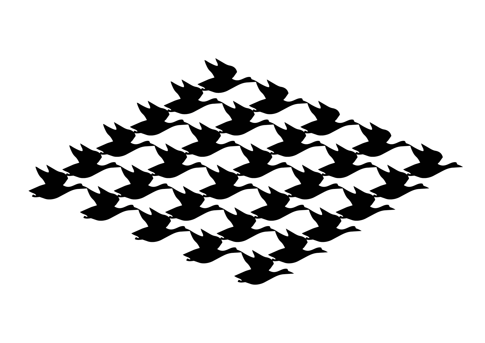

# 👁️‍🗨️ La psychologie de la forme (Gestalt)

# Similarité

||
|:---:|
| abc |

# Proximité

||
|:---:|
| abc |

# Continuité

||
|:---:|
| abc |

# Prégnance

||
|:---:|
| abc |

# Clôture

||
|:---:|
| abc |

# Figure-Fond

||
|:---:|
| abc |

<!-- ### Sources

- Ruedi Rüegg, *Basic Typography: Design with Letters / Typografische Grundlagen mit Schrift*, Zurich: Delta & Spes, 1980  
- Adrian Frutiger, *Type Sign Symbol*, Zurich: ABC Verlag, 1980  
- Karl Gerstner, *Kompendium für Alphabeten: Systematik der Schrift*, Sulgen/Frankfurt: Arthur Niggli, 1972  
- Alva Noto & Anne-James Chaton, *Uni Acronym*, 2011
- Jonas Voegeli, www.voegeli.info -->

<!--