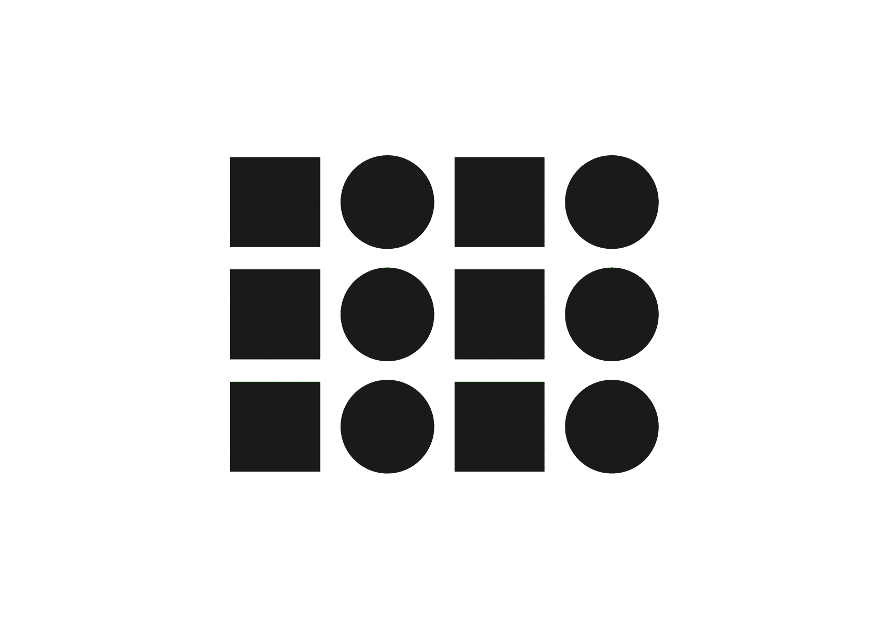

# 👁️‍🗨️ La psychologie de la forme (Gestalt)

La Gestalt étudie les conditions de la perception visuelle : comment le cerveau reconnaît, organise et assemble les formes pour produire du sens.
Elle repose sur une idée centrale souvent résumée par la formule : « le tout est plus que la somme des parties ». Plutôt que de percevoir des éléments isolés, la perception construit spontanément des ensembles organisés. En design graphique, ces principes permettent de structurer l’information, guider le regard et améliorer la lisibilité.

# Similarité

||
|:---:|
| Les éléments similaires sont perçus comme appartenant au même groupe. |

# Proximité

||
|:---:|
| Les éléments proches les uns des autres sont perçus comme liés. |

# Continuité

||
|:---:|
| L’œil perçoit en priorité les trajectoires continues. |

# Prégnance

||
|:---:|
| La perception privilégie la forme la plus simple, stable et organisée (décompose en formes simples). |

# Clôture

||
|:---:|
| Les formes incomplètes sont complétées par le cerveau. |

# Figure-Fond

||
|:---:|
| La perception distingue spontanément une forme principale de son arrière-plan. |

<!-- ### Sources

- Ruedi Rüegg, *Basic Typography: Design with Letters / Typografische Grundlagen mit Schrift*, Zurich: Delta & Spes, 1980  
- Adrian Frutiger, *Type Sign Symbol*, Zurich: ABC Verlag, 1980  
- Karl Gerstner, *Kompendium für Alphabeten: Systematik der Schrift*, Sulgen/Frankfurt: Arthur Niggli, 1972  
- Alva Noto & Anne-James Chaton, *Uni Acronym*, 2011
- Jonas Voegeli, www.voegeli.info -->