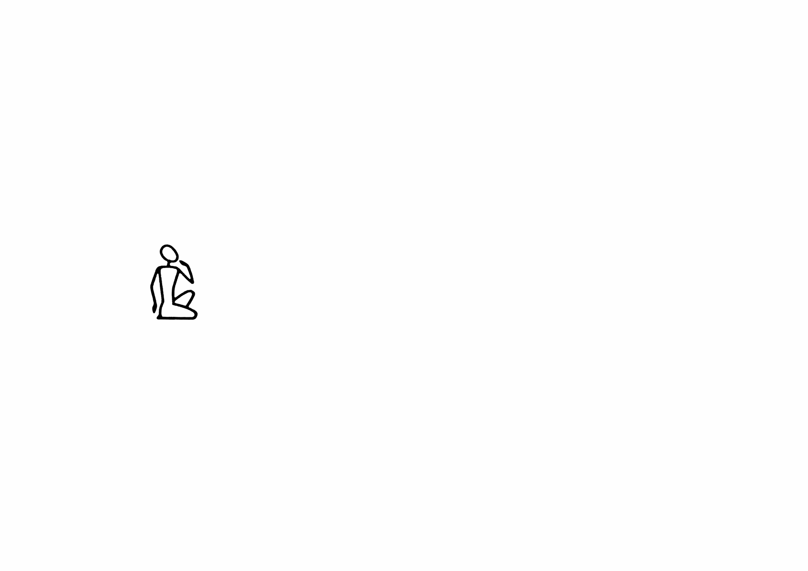

# 💬 Language

  
### &nbsp;

# Communication  

# Evolution de l'écriture  

# Concret / Abstrait  

# Applications  

# Unités typographiques  

# 1. Signe  

# 2. Mot  

# 3. Ligne  

# 4. Colonne  

# Signification  

# Scripte  

# Symboles  

# Lisibilité  

# Saccades  

# Lisibilité / Impact  

### Sources

<!-- - **Prénom Nom**  
  *Titre*, 0000 -->

<!-- [^1]: Adrian Frutiger, *Type, Sign, Symbol*, 1980 -->

