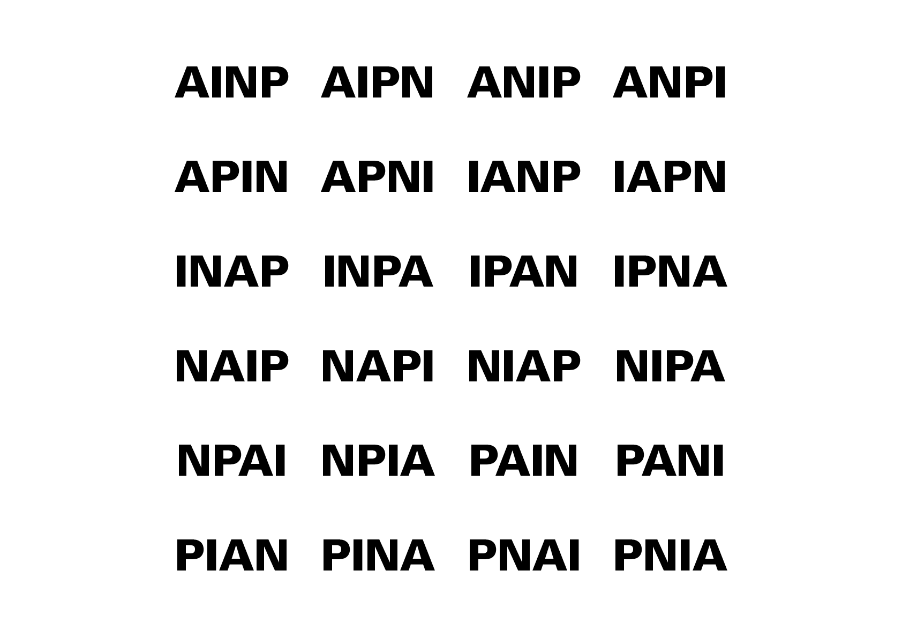

# 💬 Language

  
# &nbsp;

### Index

- [Scripte](#scripte)

# &nbsp;

# Applications  

||
|:---:|
| Abc |

# Communication  

||
|:---:|
| Abc |

# Concret / Abstrait  

||
|:---:|
| Evolution de l'écriture |

||
|:---:|
| Échelle d'iconicité |

# Unités typographiques  

||
|:---:|
| Abc |

# 1. Signe  

||
|:---:|
| Abc |

# 2. Mot  

||
|:---:|
| Abc |

# 3. Ligne  

||
|:---:|
| Abc |

# 4. Colonne  

||
|:---:|
| Abc |

# Signification  

||
|:---:|
| Abc |

# Scripte  

||
|:---:|
| Abc |

# Symboles  

||
|:---:|
| Abc |

# Lisibilité  

||
|:---:|
| Abc |

# Saccades  

||
|:---:|
| Abc |

# Lisibilité / Impact  

||
|:---:|
| Abc |

||
|:---:|
| Abc |

||
|:---:|
| Abc |

||
|:---:|
| Abc |

### Sources

<!-- - **Prénom Nom**  
  *Titre*, 0000 -->

<!-- [^1]: Adrian Frutiger, *Type, Sign, Symbol*, 1980 -->

<!--

-->

