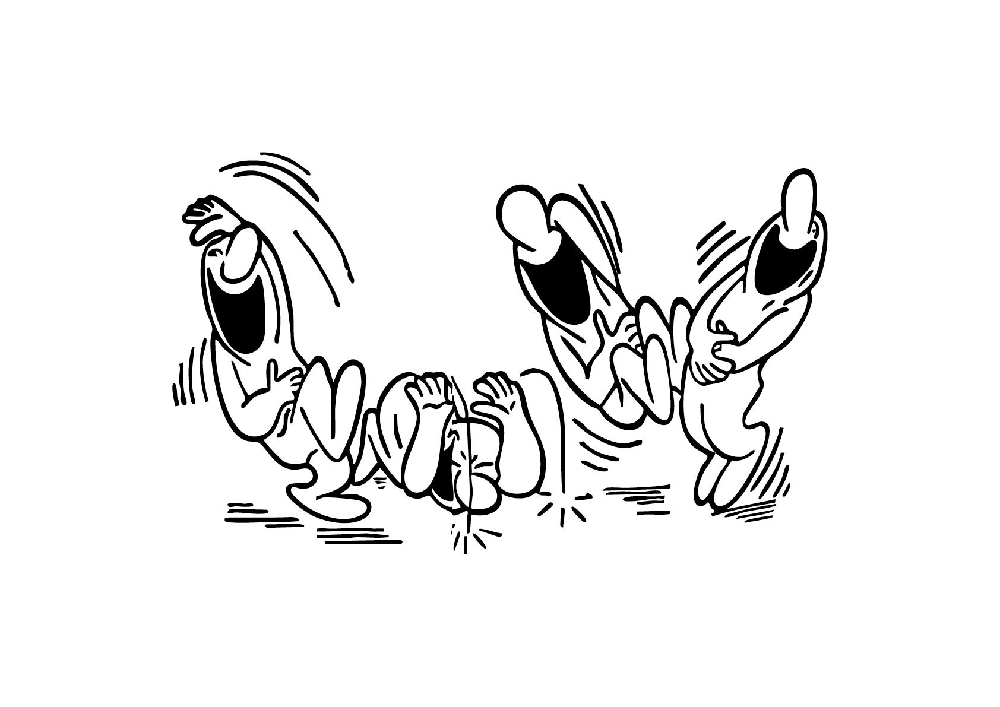

# 🎭 Sémiotique

- [Signes](#signes)
- [Langage](#langage)
- [Expression](#expression)
- [Caractère](#caractere)
- [Dénotation vs Connotation](#denotation-vs-connotation)
- [Explicite vs Implicite](#explicite-vs-implicite)
- [Axes sémantiques](#axes-semantiques)
- [Typologie](#typologie)

&nbsp;

||
|:---:|
| Le signifiant est la forme visible ou sonore d’un signe (ce que l’on perçoit) alors que le signifié est l’idée ou le concept qu’elle fait naître dans l’esprit (ce que l’on comprend) |

# Signes {#signes}

||
|:---:|
| Les signes constituent le vecteur par lequel un émetteur transmet un message à un récepteur |

||
|:---:|
| Les lettres sont des signes abstraits qui représentent des sons |

# Langage {#langage}

||
|:---:|
| Les lettres n'acquièrent un sens que lorsqu'elles sont combinées |

||
|:---:|
| Toutes les langues peuvent être codifiés dans n'importe quel alphabet (scripte) | 

||
|:---:|
| La signalétique est une forme de langage universel, capable de communiquer à tous.tes et de dépasser les frontières linguistiques |

# Expression {#expression}

| |
|:---:|
| L’expression abstraite (avant même le sens des mots) porte déjà une coloration stéréotypée |

| |
|:---:|
| La forme des caractères influence l'interprétation du message |

# Caractère {#caractere}

| |
|:---:|
| Les caractères, au-delà de leur fonction première de vecteur visuel de la langue, peuvent teinter le texte d'une certaine atmosphère |

# Dénotation vs Connotation {#denotation-vs-connotation}

| |
|:---:|
| Le message est interprété à travers sa conception typographique |

| |
|:---:|
| L'information est autant «lue» que «vue» |

# Explicite vs Implicite {#explicite-vs-implicite}

| |
|:---:|
| Le texte est réduit à l'essentiel: ce qui est dit vs ce qui n'est pas dit |

# Axes sémantiques {#axes-semantiques}

•	Fort ↔ Faible  
•	Dur ↔ Doux  
•	Sérieux ↔ Ludique  
•	Traditionnel ↔ Moderne  
•	Luxueux ↔ Populaire  
•	Amical ↔ Autoritaire  
•	Chaud ↔ Froid  
•	Stable ↔ Dynamique  
•	Lisible ↔ Expressif  
•	Formel ↔ Informel  

# Typologie {#typologie}

•	Émotions: chaleureux, froid, joyeux, triste, rassurant, menaçant.  
•	Société: prestigieux, populaire, féminin, masculin, enfantin, neutre.  
•	Fonction: lisible, confus, stable, dynamique, clair, lourd, léger.  
•	Culture: moderne, classique, rétro, futuriste, artisanal, technologique.  
•	Esthétique: élégant, brut, raffiné, décoratif, minimaliste, grotesque.  

### Sources

- Hans-Rudolf Lutz, *Ausbildung in typografischer Gestaltung*, Zurich: Hans-Rudolf Lutz Verlag, 1980  
- Abraham Moles, *Les sciences de l’imprécis: Échelles d’iconicité*, Paris: Seuil, 1990  
- Karl Gerstner, *Kompendium für Alphabeten: Systematik der Schrift*, Sulgen/Frankfurt: Arthur Niggli, 1972  
- Adrian Frutiger, *Type Sign Symbol*, Zurich: ABC Verlag, 1980  

