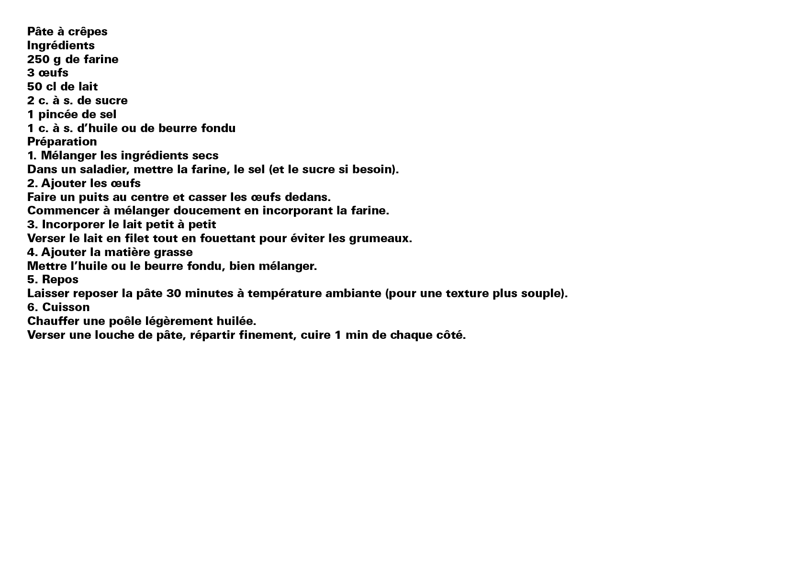

# 📶 Articulation de la lecture

L’articulation de la lecture désigne la manière dont le texte est structuré pour guider l’œil du lecteur. Hiérarchies visuelles, alinéas, retours à la ligne et espacements permettent de distinguer les niveaux d’importance et de faciliter la compréhension.
  
&nbsp;

| |
|:---:|
| Texte brut → Texte structuré |

### Sources

- Ruedi Rüegg, *Basic Typography: Design with Letters / Typografische Grundlagen mit Schrift*, Zurich: Delta & Spes, 1980  
- Jost Hochuli, *Le détail en typographie*, London: Hyphen Press, 2005 [éd. orig. 1987]  
- Karl Gerstner, *Kompendium für Alphabeten: Systematik der Schrift*, Sulgen/Frankfurt: Arthur Niggli, 1972  
- Karl Gerstner, *Designing Programmes*, Baden: Lars Müller Publishers, 2007 [1ʳᵉ éd. 1964]  
- Josef Müller-Brockmann, *Grid Systems in Graphic Design: A Visual Communication Manual for Graphic Designers, Typographers and Three Dimensional Designers*, Zurich: Niggli, 1981  

<!-- - **Prénom Nom**  
  *Titre*, 0000 -->

<!-- [^1]: Adrian Frutiger, *Type, Sign, Symbol*, 1980 -->

