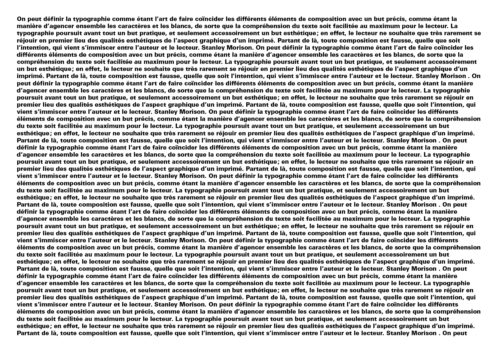
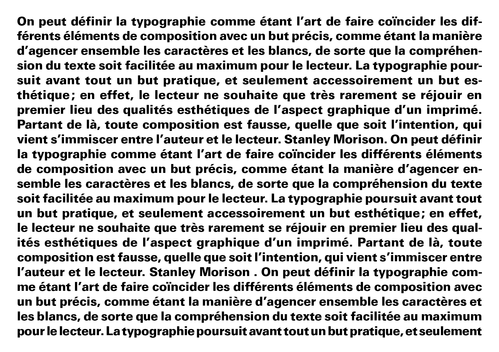
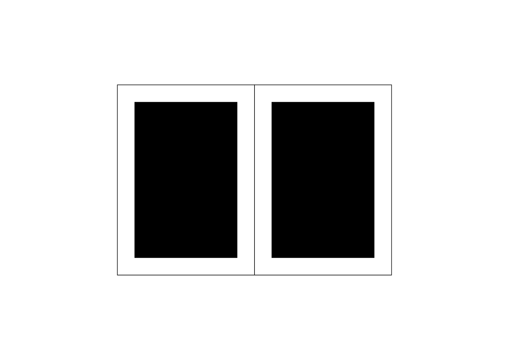
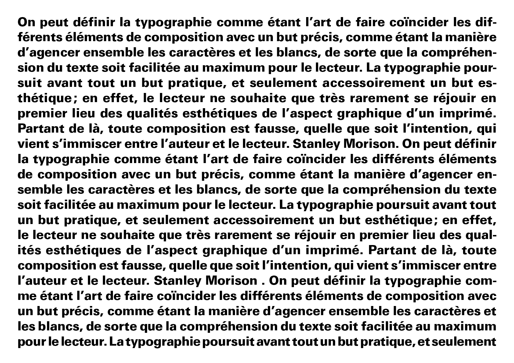
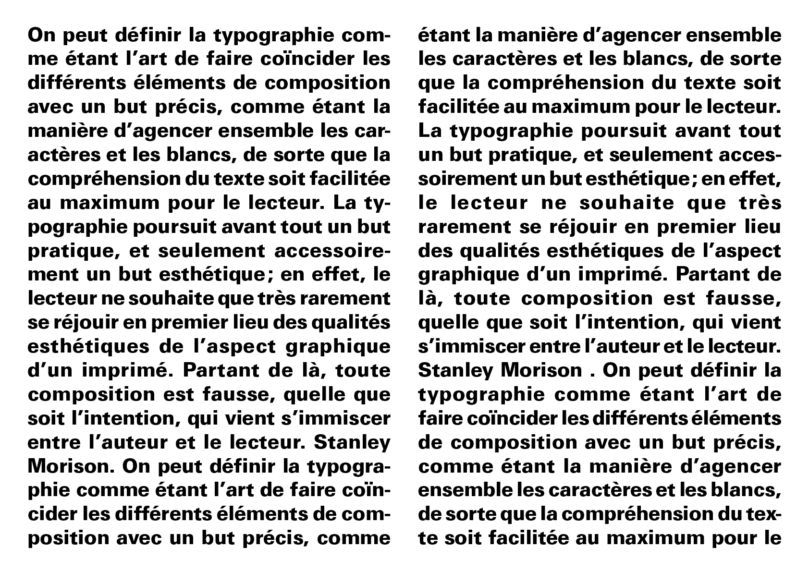
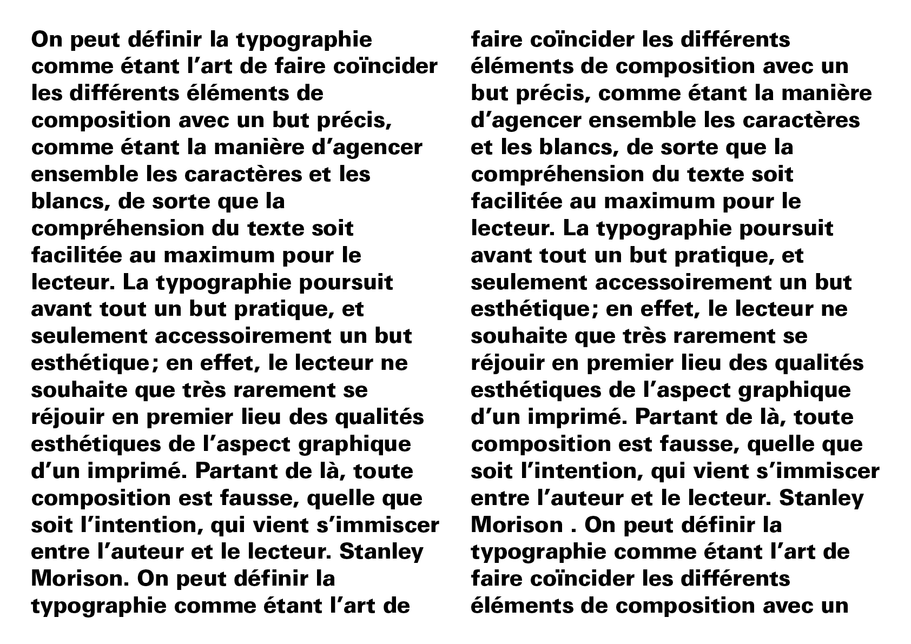

# ↔️ Composition des colonnes

La composition des colonnes concerne l’organisation du texte en largeur et en hauteur au sein de la zone de texte.

- [Mots / Ligne](#mots-ligne)
- [Inter-ligne](#inter-ligne)
- [Division en colonnes](#division-en-colonnes)
- [Alignement](#alignement)
- [Drapeau](#drapeau)

  
&nbsp;

# Mots / Ligne {#mots-ligne}  

| |
|:---:|
| Le nombre de mots par ligne influence directement la lisibilité du texte (optimum 8-12) |

# Inter-ligne {#inter-ligne}

| |
|:---:|
| Un corps plus grand demande moins d’interlignage, alors qu’un corps plus petit nécessite plus d’espace entre les lignes |

# Division en colonnes {#division-en-colonnes}

| |
|:---:|
| La division en colonnes structure la zone de texte pour équilibrer la mise en page |

| |
|:---:|
| L’enjeu principal de la justification est d’éviter l’apparition de lézardes dans le gris typographique |

# Alignement {#alignement}

| |
|:---:|
| Le texte peut être aligné à gauche, à droite, centré ou justifié, selon l’effet recherché |

# Drapeau {#drapeau}

| |
|:---:|
| Le drapeau désigne l'ajustement du bord irrégulier du texte non justifié par un travail d'espacement, de césure et de retour à la ligne |

### Sources

- Ruedi Rüegg, *Basic Typography: Design with Letters / Typografische Grundlagen mit Schrift*, Zurich: Delta & Spes, 1980  
- Jost Hochuli, *Le détail en typographie*, London: Hyphen Press, 2005 [éd. orig. 1987]  
- Karl Gerstner, *Kompendium für Alphabeten: Systematik der Schrift*, Sulgen/Frankfurt: Arthur Niggli, 1972  
- Karl Gerstner, *Designing Programmes*, Baden: Lars Müller Publishers, 2007 [1ʳᵉ éd. 1964]  
- Josef Müller-Brockmann, *Grid Systems in Graphic Design: A Visual Communication Manual for Graphic Designers, Typographers and Three Dimensional Designers*, Zurich: Niggli, 1981  
