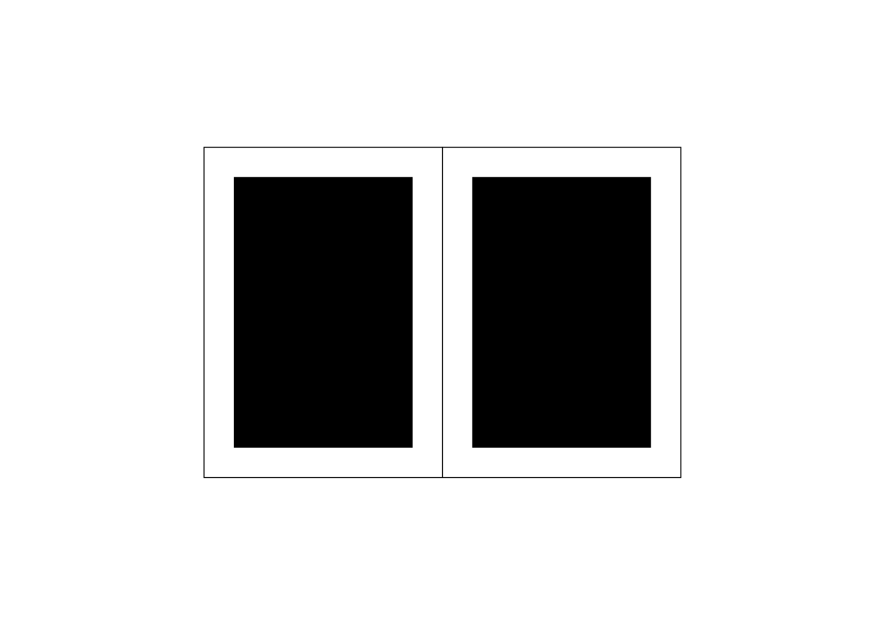

# ⏹️ Mise en page

La mise en page consiste à organiser la zone de lecture (les colonnes) dans le format global, en tenant compte des marges, du folio et des mentions de section. Elle définit la structure de navigation et assure une lecture claire et hiérarchisée.
  
&nbsp;

| |
|:---:|
| Zone de texte + Folio + Section |

### Sources

- Ruedi Rüegg, *Basic Typography: Design with Letters / Typografische Grundlagen mit Schrift*, Zurich: Delta & Spes, 1980  
- Jost Hochuli, *Le détail en typographie*, London: Hyphen Press, 2005 [éd. orig. 1987]  
- Karl Gerstner, *Kompendium für Alphabeten: Systematik der Schrift*, Sulgen/Frankfurt: Arthur Niggli, 1972  
- Karl Gerstner, *Designing Programmes*, Baden: Lars Müller Publishers, 2007 [1ʳᵉ éd. 1964]  
- Josef Müller-Brockmann, *Grid Systems in Graphic Design: A Visual Communication Manual for Graphic Designers, Typographers and Three Dimensional Designers*, Zurich: Niggli, 1981  

<!-- - **Prénom Nom**  
  *Titre*, 0000 -->

<!-- [^1]: Adrian Frutiger, *Type, Sign, Symbol*, 1980 -->

