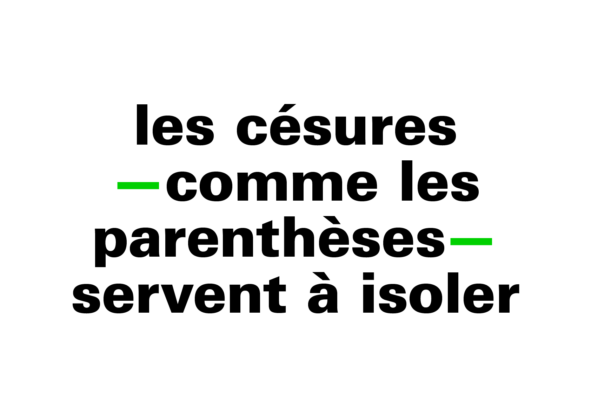
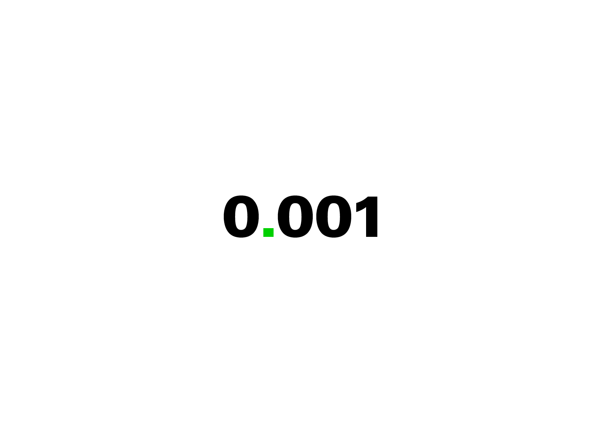
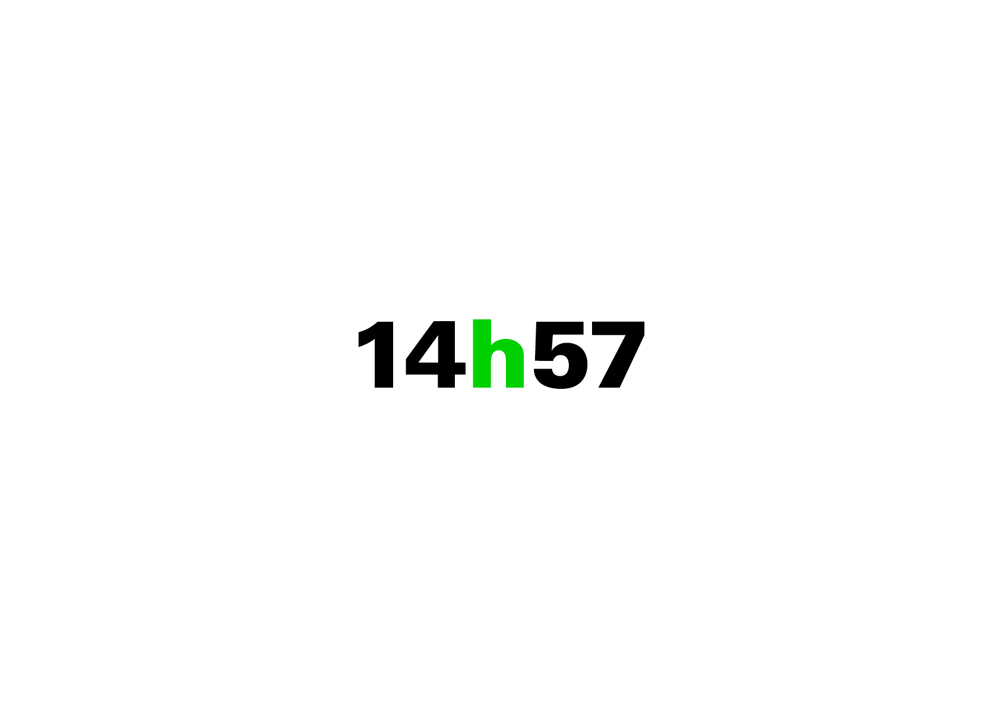

# 📶 Hiérarchies
  Micro et macro typographie

  
### &nbsp;

| |
|:---:|
| Power of Ten: un film qui traite de la taille relative des choses dans l’univers[^1]           |

# 🥂 Micro & Macro

| |
|:---:|
| Contenu = Séquence de texte & Contenant = Mise en forme[^2] |

# 🦠 Micro

La micro-typographie (contenu) concerne les symboles et les espaces dans la séquence de texte.

###  L’apostrophe

| |
|:---:|
| L’apostrophe est un signe typographique servant à signaler l’élision d’une lettre          |

###  Le point, la virgule

| |
|:---:|
| Le point et la virgule sont des signes de ponctuation qui marquent la fin ou une pause dans une phrase. |

###  Les points de suspension

| |
|:---:|
| Les points de suspension marquent une interruption ou une hésitation, ils laissent la phrase en suspens.          |

###  Les espaces insécables

| |
|:---:|
| Les signes de ponctuation ( : ; ! ? ) doivent être précédés en français d’une espace fine insécable.           |

###  Les guillemets

| |
|:---:|
| Les guillemets sont des signes de ponctuation utilisés par paire pour mettre en évidence une citation ; chaque langue possède ses propres formes.          |

###  Les césures

| |
|:---:|
| La césure permet de couper un mot en fin de ligne selon des règles précises, afin d’améliorer la justification et l’équilibre typographique.          |

###  Les parenthèses, les tirets

| |
|:---:|
| Les parenthèses encadrent un élément explicatif ou secondaire, tandis que les tirets peuvent introduire, isoler ou ponctuer une phrase selon leur longueur.          |

###  Les chiffres

| |
|:---:|
| Les chiffres peuvent varier en forme (proportionnels, tabulaires, elzéviriens) selon leur contexte typographique: texte courant, tableau ou encore affichages en grande taille.          |

###  Les opérations

| |
|:---:|
| Les opérations mathématiques (comme la multiplication) nécessite l'usage de signes distincts des lettres ou autres symboles voisins.          |

###  Les nombres

| |
|:---:|
| Les nombres s’écrivent selon des conventions propres à chaque langue, notamment pour le séparateur de milliers ou de décimales. (ici en français CH)          |

###  Les heures

| |
|:---:|
| Les heures s’écrivent avec des conventions typographiques variables propres à chaque langue.          |

###  Les index

| |
|:---:|
| Les index s’écrivent avec des abréviations spécifiques et évitent les formes anglicisées ou incorrectes comme « 2ème ».          |

# 🌏 Macro

La macro-typographie (contenant) concerne la mise en forme de la séquence de texte.

<!---
###  La police
--->

### ➡️ Le corps

### ➡️ La justification

### ➡️ L’hyphénation

### ➡️ L’interligne

### ➡️ L’intermot

### ➡️ L’interlettre

# 🚨 Langue

Pour chaque langue il y a des conventions particulières, voici certains des ouvrages de références:

**Français CH**  
Guide du typographe romand

**Français FR**  
Lexique des règles en usage à l’Imprimerie nationale

**Allemand DE**  
Detail Typografie, Nachschlagewerk für alle Fragen zu Schrift und Satz

**Anglais UK**  
Hart’s Rules for Compositors and Readers at the University Press Oxford

**Anglais US**  
Chicago Manual of Style

# 📎 Sources

[^1]: Charles & Ray Eames, *Power of Ten*, 1977
[^2]: Illustration inspirée du concept de *Crystal Goblet*, Beatrice Warde, 1955