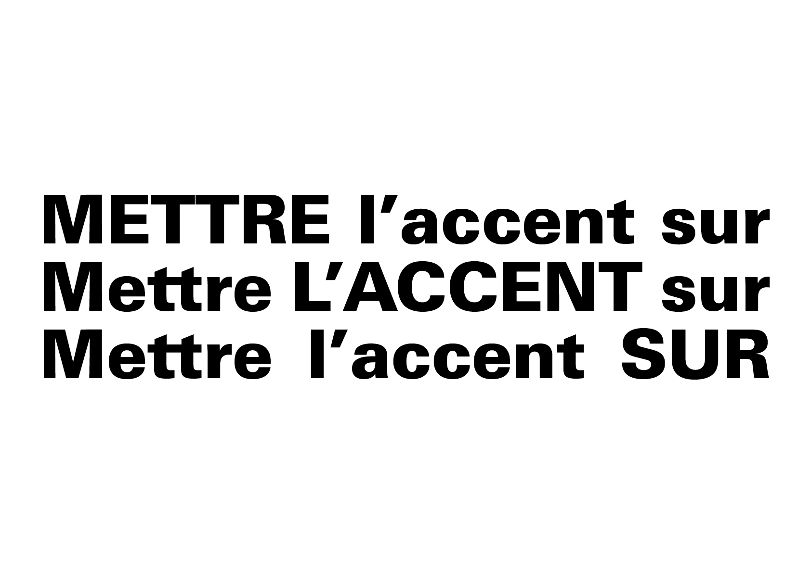

# 📶 Articulation de la ligne

L’articulation de la ligne concerne la manière de mettre en relief certains mots pour distinguer l’important de l’accessoire. Ce rôle appartient d’abord à l’orthographe (accents, majuscules) mais se traduit aussi en typographie par des choix de mise en évidence graphiques.
  
&nbsp;

| |
|:---:|
| Différents moyens de mettre en évidence |

### Sources  

- Ruedi Rüegg, *Basic Typography: Design with Letters / Typografische Grundlagen mit Schrift*, Zurich: Delta & Spes, 1980  
- Jost Hochuli, *Le détail en typographie*, London: Hyphen Press, 2005 [éd. orig. 1987]  
- Hans-Rudolf Lutz, *Ausbildung in typografischer Gestaltung*, Zurich: Hans-Rudolf Lutz Verlag, 1980  
- Hans-Rudolf Lutz, *Typoundso*, Zurich: Hans-Rudolf Lutz Verlag, 1990–1996  
- Karl Gerstner, *Kompendium für Alphabeten: Systematik der Schrift*, Sulgen/Frankfurt: Arthur Niggli, 1972   

<!-- - **Prénom Nom**  
  *Titre*, 0000 -->

<!-- [^1]: Adrian Frutiger, *Type, Sign, Symbol*, 1980 -->

