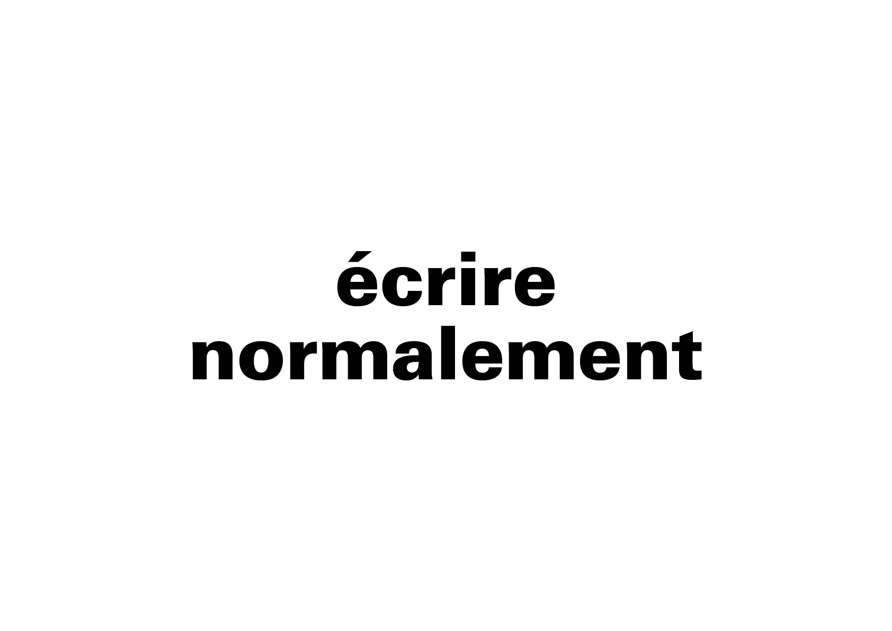

# ↔️ Composition de la ligne

La composition de la ligne se réfère à l'espacement vertical et horizontal entre les mots qui régit la fluidité de lecture. Selon la police et le contexte, le règlage de ces intervalles peut renforcer soit la lisiblité, soit l'impact graphique.
  
&nbsp;

| |
|:---:|
| Inter-lignage | 

| |
|:---:|
| Fluidité |

### Sources

- Ruedi Rüegg, *Basic Typography: Design with Letters / Typografische Grundlagen mit Schrift*, Zurich: Delta & Spes, 1980  
- Jost Hochuli, *Le détail en typographie*, London: Hyphen Press, 2005 [éd. orig. 1987]  
- Hans-Rudolf Lutz, *Ausbildung in typografischer Gestaltung*, Zurich: Hans-Rudolf Lutz Verlag, 1980  
- Hans-Rudolf Lutz, *Typoundso*, Zurich: Hans-Rudolf Lutz Verlag, 1990–1996  
- Karl Gerstner, *Kompendium für Alphabeten: Systematik der Schrift*, Sulgen/Frankfurt: Arthur Niggli, 1972  
